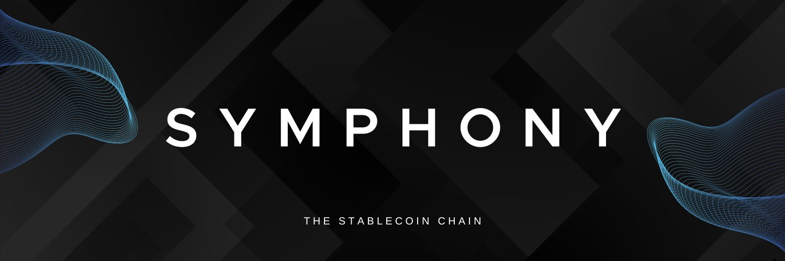

# Osmosis

As the largest DEX in the Cosmos, Osmosis is a source of liquidity for over 50 sovereign blockchains connected via IBC. Pioneering in its approach, Osmosis offers a dynamic trading and liquidity provision experience, integrating non-IBC assets from other ecosystems, including: Bitcoin, Ethereum, Solana, Avalanche, and Polkadot. Initially adopting Balancer-style pools, Osmosis now also features a concentrated liquidity model that is orders of magnitude more capital efficient, meaning that significantly less liquidity is required to handle the same amount of trading volume with minimal slippage.

As a true Layer 1 appchain, Osmosis has greater control over the full blockchain stack than traditional smart contract DEXs, which must follow the code of the parent chain that it is built on. This fine-grained control has enabled, for example, the development of Superfluid Staking, an extension of Proof of Stake that allows assets at the application layer to be staked to secure the chain. The customizability of appchains also allows implementing features like the Protocol Revenue module, which enables Osmosis to conduct on-chain cyclic arbitrage on behalf of OSMO stakers, balancing prices across pools while generating real yield revenue from this volume. Additionally, as a sovereign appchain, Osmosis governance can vote on upgrades to the protocol. One example of this was the introduction of a Taker Fee, which switched on the collection of exchange fees to generate a diverse yield from Osmosis volume and distribute it to OSMO stakers.

Osmosis is bringing the centralized exchange experience to the decentralized world by building a cross-chain DEX and trading suite that aims to interconnect all chains via IBC. To reach this goal, Osmosis hosts an ever-expanding suite of DeFi applications, including: lending/borrowing, margin trading, strategy vaults, perpetuals, fiat on-ramping, NFTs, stablecoins, etc.—all of the functionalities that centralized exchanges offer, and more, but in the trust-minimized environment of decentralized finance.

## System Requirements

This system spec has been tested by many users and validators and found
to be comfortable:

- Quad Core or larger AMD or Intel (amd64) CPU
  - ARM CPUs like the Apple M1 are not supported at this time.
- 64GB RAM (A lot can be in swap)
- 1TB NVMe Storage
- 100MBPS bidirectional internet connection

You can run Osmosis on lower-spec hardware for each component, but you
may find that it is not highly performant or prone to crashing.

## Documentation

For the most up-to-date documentation please visit
[docs.osmosis.zone](https://docs.osmosis.zone/)

## Joining the Mainnet

[Please visit the official instructions on how to join the Mainnet
here.](https://docs.osmosis.zone/overview/validate/joining-mainnet)

Thank you for supporting a healthy blockchain network and community by
running an Osmosis node!

## Contributing

The contributing guide for Osmosis explains the branching structure, how
to use the SDK fork, and how to make / test updates to SDK branches.

## LocalOsmosis

LocalOsmosis is a containerized local Osmosis testnet used for trying out new features locally. 
LocalOsmosis documentation can be found [here](https://github.com/osmosis-labs/osmosis/tree/main/tests/localosmosis)
