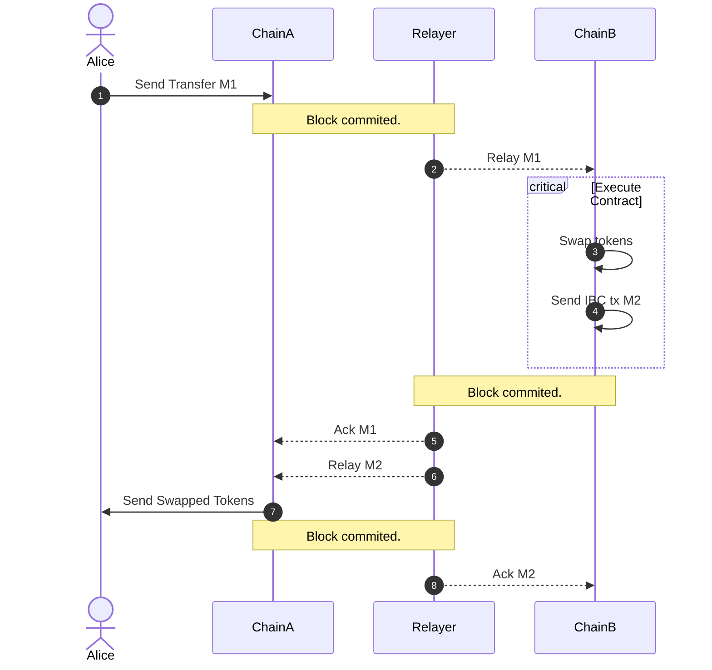

# Crosschain Swaps

The following contract is a *swap and forward* contract that takes the received
tokens, swaps them via a swaprouter contract, and sends them to an IBC receiver.

The goal is to use this contract to provide *crosschain swaps*: sending an ICS20
transfer on chain A, receiving it on osmosis, swapping for a different token,
and forwarding to a different chain.

## XCS v1 vs XCS v2

There are two versions of the crosschain swaps contract. The first version allows users
to swap via instructions in the memo as described above. This is enough to do swaps with
arbitrary complexity but still requires users to build the memo manually, which implies
knowing about the channels used to transfer the tokens in each intermediate hop, the canonical
ibc denoms of tokens on osmosis, and when to use packet forward middleware vs callbacks.

The second version of the contract simplifies this for users by keeping registries with the 
necessary information and doing the token unwinding automatically. 

This documentation is for the latest version of the contract. For v1, see the [previous docs](https://github.com/osmosis-labs/osmosis/tree/v15.x/cosmwasm/contracts/crosschain-swaps)

## Instantiation

To instantiate the contract, you need to specify the following parameters:

 * swap_contract: the swaprouter contract to be used
 * governor: The address that will be allowed to manage which swap_contract to use 

### Example instantiation message

``` json
{"swap_contract": "osmo1thiscontract", "governor": "osmo1..."}
```

## Usage

### Via IBC

Assuming the current implementation of the wasm middleware on Osmosis v14 (`x/ibc-hooks/v0.0.6`), the memo
of an IBC transfer to do crosschain swaps would look as follows:

``` json
{"wasm": {
    "contract": "osmo1crosschainswapscontract", 
    "msg": {
        "osmosis_swap": {
            "output_denom":"token1",
            "slippage":{"twap": {"slippage_percentage":"20", "window_seconds": 10}},
            "receiver":"juno1receiver",
            "on_failed_delivery": "do_nothing",
            "next_memo":null
        }
    }
}}
```

TODO: Expand documentation on how to specify receivers

Channels are determined by the prefixes specified in the contract during
instantiation, so the user needs to provide a receiver with the supported
prefix. This will probably change in the future 

The `slippage` can be set to a percentage of the twap price (as shown above), or as
the minimum amount of tokens expected to be received: `{"min_output_amount": "100"}`.

The `on_failed_delivery` field can be set to `do_nothing` or a local recovery addr 
via `{"local_recovery_addr": "osmo1..."}`. If set to `do_nothing`, the contract will
not track the packet, and the user will not be able to recover the funds if the packet 
fails. If set to a local recovery addr, the contract will track the packet, and 
the specified address will be able to execute `{"recover": {}}` on the crosschain swaps 
contract to recover the funds. 


#### Optional keys

The `next_memo` key, if provided, will be added to the IBC transfer as the memo
for that transfer. This can be useful if the receiving chain also has IBC hooks
on transfers. In that case, this can be used to specify how the receiver should
deal with the received tokens (mostly useful when the receiver is a contract or
another ibc actor).

Any JSON object is accepted as a valid memo, as long as it doesn't contain the 
key "ibc_callback". That key is used internally for the contract to track the 
success or failure of the packet delivery.

#### Response

The contract will return the following response:

```rust
pub struct CrosschainSwapResponse {
    pub sent_amount: Uint128,
    pub denom: String,
    pub channel_id: String,
    pub receiver: String,
    pub packet_sequence: u64,
}
```
or as json:

``` json
{"sent_amount": "818", "denom": "token0", "channel_id": "channel-42", "receiver": "juno1receiver", "packet_sequence": 17}
```

## Usage examples

Here are some usage examples of sending tokens on the live versions of the contracts:

### XCS v1

#### Native to Native

To swap from a chain's native token to another chain's native token. 

For this example we will swap JUNO stored in the Juno, for ATOM and send it to Gaia. 

To do that you can execute an IBC transfer on the first chain (juno) with a memo like the following:

```json
{
  "wasm": {
    "contract": "osmo1uwk8xc6q0s6t5qcpr6rht3sczu6du83xq8pwxjua0hfj5hzcnh3sqxwvxs",  // XCS contract
    "msg": {
      "osmosis_swap": {
        "output_denom": "ibc/27394FB092D2ECCD56123C74F36E4C1F926001CEADA9CA97EA622B25F41E5EB2",  // ATOM on osmosis
        "slippage": {
          "twap": {
            "slippage_percentage": "20",
            "window_seconds": 10
          }
        },
        "receiver": "cosmos1tfu4j7nzfhtex2wyp946rm02748zxu8w0kvt87",  // Address on gaia
        "on_failed_delivery": "do_nothing"
      }
    }
  }
}
```

The full command to execute this is:

```bash
junod  --node https://rpc.cosmos.directory:443/juno tx ibc-transfer transfer transfer channel-0 osmo1uwk8xc6q0s6t5qcpr6rht3sczu6du83xq8pwxjua0hfj5hzcnh3sqxwvxs 100ujuno   \
--from testaccount -y --gas auto --gas-prices 0.1ujuno --gas-adjustment 1.3 \
--memo '{"wasm":{"contract":"osmo1uwk8xc6q0s6t5qcpr6rht3sczu6du83xq8pwxjua0hfj5hzcnh3sqxwvxs","msg":{"osmosis_swap":{"output_denom":"ibc/27394FB092D2ECCD56123C74F36E4C1F926001CEADA9CA97EA622B25F41E5EB2","slippage":{"twap":{"slippage_percentage":"20","window_seconds":10}},"receiver":"cosmos1tfu4j7nzfhtex2wyp946rm02748zxu8w0kvt87","on_failed_delivery":"do_nothing"}}}}'
```

TODO: Add an example in TS

#### Native to Osmosis native

Similarly, if you wanted to swap for a token that is native to osmosis (osmo, ion, or tokenfactory tokens) you can use a 
memo like the one above but with the appropriate valies for the token and receiver.

```json
{
  "wasm": {
    "contract": "osmo1uwk8xc6q0s6t5qcpr6rht3sczu6du83xq8pwxjua0hfj5hzcnh3sqxwvxs",
    "msg": {
      "osmosis_swap": {
        "output_denom": "uosmo",  // Osmosis native token
        "slippage": {
          "twap": {
            "slippage_percentage": "20",
            "window_seconds": 10
          }
        },
        "receiver": "juno1tfu4j7nzfhtex2wyp946rm02748zxu8wey0sqz",  // The receiver is now on juno
        "on_failed_delivery": "do_nothing"
      }
    }
  }
}
```


```bash
junod  --node https://rpc.cosmos.directory:443/juno tx ibc-transfer transfer transfer channel-0 osmo1uwk8xc6q0s6t5qcpr6rht3sczu6du83xq8pwxjua0hfj5hzcnh3sqxwvxs 100738ujuno   \
--from testaccount -y --gas auto --gas-prices 0.1ujuno --gas-adjustment 1.3 \
--memo '{"wasm":{"contract":"osmo1uwk8xc6q0s6t5qcpr6rht3sczu6du83xq8pwxjua0hfj5hzcnh3sqxwvxs","msg":{"osmosis_swap":{"output_denom":"uosmo","slippage":{"twap":{"slippage_percentage":"20","window_seconds":10}},"receiver":"juno1tfu4j7nzfhtex2wyp946rm02748zxu8wey0sqz","on_failed_delivery":"do_nothing"}}}}'
```

TODO: Add an example in TS


#### Native to Non-Native

Sometimes, the token you want to receive is neither native to the chain initiating the swap, nor to osmosis.

In this case we will need to unwind the path of this token using the packet forward middleware (which needs
to be supported by the intermediate chain).

For this example, we will swap OSMO stored in juno to ATOM and send it back to juno. 

If we did this like the previous examples we would end up with a token that isn't recognized 
as ATOM on juno. This is because the pools on osmosis use ATOM sent directly from gaia
and not via juno (i.e.: osmosis(ATOM) != osmosis(juno(ATOM))).

To fix this, we will use the packet forward middleware to unwind the path of the token. The final memo would be:

```json
{
    "wasm": {
        "contract": "osmo1uwk8xc6q0s6t5qcpr6rht3sczu6du83xq8pwxjua0hfj5hzcnh3sqxwvxs",
        "msg": {
            "osmosis_swap": {
                "output_denom": "ibc/27394FB092D2ECCD56123C74F36E4C1F926001CEADA9CA97EA622B25F41E5EB2",  // ATOM on osmosis
                "receiver": "cosmos1tfu4j7nzfhtex2wyp946rm02748zxu8w0kvt87",  // Intermediate receiver
                "slippage": {
                   "twap": {
                      "slippage_percentage": "20",
                      "window_seconds": 10
                   }
                },
                "next_memo": {
                    "forward": {
                        "receiver": "juno1tfu4j7nzfhtex2wyp946rm02748zxu8wey0sqz",  // Final receiver
                        "port": "transfer",
                        "channel": "channel-207"  // Juno's channel on gaia
                    }
                },
               "on_failed_delivery": "do_nothing"
            }
        }
    }
}
```

Note that in this example we are using OSMO stored in juno, so the token we send is 
`ibc/ED07A3391A112B175915CD8FAF43A2DA8E4790EDE12566649D0C2F97716B8518` and not `ujuno` like in previous examples.

```bash
junod  --node https://rpc.cosmos.directory:443/juno tx ibc-transfer transfer transfer channel-0 osmo1uwk8xc6q0s6t5qcpr6rht3sczu6du83xq8pwxjua0hfj5hzcnh3sqxwvxs 100ibc/ED07A3391A112B175915CD8FAF43A2DA8E4790EDE12566649D0C2F97716B8518   \
--from testaccount -y --gas auto --gas-prices 0.1ujuno --gas-adjustment 1.3 \
--memo '{"wasm":{"contract":"osmo1uwk8xc6q0s6t5qcpr6rht3sczu6du83xq8pwxjua0hfj5hzcnh3sqxwvxs","msg":{"osmosis_swap":{"output_denom":"ibc/27394FB092D2ECCD56123C74F36E4C1F926001CEADA9CA97EA622B25F41E5EB2","receiver":"cosmos1tfu4j7nzfhtex2wyp946rm02748zxu8w0kvt87","slippage":{"twap":{"slippage_percentage":"20","window_seconds":10}},"next_memo":{"forward":{"receiver":"juno1tfu4j7nzfhtex2wyp946rm02748zxu8wey0sqz","port":"transfer","channel":"channel-207"}},"on_failed_delivery":"do_nothing"}}}}'
```

#### Non-Native to Non-Native

Similarly to the above example, if the token we want to send send for swapping is not the native to the sender or 
to osmosis, then we need to do the denom path unwinding as part of the IBC packet sent. 

For this example, we will use ATOM stored on juno, swap it for JUNO and send it to gaia.


```json
{
    "forward": {
        "receiver": "osmo1uwk8xc6q0s6t5qcpr6rht3sczu6du83xq8pwxjua0hfj5hzcnh3sqxwvxs",  // XCS contract
        "port": "transfer",
        "channel": "channel-141",  // Osmosis channel on gaia
        "next": {
            "wasm": {
                "contract": "osmo1uwk8xc6q0s6t5qcpr6rht3sczu6du83xq8pwxjua0hfj5hzcnh3sqxwvxs",  // XCS contract
                "msg": {
                    "osmosis_swap": {
                        "output_denom": "ibc/46B44899322F3CD854D2D46DEEF881958467CDD4B3B10086DA49296BBED94BED",  // Juno denom on osmosis
                        "receiver": "juno1tfu4j7nzfhtex2wyp946rm02748zxu8wey0sqz",  // temp receiver
                        "slippage": {
                           "twap": {
                              "slippage_percentage": "20",
                              "window_seconds": 10
                           }
                        },
                        "next_memo": {
                            "forward": {
                                "receiver": "cosmos1tfu4j7nzfhtex2wyp946rm02748zxu8w0kvt87",  // final receiver
                                "port": "transfer",
                                "channel": "channel-1"  // gaia's channel on juno
                            }
                        },
                       "on_failed_delivery": "do_nothing"
                    }
                }
            }
        }
    }
}
```
The full command is:

```bash
junod  --node https://rpc.cosmos.directory:443/juno tx ibc-transfer transfer transfer channel-1 cosmos1tfu4j7nzfhtex2wyp946rm02748zxu8w0kvt87 1ibc/C4CFF46FD6DE35CA4CF4CE031E643C8FDC9BA4B99AE598E9B0ED98FE3A2319F9   \
--from testaccount -y --gas auto --gas-prices 0.1ujuno --gas-adjustment 1.3 \
--memo '{"forward":{"receiver":"osmo1uwk8xc6q0s6t5qcpr6rht3sczu6du83xq8pwxjua0hfj5hzcnh3sqxwvxs","port":"transfer","channel":"channel-141","next":{"wasm":{"contract":"osmo1uwk8xc6q0s6t5qcpr6rht3sczu6du83xq8pwxjua0hfj5hzcnh3sqxwvxs","msg":{"osmosis_swap":{"output_denom":"ibc/46B44899322F3CD854D2D46DEEF881958467CDD4B3B10086DA49296BBED94BED","receiver":"juno1tfu4j7nzfhtex2wyp946rm02748zxu8wey0sqz","slippage":{"twap":{"slippage_percentage":"20","window_seconds":10}},"next_memo":{"forward":{"receiver":"cosmos1tfu4j7nzfhtex2wyp946rm02748zxu8w0kvt87","port":"transfer","channel":"channel-1"}},"on_failed_delivery":"do_nothing"}}}}}}'
```

Note that as opposed to the previous example, we send the tokens to gaia first, so the channel we use 
is channel-1 (gaia) and the  (temporary) receiver is a cosmos1 address. Similarly, the token we send is
`ibc/C4CFF46FD6DE35CA4CF4CE031E643C8FDC9BA4B99AE598E9B0ED98FE3A2319F9` which is 
ATOM on juno.


### XCS v2

XCSv2 should take care of the complexities of unwrapping tokens and sending them to the correct chain. When that 
is finished, we should document it here.

TODO: Add examples when the contracts are ready and deployed


## Requirements

To use this contract for crosschain swaps, the following are needed:

 * The chain needs a wasm execute middleware that executes a contract when
   receiving a wasm directive in the memo.
 * The swaprouter contract should be instantiated


## Testing
  
### Manual testing with localrelayer

This guide will walk you through the process of manually testing the cross-chain swapping functionality in Osmosis.

To test this contract, we will use the 
[localrelayer tool](https://github.com/osmosis-labs/osmosis/tree/main/tests/localrelayer). This tool will setup two 
osmosis testnets and a relayer between them.


#### Prerequisites
* osmosisd command line tool installed and configured.
* [jenv](https://github.com/nicolaslara/jenv) command line tool installed, if you don't have it you can generate the json manually or modify the commands accordingly.
* jq command line tool installed.
* localrelayer tool installed, configured and running.

#### Setup

Create an alias for chainA and chainB commands that will be used throughout the guide:

```bash
alias chainA="osmosisd --node http://localhost:26657 --chain-id localosmosis-a"
alias chainB="osmosisd --node http://localhost:36657 --chain-id localosmosis-b"
```

Prepare other variables that we will use across the test:

```bash
VALIDATOR=$(osmosisd keys show validator -a)
CHANNEL_ID="channel-0"
args="--keyring-backend test --gas auto --gas-prices 0.1uosmo --gas-adjustment 1.3 --broadcast-mode block --yes"
TX_FLAGS=($args)
```

#### Generate Keys
First, you need to generate the keys that will be used in the test:

```bash
echo "bottom loan skill merry east cradle onion journey palm apology verb edit desert impose absurd oil bubble sweet glove shallow size build burst effort" | osmosisd --keyring-backend test keys add validator --recover
echo "increase bread alpha rigid glide amused approve oblige print asset idea enact lawn proof unfold jeans rabbit audit return chuckle valve rather cactus great" | osmosisd --keyring-backend test  keys add faucet --recover
```
This will generate two keys, validator and faucet and will be used to send money to the validator on both chains.

#### Fund accounts on both chains

```bash
chainA tx bank send faucet "$VALIDATOR" 1000000000uosmo "${TX_FLAGS[@]}"
chainB tx bank send faucet "$VALIDATOR" 1000000000uosmo "${TX_FLAGS[@]}"
```
We will use the validator account as our main account for this test. This sends 1000000000uosmo from the faucet that account.

#### Transfer IBC tokens

Chain B will be the chain that represents osmosis, so it needs to have IBC'd tokens from chain A so that we can setup 
a pool in it

```bash
chainA tx ibc-transfer transfer transfer $CHANNEL_ID "$VALIDATOR" 600000000uosmo --from validator "${TX_FLAGS[@]}"
```

Get the denomination of the token:

```bash
export DENOM=$(chainB q bank balances "$VALIDATOR" -o json | jq -r '.balances[] | select(.denom | contains("ibc")) | .denom')
```

Here, we export DENOM so that it later can be used with `jenv`.

#### Create the pool

To create the pool we will need a pool definition file:

```bash
cat > sample_pool.json <<EOF
{
        "weights": "1${DENOM},1uosmo",
        "initial-deposit": "1000000${DENOM},1000000uosmo",
        "swap-fee": "0.01",
        "exit-fee": "0.01",
        "future-governor": "168h"
}
EOF
```

Create the pool:

```bash
chainB tx gamm create-pool --pool-file sample_pool.json --from validator --yes  -b block
```

export the pool id:

```bash
export POOL_ID=$(chainB query gamm pools -o json | jq -r '.pools[-1].id')
```

#### Store and instantiate the swaprouter contract

Store the contract:

```bash
chainB tx wasm store ./bytecode/swaprouter.wasm --from validator "${TX_FLAGS[@]}"
```

Get the code id:

```bash
SWAPROUTER_CODE_ID=$(chainB query wasm list-code -o json | jq -r '.code_infos[-1].code_id')
```

Instantiate the contract:

```bash
MSG=$(jenv -c '{"owner": $VALIDATOR}')
chainB tx wasm instantiate "$SWAPROUTER_CODE_ID" "$MSG" --from validator --admin $VALIDATOR --label swaprouter --yes  -b block
```

Export the swaprouter contract address:

```bash
export SWAPROUTER_ADDRESS=$(chainB query wasm list-contract-by-code "$SWAPROUTER_CODE_ID" -o json | jq -r '.contracts[-1].address')
```

#### Add the pool to the swaprouter

```bash
MSG=$(jenv -c '{"set_route":{"input_denom":$DENOM,"output_denom":"uosmo","pool_route":[{"pool_id":$POOL_ID,"token_out_denom":"uosmo"}]}}')
chainB tx wasm execute "$SWAPROUTER_ADDRESS" "$MSG" --from validator -y
```

#### Store and instantiate the crosschain swaps contract

Store the contract:

```bash
chainB tx wasm store ./bytecode/crosschainswaps.wasm --from validator "${TX_FLAGS[@]}"
```

Get the code id:

```bash
CROSSCHAINSWAPS_CODE_ID=$(chainA query wasm list-code -o json | jq -r '.code_infos[-1].code_id')
```

Instantiate the contract:

```bash
MSG=$(jenv -c '{"swap_contract": $SWAPROUTER_ADDRESS, "channels": [["osmo", $CHANNEL_ID]]}')
chainB tx wasm instantiate "$CROSSCHAIN_SWAPS_CODE_ID" "$MSG" --from validator --admin $VALIDATOR --label=crosschain_swaps --yes  -b block
```

The channels here describe the allowed channels that the cross chain swap contract will accept for the receiver.

They are represented as a list of pairs of the source chain bech32 address prefix and the channel id. 

In this case, if the receiver is "osmo", then the tokens will be sent through the channel with id $CHANNEL_ID. 
No other bech32 prefixes are allowed in this example. 


```bash
export CROSSCHAIN_SWAPS_ADDRESS=$(chainB query wasm list-contract-by-code "$CROSSCHAIN_SWAPS_CODE_ID" -o json | jq -r '.contracts | [last][0]')
```

#### Prepare to perform the crosschain swap

Now we're ready to perform the swap. To be able to verify that the swap was successful, we need to check the balance of 
the receiver before executing this swap:

```bash
chainA query bank balances "$VALIDATOR"
```
Note this so that we can later check how it has changed.

#### Perform the crosschain swap


Now the exciting bit! We will perform a crosschain swap from chainA/osmo to chainB/uosmo.

This will send 100 uosmo from chainA to chainB, swap it for 100 uosmo on chainB, and then send it via IBC back to chain A.

The command to do this is:

```bash
MEMO=$(jenv -c '{"wasm": {"contract": $CROSSCHAIN_SWAPS_ADDRESS, "msg": {"osmosis_swap":{"output_denom":"uosmo","slippage":{"twap": {"slippage_percentage":"20", "window_seconds": 10}},"receiver":$VALIDATOR, "on_failed_delivery": "do_nothing"}}}}')
chainA tx ibc-transfer transfer transfer $CHANNEL_ID $CROSSCHAIN_SWAPS_ADDRESS 100uosmo \
    --from validator -y "${TX_FLAGS[@]}" \
    --memo "$MEMO"
```

The memo here is a JSON object that describes what osmosis should execute when it receives the transaction. 
The "contract" field is the address of a smart contract to be executed and the "msg" field is the message to be
passed to that contract.

The msg describes the specific details of the cross-chain swap. 

The "osmosis_swap" contains the following required fields: output_denom, slippage, receiver, 
and on_failed_delivery fields. All denominations inside the memo are expressed in the denoms 
on the chain doing the swap (chainB).

* The output_denom field specifies the denomination of the coin being received in the swap, which is "uosmo".
* The slippage field is used to specify the acceptable price slippage for the swap, here we use a 20% of the time-weighted-average price with a 10-second window.
* The receiver field specifies the address of the recipient of the swap. 
* The on_failed_delivery field specifies what should happen in case the swap cannot be executed, which is set to "do_nothing"

After executing this transaction, the relayer will send it to chain B, which will process it, and generate a new 
IBC package to be sent back to chain A with the resulting (swapped) tokens. This will be relayed to chain A and an 
acknowledgement sent back to chain B to finalize the second IBC transaction.




where M1 is the message sent above, and M2 is the transfer of the swapped tokens to the receiver (in this case, 
the receiver is the same as the sender)

#### Verifying the swap

To verify the swap, check the balance of the validator on chain A:

```bash
chainA query bank balances "$VALIDATOR"
```

It should contain IBC'd tokens with the appropriate denom.

### Manual testing on testnets

TODO: Add instructions for testing on testnets.

Right now the testnets are not configured to allow crosschain swaps. We can update this when those are available.

The following is the procedure to test the contracts on a testnet.

### Requirements

You will need:

* An osmosis testnet
* Another testnet that supports IBC memo with an open channel to the osmosis testnet
* Tokens on the both osmosis testnets
