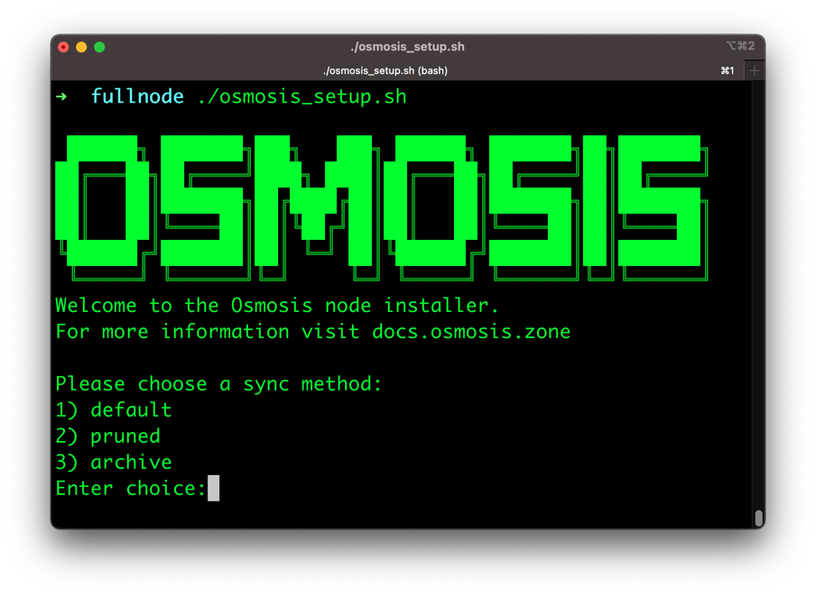

#Osmosis Node Bash Installer
This is a installer bash script to run a full node and  test node eventually. Please use this issue to track 

Based on the work by @hyehan [here](https://github.com/osmosis-labs/awesome/blob/main/tools/spin_osmosis_with_snapshot.md)
