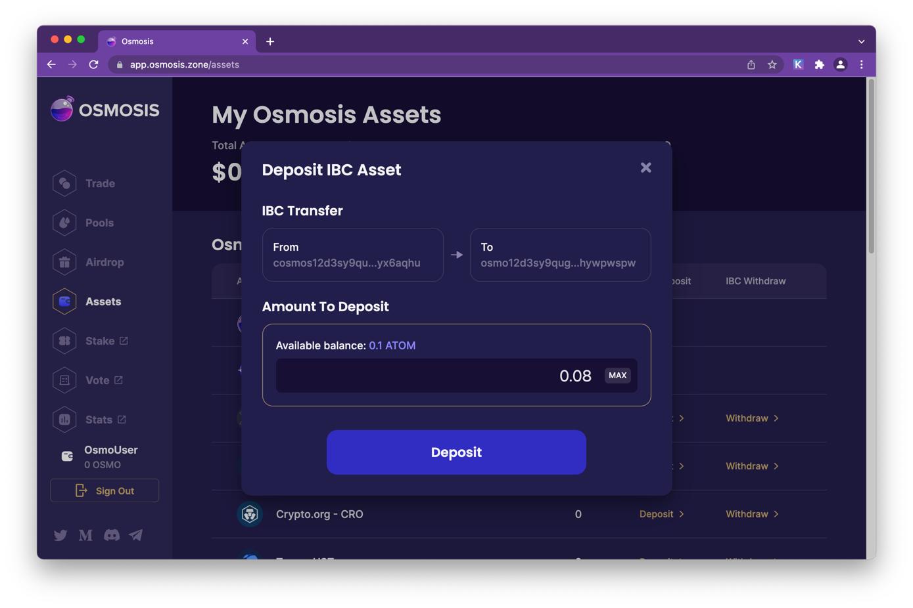

# Getting Started
Before opening the Osmosis AMM App, make sure to install the [Keplr Wallet](../wallets/keplr).

## Open the App
Go to [https://app.osmosis.zone/](https://app.osmosis.zone/)

## Connect Wallet

Click Approve. This confirms that you are connecting to the app.osmosis.zone and the chain osmosis-1.

::: danger Always make sure you are connected to the right domain (app.osmosis.zone) name and network (osmosis-1) 
:::

## Deposit Funds

Click Assets. Then click on the deposit link next to the asset name. For this example we are clicking the ATOM deposit link. 

Accept connection to cosmoshub-4

Once connected, select how much you would like to deposit, then click the deposit button

Approve the transaction

Once the transaction is completed a series if confirmations notifications will  be displayed including the IBC confirmation.

## Swapping Tokens

Pending....

 
