# Getting Started
Before opening the Osmosis AMM App, make sure to install the [Keplr Wallet](../../wallets/keplr).

## Open the App
Go to [https://app.osmosis.zone/](https://app.osmosis.zone/)

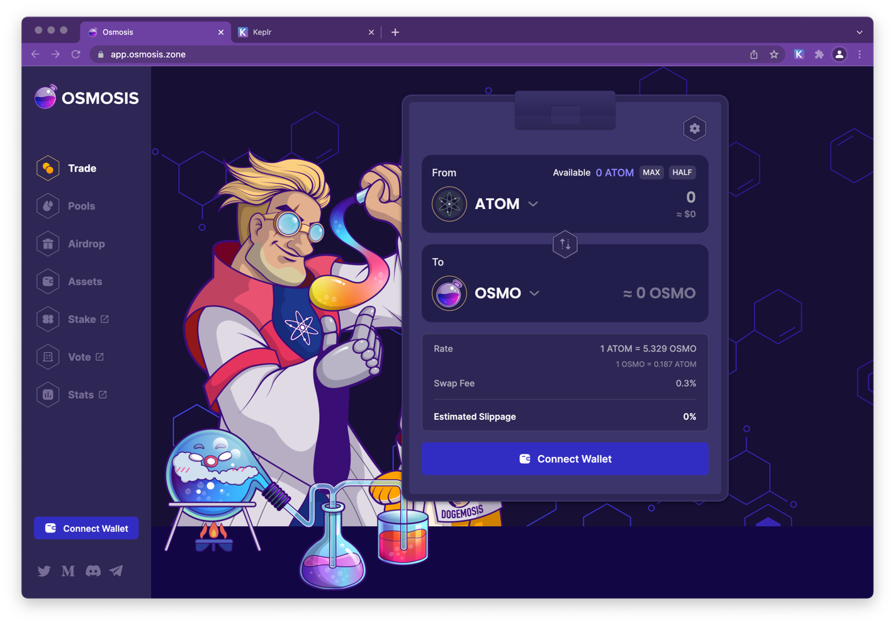

## Connect Wallet
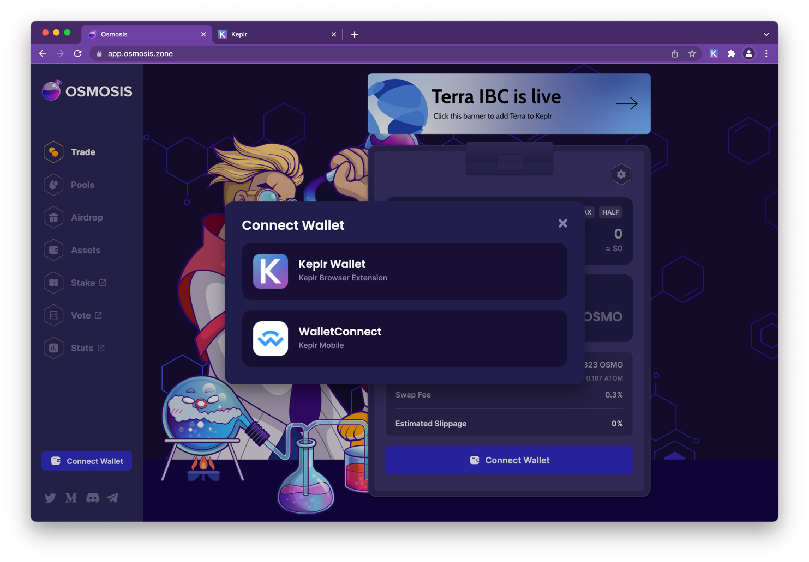

Click Approve. This confirms that you are connecting to the app.osmosis.zone and the chain osmosis-1.

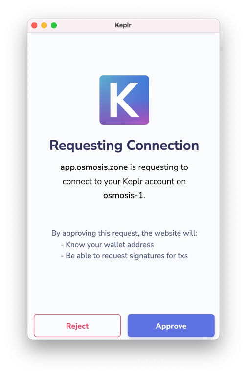

::: danger 
Always make sure you are connected to app.osmosis.zone name and network (osmosis-1)
:::

## Deposit Funds

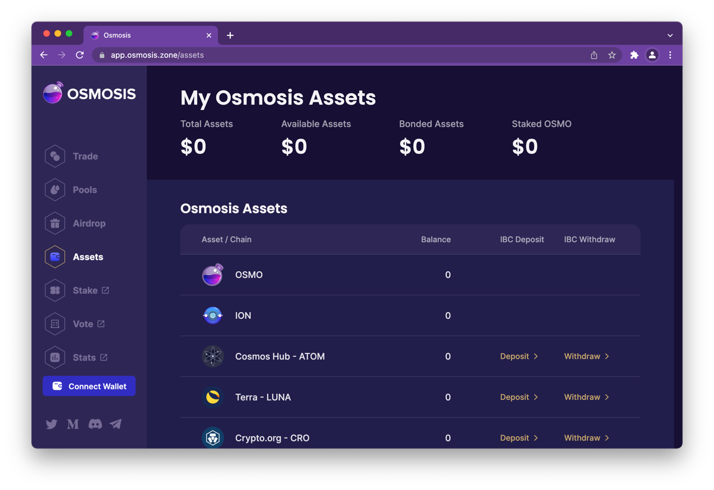

Click Assets. Then click on the deposit link next to the asset name. For this example we are clicking the ATOM deposit link. 

Accept connection to cosmoshub-4

 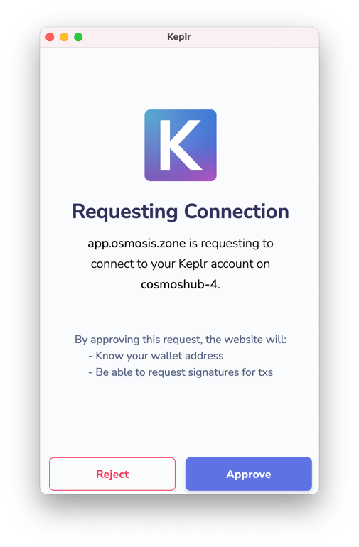

Once connected, select how much you would like to deposit, then click the deposit button

Approve the transaction

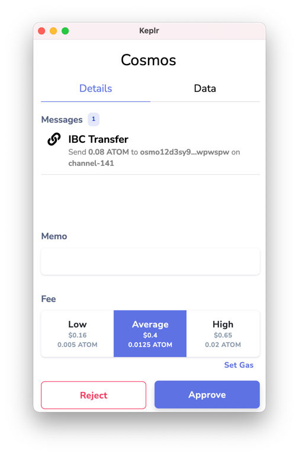

Once the transaction is completed a series if confirmations notifications will  be displayed including the IBC confirmation.

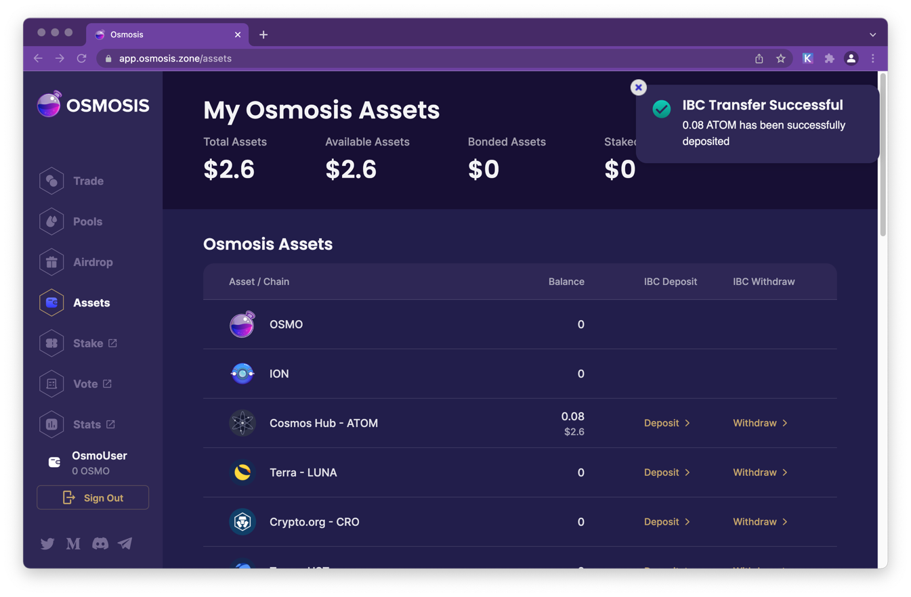

## Swapping Tokens

Trading tokens is as easy as clicking on the Trade link and then selecting the pair you would like to trade.  Check out the [glossary](/overview/terminology.html) to learn about terms such as [slippage](/overview/terminology.html#slippage). 
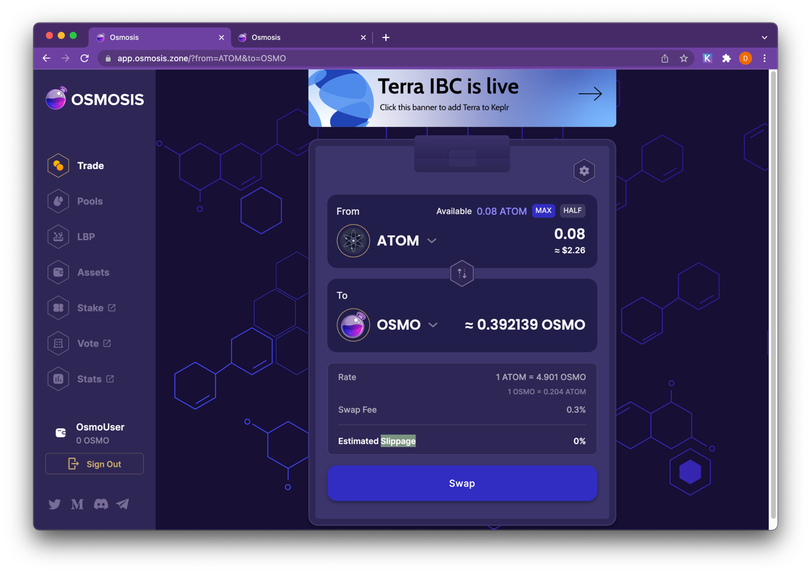

# Adding Liquidity to a Pool
Select a pool from the [Pools](https://app.osmosis.zone/pools) page.
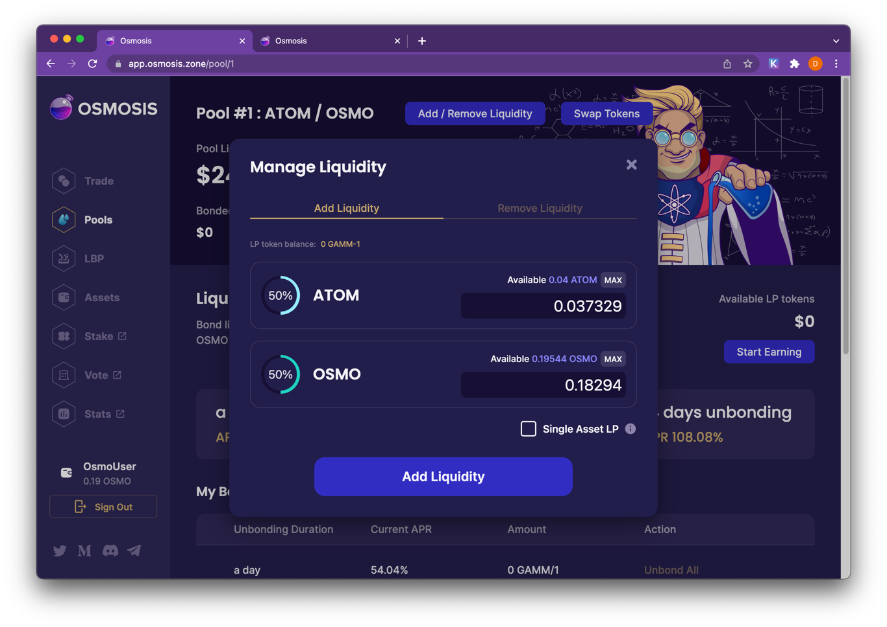

Then click Add/Remove Liquidity
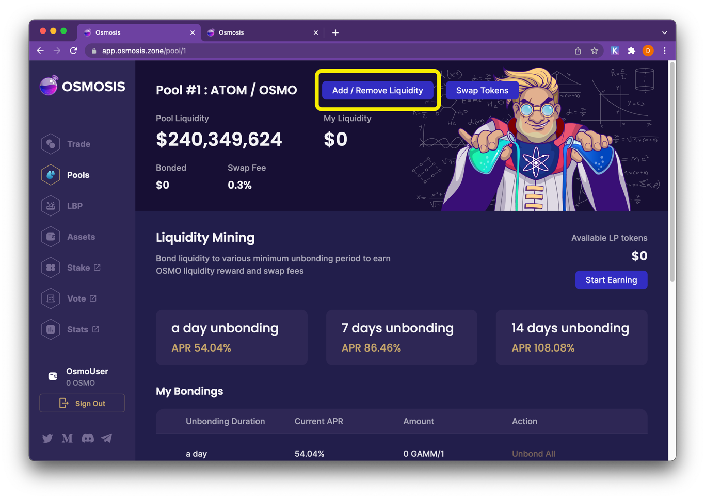

Input a quantity of one of the assets. The quantity of the other asset(s) will auto-complete. (Pools require assets to be deposited in pre-determined weights.)

::: warning Warning
Please note that simply adding liquidity will not give you rewards. In order to get rewards you must bond LP tokens. 
:::

To remove liquidity, input the percentage amount to withdraw.

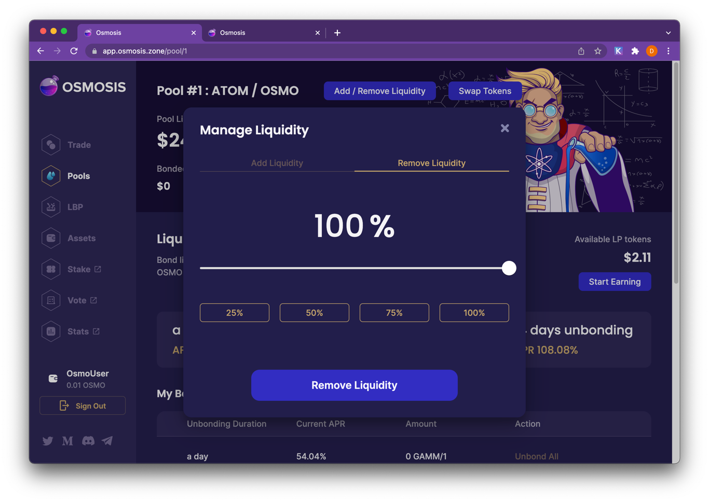

Incentivized pools receive OSMO liquidity mining rewards. Rewards are distributed to bonded LP tokens in these pools that meeting the bonding length criteria.

## Bonding LP Tokens
 Start Earning! Users can choose to bond their LP tokens after depositing liquidity. LP tokens remain bonded for a length of their time of their choosing. Bonded LP tokens are eligible for liquidity mining rewards if they meet the minimum bonding length requirement.

Click Start Earning and choose a bonding length.

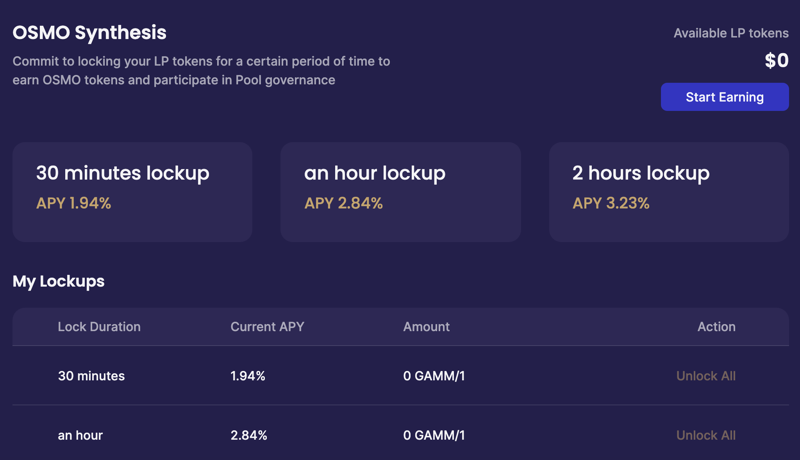

When a user wants to stop bonding an LP token, they submit a transaction that begins the unbonding period. After the end of the timer, they can submit another transaction to withdraw the tokens.

## Create a New Pool

Creating pools in Osmosis is permissionless, meaning any user can create a pool with two or more supported assets.
Go to Pools > Create a Pool. Select from your wallet the assets that will comprise the pool. Choose a weight for each asset.

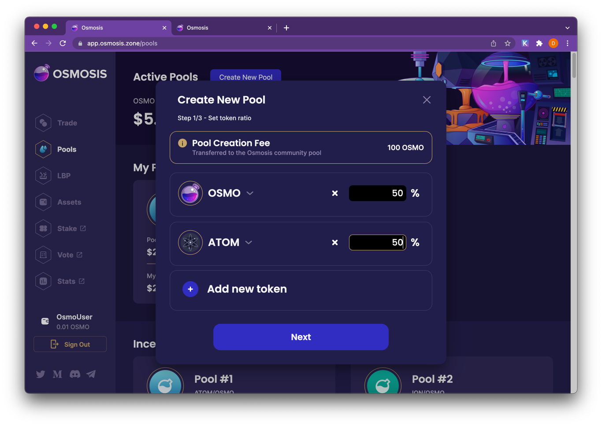

Choose a quantity of each asset to deposit into the pool.

Input a swap fee for the pool. (An explanation of swap fees can be found [here](/overview/terminology.html#fees).)

Click Create a Pool and voilà! The pool is launched. The parameters chosen when creating the pool (token weights, swap fees) cannot be changed later.

 
