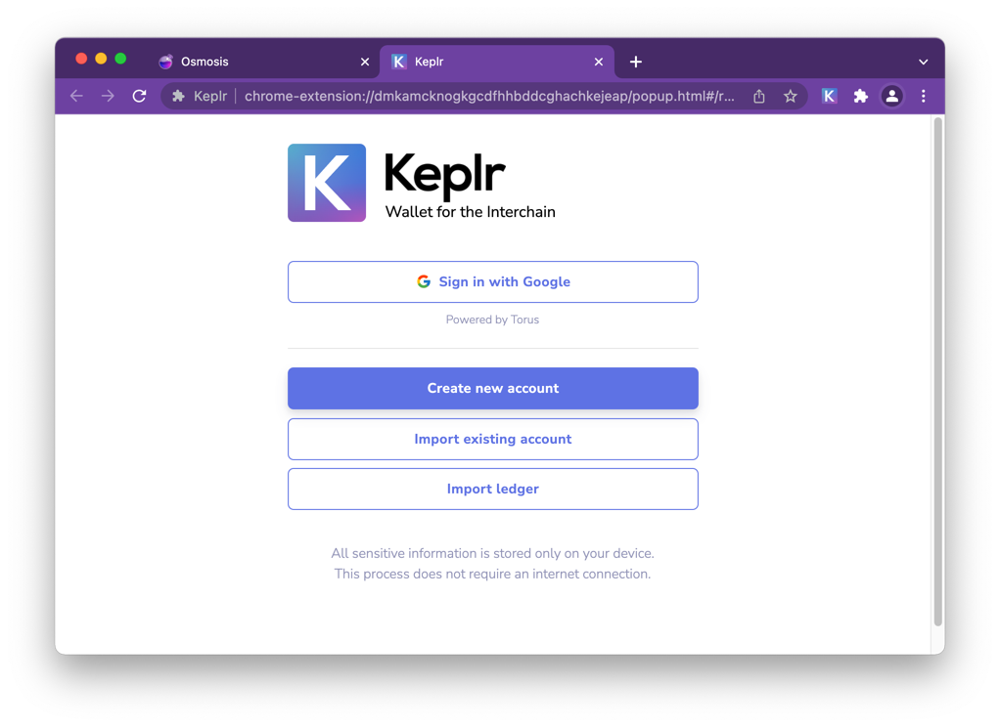
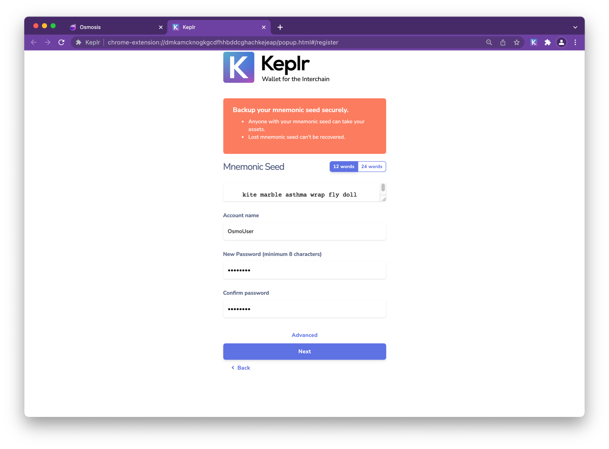
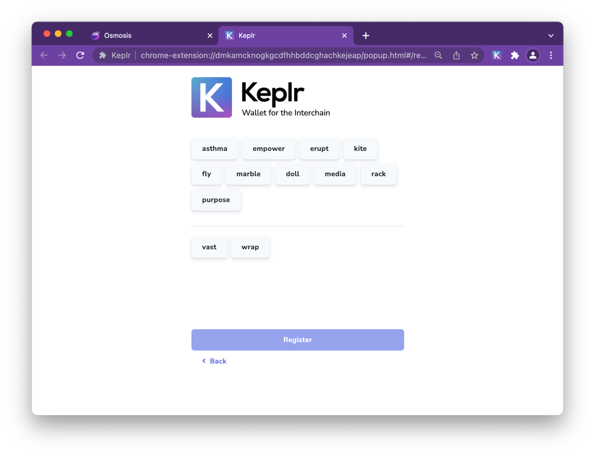
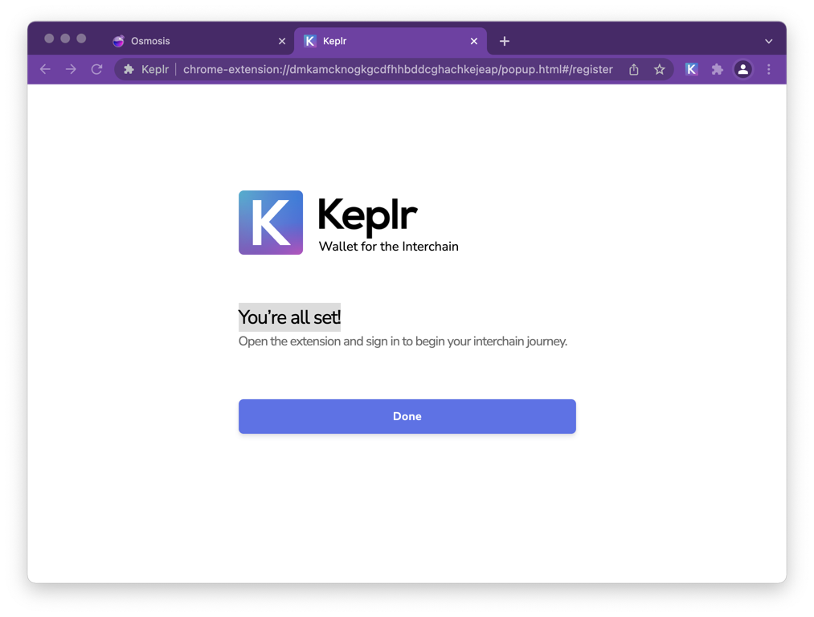

# Create Keplr Wallet

## How to create a new Account via Manemonic/Seed Phrase
If you are setting up Keplr for the first time: In the initial pop-up window, choose [Create New Account]

If you have used Keplr before: In the extension click on the silhouette in the upper-right-hand corner, then the blue box [Add Account] & select [Create New Account]

Choose to have a seed/mnemonic phrase of 24 words, then be sure to save them.
The safest way is to write the words on paper and store them in a secure place. Avoid taking screenshots of the words or copying them into your computer/phone notes.

Now enter a name for your account (you can change it later).

You can change the derivation path by clicking on [Advanced], but this is optional and not suggested for how we are going to use Keplr.

If you are interested in knowing more about the HD wallet derivation path, you can find more in the Keplr FAQ, section [General Questions].

Once you are sure that you have correctly transcribed the seed/mnemonic phrase, click on [Next].

To confirm the creation of the new account, all you have to do is click on the words in the right order in which they appear in your seed/mnemonic phrase and press [Register].

If you have just downloaded Keplr extension, it’s time to set your password! Choose carefully, if possible select a password you’re not using in any other application, and then click [Confirm].

If you have used Keplr before, this step will be skipped as you have already set your password when creating/importing your first account
