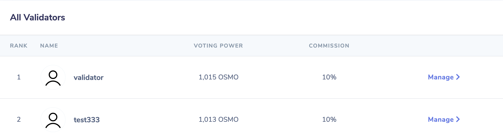
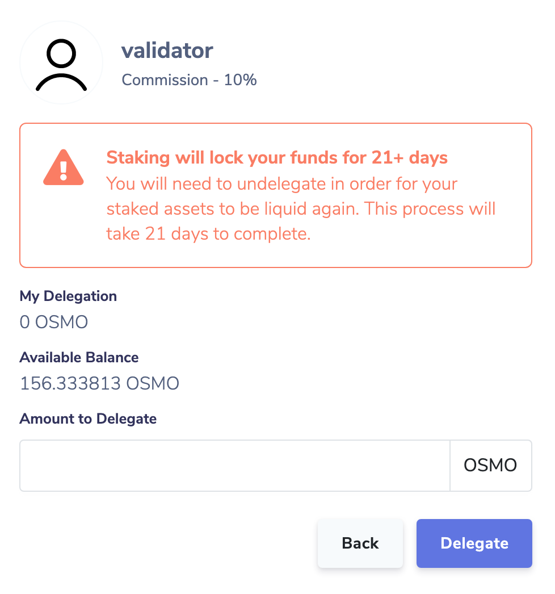

# Staking

## Staking OSMO

OSMO holders can delegate their OSMO to validators, who add these tokens to their slashable bond. Delegators receive staking rewards, less the validator's commission.
To stake OSMO, select a validator from the list.

Input a quantity of OSMO to delegate to this validator. Staked OSMO takes 14 days to unbond. Tokens can be withdrawn two weeks after the unbonding process is initiated by the user.

Staked OSMO is used to help secure the network. In exchange for their contributions, owners of staked OSMO receive staking rewards and transaction fees.

