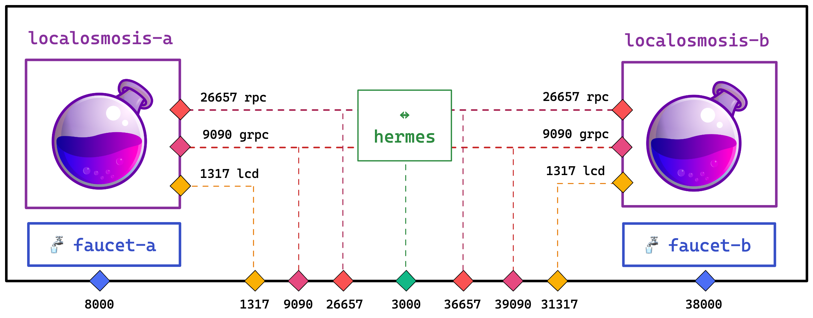

# Localrelayer

Localrelayer is a local testing environment composed of two localOsmosis instances connected by a relayer.



## Endpoints

| Chain ID         | Component  | Endpoint                 |
|------------------|------------|--------------------------|
| `localosmosis-a` | `RPC`      | <http://localhost:26657> |
| `localosmosis-a` | `REST/LCD` | <http://localhost:1317>  |
| `localosmosis-a` | `gRPC`     | <http://localhost:9090>  |
| `localosmosis-a` | `faucet`   | <http://localhost:8080>  |
| `localosmosis-b` | `RPC`      | <http://localhost:36657> |
| `localosmosis-b` | `REST/LCD` | <http://localhost:31317> |
| `localosmosis-b` | `gRPC`     | <http://localhost:39090> |
| `localosmosis-b` | `faucet`   | <http://localhost:38080> |
| `-`              | `hermes`   | <http://localhost:3000>  |

## Accounts

By default the following mnemonics are used:

| Chain ID         | Account       | Mnemonic                                                                                                                                                          |
|------------------|---------------|-------------------------------------------------------------------------------------------------------------------------------------------------------------------|
| `localosmosis-a` | `validator-a` | *family album bird seek tilt color pill danger message abuse manual tent almost ridge boost blast high comic core quantum spoon coconut oyster remove*            |
| `localosmosis-a` | `faucet`      | *increase bread alpha rigid glide amused approve oblige print asset idea enact lawn proof unfold jeans rabbit audit return chuckle valve rather cactus great*     |
| `localosmosis-a` | `relayer`     | *black frequent sponsor nice claim rally hunt suit parent size stumble expire forest avocado mistake agree trend witness lounge shiver image smoke stool chicken* |
| `localosmosis-b` | `validator-b` | *family album bird seek tilt color pill danger message abuse manual tent almost ridge boost blast high comic core quantum spoon coconut oyster remove*            |
| `localosmosis-b` | `faucet`      | *increase bread alpha rigid glide amused approve oblige print asset idea enact lawn proof unfold jeans rabbit audit return chuckle valve rather cactus great*     |
| `localosmosis-b` | `relayer`     | *black frequent sponsor nice claim rally hunt suit parent size stumble expire forest avocado mistake agree trend witness lounge shiver image smoke stool chicken* |


## Deploy

Build a local docker image with current changes

```bash
make build
```

Start the testing environment:

```bash
make start
```

The command will:

1. create a local docker network:

```bash
 ⠿ Network localrelayer_localosmosis        Created
```

2. run the following containers:

```bash
 ⠿ Container localrelayer-localosmosis-b-1  Created
 ⠿ Container localrelayer-localosmosis-a-1  Created
 ⠿ Container localrelayer-faucet-a-1        Created
 ⠿ Container localrelayer-faucet-b-1        Created  
 ⠿ Container localrelayer-hermes-1          Created
```

> If you don't want the logs, you can start in detached mode with the following command:
> 
> `make startd`

Check that everything is running:

```bash
docker ps
```

Expected output:

```bash
❯ docker ps
CONTAINER ID   IMAGE                          COMMAND                  CREATED              STATUS         PORTS                                                                                   NAMES
318c89d3015f   informalsystems/hermes:1.1.0   "/home/hermes/setup.…"   About a minute ago   Up 2 seconds   0.0.0.0:3000->3000/tcp                                                                  localrelayer-hermes-1
ff7abb62fdb3   confio/faucet:0.28.11          "/app/packages/fauce…"   About a minute ago   Up 2 seconds   0.0.0.0:38000->8000/tcp                                                                 localrelayer-faucet-b-1
7e7ca3ff8a67   confio/faucet:0.28.11          "/app/packages/fauce…"   About a minute ago   Up 2 seconds   0.0.0.0:8000->8000/tcp                                                                  localrelayer-faucet-a-1
d90ec29c7a6f   local:osmosis                  "/osmosis/setup.sh"      About a minute ago   Up 3 seconds   26656/tcp, 0.0.0.0:31317->1317/tcp, 0.0.0.0:39090->9090/tcp, 0.0.0.0:36657->26657/tcp   localrelayer-localosmosis-b-1
e36cead49a07   local:osmosis                  "/osmosis/setup.sh"      About a minute ago   Up 3 seconds   0.0.0.0:1317->1317/tcp, 0.0.0.0:9090->9090/tcp, 0.0.0.0:26657->26657/tcp, 26656/tcp     localrelayer-localosmosis-a-1
```

## Usage

### Interact with chain

Check `localosmosis-a` status:

```bash
curl -s http://localhost:26657/status
```

Check `localosmosis-b` status:

```bash
curl -s http://localhost:36657/status
```

### Faucet

The faucet used is `confio/faucet:0.28.11`. The source code and additional documentation are available [here](https://github.com/cosmos/cosmjs/tree/main/packages/faucet).

Create a new account:

```bash
❯ osmosisd keys add my-account --keyring-backend test

- name: my-account
  type: local
  address: osmo1e5zmvznxr0zuulsstna0rd3959sw858e5ctw2j
  pubkey: '{"@type":"/cosmos.crypto.secp256k1.PubKey","key":"AougdpyGftv+BMBXzQWFVJx9ASz/QRoBDM0nRI/xq90Y"}'
  mnemonic: ""
```

Request founds:

```bash
FAUCET_ENDPOINT=http://localhost:8080

# Use the following endpoint for localosmosis-b:
# FAUCET_ENDPOINT=http://localhost:38080

curl --header "Content-Type: application/json" \
  --request POST \
  --data '{"denom":"uosmo","address":"osmo1e5zmvznxr0zuulsstna0rd3959sw858e5ctw2j"}' \
  http://localhost:8000/credit
```

Check balance:

```bash
LCD_ENDPOINT=\localhost:1317

# Use the following endpoint for localosmosis-b:
# LCD_ENDPOINT=localhost:31317

curl -s http://$LCD_ENDPOINT/cosmos/bank/v1beta1/balances/osmo1e5zmvznxr0zuulsstna0rd3959sw858e5ctw2j
```

### Hermes

You can test that hermes is working by sending a test IBC transaction.

Make sure `hermes` is running:

```bash
❯ docker ps | grep hermes
```

Expected output:

```bash
318c89d3015f   informalsystems/hermes:1.1.0   "/home/hermes/setup.…"   23 minutes ago   Up 22 minutes   0.0.0.0:3000->3000/tcp  
```

Exec inside the container:

```bash
docker exec -ti localrelayer-hermes-1 sh
```

Send a transaction from juno to osmosis:

```bash
hermes tx ft-transfer --timeout-seconds 1000 \
    --dst-chain localosmosis \
    --src-chain localjuno \
    --src-port transfer \
    --src-channel channel-0 \
    --amount 100 \
    --denom ujuno
```

Or from osmosis container:

```bash
osmosisd tx ibc-transfer transfer transfer channel-0 \
  juno1qvdeu4x34rapp3wc8fym5g4wu343mswx5skadx  \
  --keyring-backend test \
  --chain-id localosmosis \
  1uosmo \
  --from validator -y \
  --gas auto \
  --gas-prices 0.1uosmo \
  --gas-adjustment 1.3 \
  --memo '{"my-memo": "message"}'
```
