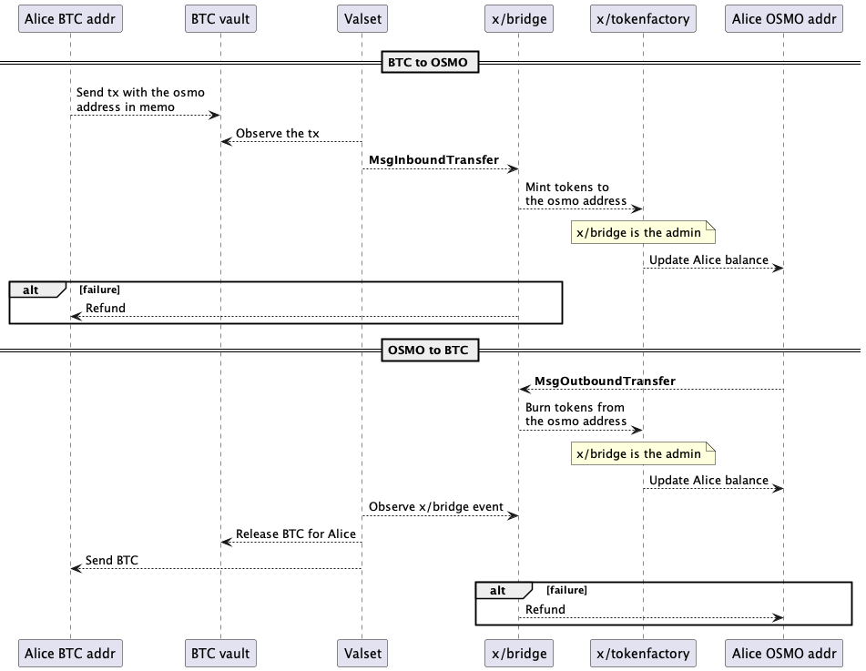
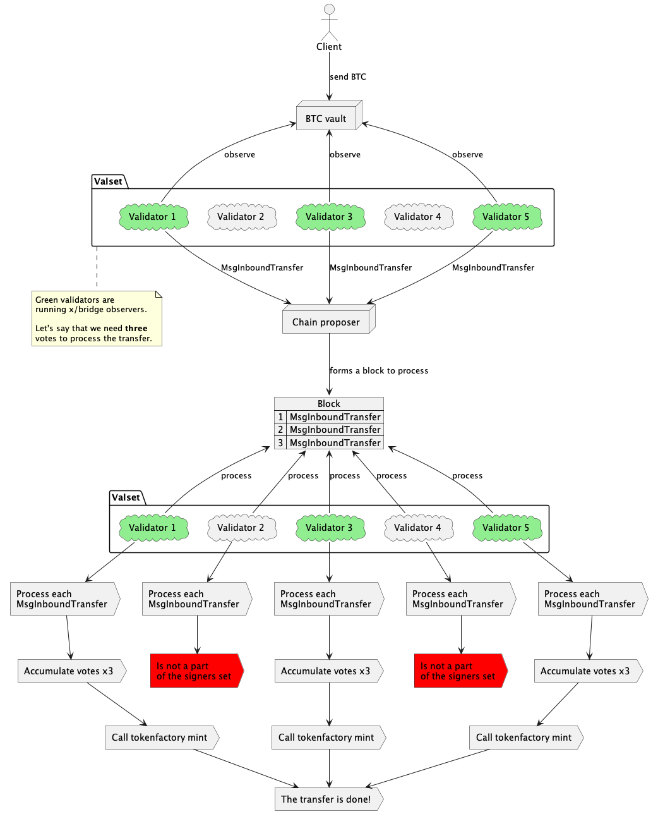
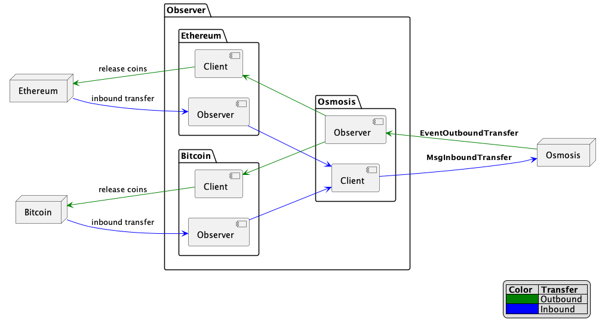
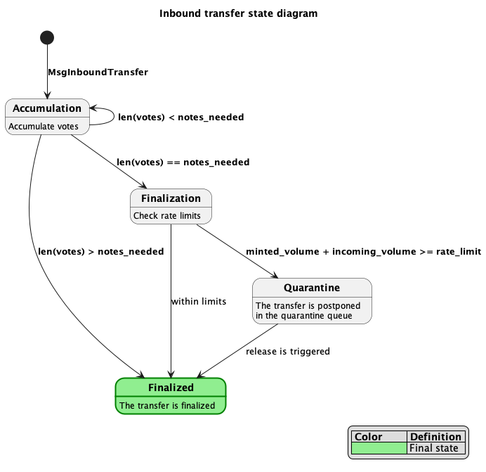
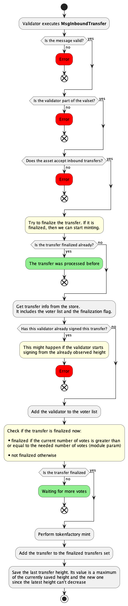

# Bridge

## Abstract

This README provides a detailed outline of the bridging mechanism implementation, which facilitates cross-chain asset transfers between Osmosis and various external chains. The mechanism aims to integrate Osmosis with other blockchains, beginning with the BTC network. The primary objective is to enable decentralized cross-chain asset transfers, seamlessly connecting Osmosis with other blockchain ecosystems.


## Contents

* **[Concepts](#concepts)**
  * **[Super valset](#super-valset)**
  * **[Vault](#vault)**
  * **[Observer](#observer)**
  * **[Asset](#asset)**
  * **[Minting and burning](#minting-and-burning)**
  * **[Votes](#votes)**
  * **[Rate limiting](#rate-limiting)**
  * **[Quarantine](#quarantine)**
  * **[Validator fee](#validator-fee)**
  * **[Refunds](#refunds)**
* **[Design](#design)**
  * **[Inbound transfers](#inbound-transfers)**
  * **[Outbound transfers](#outbound-transfers)**
  * **[Observer](#observer-1)**
  * **[Quarantine](#quarantine-1)**
  * **[Validators reviving](#validator-reviving)**
* **[State](#state)**
* **[Query Server](#query-server)**
* **[Message Server](#message-server)**
* **[Events](#events)**


## Concepts

### Super valset

The core concept of cross-chain transfers involves a selected group of validators, known as the **super valset**, which operates the **observer**. This functionality enables the bridging of assets between external chains and Osmosis, and vice versa. Initially, the **super valset** is formed by Osmosis validators and is empty at genesis. However, its composition can be altered through governance processes.

The **super valset** is responsible for monitoring activities on external chains and managing all incoming transfers to Osmosis. Conversely, it also tracks events within Osmosis, identifies outbound transfers to external chains, and facilitates these transactions.

### Vault

To facilitate cross-chain transfers, a representative entity, referred to as the vault, must be present on the external chain. Essentially, the vault is an address on the external chain that is persistently being observed by the **super valset** members. If the client wants to execute a cross-chain transfer from the external chain to Osmosis, they must send their assets to the **vault**, specifying the desired Osmosis recipient. After that, the **super valset** will observe this transfer and start handling it.

### Observer

The **Observer**, running as part of the `osmosisd` binary, operates exclusively within the nodes of the **super valset**. It functions as a background process that monitors both external chains and Osmosis. Its components include:

* **External Chain Observers**: One for each chain, these observers track all transactions occurring within the vault. Upon identifying a valid transaction (e.g., one with the correct memo), they facilitate its transfer to Osmosis.
* **External Chain Clients**: One for each chain, these clients communicate with external chains, allowing the **observer** to perform transfers and other supporting operations.
* **Osmosis Observer**: This observer monitors all tx results on Osmosis, focusing only on relevant ones such as **MsgOutboundTransfer**.
* **Osmosis Client**: The client helps perform method calls to Osmosis such as triggering **MsgInboundTransfer**.
* **TSS Signer**: This component manages outbound transfers from Osmosis. It handles the signing of these transfers and selects a leader to broadcast them.

_Additional components are to be determined._

### Asset

In the context of Osmosis, an asset refers to the representation of an external token within Osmosis. Specifically, an asset is identified by a pair: the name of the external chain and the corresponding token on that chain. For example:

* Source chain: Bitcoin, token: BTC
* Source chain: Ethereum, token: USDT

The asset has a status and the 'last transfer height'.

Each asset is characterized by its status and the last transfer height.

The asset's status indicates the types of transfers that are permissible with it. The possible statuses are:

* Only inbound transfers allowed.
* Only outbound transfers allowed.
* Both inbound and outbound transfers allowed.
* All transfers blocked.

The 'last transfer height' refers to the latest block height on the asset’s chain containing the finalized transfer. You can find more details about the finalization process in the [Votes](#votes) section. Validators use this height as a starting point for the **observer**.

### Votes

In the `x/bridge` module, a **vote** signifies that the member of the **super valset** has acknowledges, verified, and correctly processed the transfer.

For inbound transfers, the `x/bridge` module employs the `votes_needed` parameter to determine the required number of votes for a transfer to be considered complete. When processing an inbound transfer, the module accumulates votes cast for that transfer. A validator casts a **vote** for an inbound transfer by sending a **MsgInboundTransfer** to the chain proposer after its observation. The transfer is deemed **finalized** and the minting process initiated once the number of votes reaches the `votes_needed`.

Consider an example where `votes_needed` is set to 3, and there are 4 members in the **super valset**. The module will initiate token minting for the destination address once it receives the third vote. Although the fourth vote is counted, it doesn’t prompt any further action. Conversely, if two validators from the **super valset** are inactive, the maximum number of votes obtainable would be two. In such a case, the transfer remains pending until another validator joins and votes, fulfilling the `votes_needed` criterion.

_For outbound transfers, the process is to be determined._

### Minting and burning

The module utilizes [tokenfactory](../tokenfactory/README.md) functionality to facilitate cross-chain transfers. The core idea is to have Osmosis-based representations of assets from various external chains to operate with them during the transfers. For instance, transferring 0.05 BTC from Bitcoin would result in receiving an equivalent 5 OSMOBTC on Osmosis, assuming a 1:100 ratio, and vice versa (note this is a hypothetical example with made-up token names and ratios). This is achieved by creating unique denoms for each external asset, managed by the `x/bridge` module, which acts as the admin for all such denoms (refer to [CreateDenom](../tokenfactory/README.md#createdenom) for details).

The transfer process is straightforward:

* When the `x/bridge` module receives an inbound transfer, it starts accumulating votes for this transfer. Once the vote threshold is met, it employs the tokenfactory's [Mint](../tokenfactory/README.md#mint) method to mint the appropriate amount of coins for the destination address.
* For an outbound transfer, the `x/bridge` module uses the tokenfactory's [Burn](../tokenfactory/README.md#burn) method to burn the specified amount of coins from the sender's address. Subsequently, an **EventOutboundTransfer** event is emitted and handled by the **super valset** through the **observer**.

### Rate limiting

**Rare limiting** is a strategy used to restrict the amount of incoming volume over a specified period of time. For instance, consider a scenario where the limit is set to 1 BTC every 10 minutes. Should the module receive more than 1 BTC within this 10-minute timeframe, any excess volume above the permitted amount would not be minted and instead be placed in **quarantine** (for more details, please see the [Quarantine](#quarantine) section). This approach is crucial for ensuring chain security, as it prevents the system from being overwhelmed by excessive, uncontrolled minting. Essentially, rate limiting acts as a safeguard, setting a maximum on potential losses the chain might incur due to unforeseen malicious activities.

### Quarantine

The **quarantine** mechanism ensures the smooth handling of inbound transfers, even during periods when asset activity is paused due to rate limiting, maintenance, or other factors that might otherwise halt the minting process.

The **quarantine** solves the following problem: when the module is unable to process transfers for reasons like exceeding rate limits, maintenance shutdowns, or other transfer-blocking circumstances, it cannot accept new transfers. For outbound transfers, this is straightforward as new requests are simply rejected with an error message. However, managing inbound transfers is more complex. Users perceive inbound transfers as transactions to the dedicated **vault**, and since the incoming flow on external chains can't be directly controlled, users might continue sending transfers irrespective of module availability.

Refunding these transfers could be an option, but it's neither efficient nor entirely secure. Therefore, the **quarantine** approach is employed. Transfers that cannot be minted immediately are placed in the **quarantine**, to be processed at a later, more suitable time. Crucially, **quarantine** does not block transfers; it merely defers them. This process is transparent, informing users that their transfers are delayed but will be processed as soon as conditions allow.

### Validator fee

_To be determined._

### Refunds

_To be determined._


## Design

The following provides a high-level overview of the transfer design. For more in-depth information, refer to the detailed processes described further.



### Inbound transfers

1. The client initiates the transfer by sending it to the dedicated vault on the external chain.
2. During this process, the client must specify the intended recipient's address in Osmosis. The method for specifying varies by chain; for example, it might be done through a memo. 
3. Validators in the **super valset** run the **observer** to monitor the vault continuously. 
4. Upon detecting a new inbound transfer, these validators process it and generate a **MsgInboundTransfer** message. 
5. This message is then sent to the chain proposer by each validator. 
6. It’s important to note that as every validator in the **super valset** performs this action, the number of messages in a block will correspond to the size of the **super valset**. 
7. Once a block is formed, all Osmosis validators begin to process it. 
8. They process the transfers sequentially, compiling a list of all validators who have voted (i.e., sent the message) for each transfer. 
9. A transfer is deemed **finalized** once the count of voters for it meets the required vote threshold, as set by the module parameter.
10. If the transfer is **finalized**, then coins are minted to the destination address through the `x/tokenfactory` module.



As a security precaution, all non-finalized transfers are recorded in the state using a `external_id | external_height` composite key during the vote accumulation phase. This approach is designed to guard against the potential of malicious validators submitting transfers with incorrect `external_height` values. Essentially, a transfer entry that has an incorrect `external_height` is unlikely to receive sufficient confirmations, and as a result, it will not reach the finalization stage.

### Outbound transfers

1. The transfer process begins when the client invokes the **OutboundTransfer** method via the message server.
2. The `x/bridge` module then processes this request by invoking the tokenfactory's burn function, using the client's address as a burning address.
3. The module generates the **EventOutboundTransfer** event.
4. This event is captured by members of the **super valset** through the **observer**. 
5. After receiving it, they start submitting their signatures to the TSS Server.
6. Once the TSS Server collects all the needed signatures, it starts the leader election process.
7. The selected leader broadcasts the transfer to the external chain, releasing the **vault** and transferring coins to the destination address.


### Observer

_Detailed description is to be done._



### Quarantine

The **quarantining** might be initiated right after an inbound transfer reaches the required number of votes for processing. When a transfer receives the final necessary vote, the module evaluates it against the asset's rate limits. If the transfer exceeds these limits, it is added to the end of the quarantine queue. This queue can be activated for processing through a governance proposal. Notably, **quarantining** allows for partial execution: if a part of the transfer falls within the rate limits, that portion will be minted, while the remainder goes into the queue.

There are two methods for managing quarantined assets:

* Simply storing the queue in the state. Here, if rate limits are exceeded, the coins are added to the state queue without minting. Upon release, the tokenfactory's Mint function is called for the relevant addresses.
* Minting all coins to a special **quarantine** address (not the destination address) immediately after finalization. The coins are then transferred to their intended addresses upon release following a governance proposal. This method still requires the state queue, but operations are based solely on straightforward transfers. It also offers a transparent view of the **quarantine**, represented by a dedicated **quarantine** vault on Osmosis.



For **quarantining**, a queue is utilized instead of a map to allow sequential execution of transfers and to potentially filter out malicious transactions. While this queue cannot completely eliminate all malicious transfers, it can help segregate them and make them less harmful. As a security measure, periodically matching the total supply of minted assets with the balances in external vaults can help identify fraudulent activity.

### Validator reviving

The module uses a combination of the finalization flag and the last transfer height value to ensure that validators can join the valset at any time and begin processing transfers from any height without compromising integrity of the bridging process.

The last transfer height is crucial for coordinating validators, guiding them to the appropriate starting point for their observations. Validators have the option to rely on this module's height value or to use their own local height checkpoints for starting or continuing observation. The last transfer height, linked to each asset, is updated whenever a transfer involving the asset occurs, calculated as `max(current_last_height, new_last_height)`, where `current_last_height`  is the value from the state, and `new_last_height` is obtained during finalizing the transfer. This is necessary because the module cannot ensure a sequential order for processing transfers.

Despite validators having the flexibility to start observing from any height, it doesn't pose a risk to the module's operations. This is because transfers that have already been finalized will not trigger the finalization again, thereby maintaining the system's integrity.


## State

The `x/bridge` module keeps state of the following objects:

### Inbound transfer
When accepting the inbound transfer, the new `InboundTransfer` record in the state is created. This record stores all information about the transfer along with the voter list and finalization flag. This object is stored in the state until the transfer **finalized**. After that, the object should be garbage-collected.

* Inbound transfer: `0x01 | external_id | external height -> ProtocolBuffer(InboundTransfer)`

```protobuf
// InboundTransfer is a representation of the inbound transfer.
message InboundTransfer {
  // ExternalId is a unique ID of the transfer coming from outside.
  // Serves the purpose of uniquely identifying the transfer in another chain
  // (e.g., this might be the BTC tx hash).
  string external_id = 1 [ (gogoproto.moretags) = "yaml:\"external_id\"" ];
  // ExternalHeight is the height at which the transfer occurred in the external
  // chain
  uint64 external_height = 2
  [ (gogoproto.moretags) = "yaml:\"external_height\"" ];
  // DestAddr is a destination Osmosis address
  string dest_addr = 3 [ (gogoproto.moretags) = "yaml:\"dest_addr\"" ];
  // AssetID is the ID of the asset being transferred
  AssetID asset_id = 4 [
  (gogoproto.moretags) = "yaml:\"asset_id\"",
  (gogoproto.nullable) = false
  ];
  // Amount of coins to transfer
  string amount = 5 [
  (gogoproto.moretags) = "yaml:\"amount\"",
  (gogoproto.customtype) = "cosmossdk.io/math.Int",
  (gogoproto.nullable) = false
  ];
  // Voters is a list of validators signed this transfer
  repeated string voters = 6 [ (gogoproto.moretags) = "yaml:\"voters\"" ];
  // Finalized indicates whether the transfer needs more votes or has
  // already accumulated a sufficient number. The finalised flag is set
  // to true as soon as length(voters) is greater than or equal to
  // the module's param votes_needed.
  bool finalized = 7 [ (gogoproto.moretags) = "yaml:\"finalized\"" ];
}
```

### Finalized transfer

The set of all transfers deemed **finalized**.

* Finalized transfer: `0x02 | external_id -> []byte{}`

### Last transfer height

The mapping of the asset ID to the block height on the external chain at which the most recent transfer involving this asset was successfully **finalized**

* Last transfer height: `0x03 | asset_id -> byte(last_transfer_height)`

### Params

Module parameters are stored in the dedicated params subspace by the `bridge` store key. Params can be updated with governance or the address with authority.

```protobuf
// Params defines params for x/bridge module.
message Params {
  // Signers used to sign inbound and release outbound transactions
  repeated string signers = 1 [ (gogoproto.moretags) = "yaml:\"signers\"" ];
  // Assets is a list used to create tokenfactory denoms
  // for corresponding trading pairs
  repeated Asset assets = 2 [
    (gogoproto.moretags) = "yaml:\"assets\"",
    (gogoproto.nullable) = false
  ];
  // VotesNeeded marks how many signers out of the list of signers need
  // to sign until a tx can be considered finalized
  uint64 votes_needed = 3 [ (gogoproto.moretags) = "yaml:\"votes_needed\"" ];
  // Fee defines a param for fee that go towards the validator set
  // signing the incoming/outgoing txs. The fee is measured as a ratio,
  // so its value lies between 0 and 1.
  string fee = 4 [
    (gogoproto.customtype) = "cosmossdk.io/math.LegacyDec",
    (gogoproto.moretags) = "yaml:\"fee\"",
    (gogoproto.nullable) = false
  ];
}
```

Params include information about all available assets.

```protobuf
// AssetID defines a pair of the source chain name and its Osmosis
// representation denoted by denom. AssetID is a primary key for Asset.
message AssetID {
  // SourceChain is a source chain name
  string source_chain = 1 [ (gogoproto.moretags) = "yaml:\"source_chain\"" ];
  // Denom is the Osmosis representation of the SourceChain
  string denom = 2 [ (gogoproto.moretags) = "yaml:\"denom\"" ];
}

// Asset is a representation of the asset.
message Asset {
  // ID is the asset's primary key
  AssetID id = 1
      [ (gogoproto.moretags) = "yaml:\"id\"", (gogoproto.nullable) = false ];
  // Status is a current status of the asset
  AssetStatus status = 2 [ (gogoproto.moretags) = "yaml:\"status\"" ];
  // Exponent represents the power of 10 used for coin representation
  uint64 exponent = 3 [ (gogoproto.moretags) = "yaml:\"exponent\"" ];
  // ExternalConfirmations is a number of the confirmations on the external
  // chain needed to consider the transfer confirmed
  uint64 external_confirmations = 4
      [ (gogoproto.moretags) = "yaml:\"external_confirmations\"" ];
}

enum AssetStatus {
  ASSET_STATUS_UNSPECIFIED = 0;
  ASSET_STATUS_OK = 1;
  ASSET_STATUS_BLOCKED_INBOUND = 2;
  ASSET_STATUS_BLOCKED_OUTBOUND = 3;
  ASSET_STATUS_BLOCKED_BOTH = 4;
}
```


## Query server

### Params

This method is used for getting module parameters.

```protobuf
// QueryParamsRequest is the request type for the Query/Params RPC method.
message QueryParamsRequest {}

// QueryParamsResponse is the response type for the Query/Params RPC method.
message QueryParamsResponse {
  Params params = 1 [
    (gogoproto.moretags) = "yaml:\"params\"",
    (gogoproto.nullable) = false
  ];
}
```

### LastTransferHeight

This method allows to get the last transfer height for the provided asset.

```protobuf
// LastTransferHeightRequest is the request type for the
// Query/LastTransferHeight RPC method.
message LastTransferHeightRequest {
  AssetID asset_id = 1 [
    (gogoproto.moretags) = "yaml:\"asset_id\"",
    (gogoproto.nullable) = false
  ];
}

// LastTransferHeightResponse is the response type for the
// Query/LastTransferHeight RPC method.
message LastTransferHeightResponse {
  uint64 last_transfer_height = 1
      [ (gogoproto.moretags) = "yaml:\"last_transfer_height\"" ];
}
```


## Message server

### InboundTransfer

Each validator invokes this method when processing the **MsgInboundTransfer** message. This message contains all information about the transfer, including the unique primary key from the external chain, such as the Bitcoin transaction hash, and the external chain height at which the transfer was witnessed. Can be called only by the members of the **super valset**.

```protobuf
// MsgInboundTransfer defines the message structure for the InboundTransfer gRPC
// service method. It allows a sender to perform an inbound cross-chain
// transfer, i.e., to transfer their tokens from the source chain to Osmosis and
// get the equivalent amount of the corresponding token (specified in subdenom)
// on Osmosis in return. The tokens are minted through the x/tokenfactory module
// to the destination address.
message MsgInboundTransfer {
  option (amino.name) = "osmosis/bridge/inbound-transfer";

  // ExternalId is a unique ID of the transfer coming from outside.
  // Serves the purpose of uniquely identifying the transfer in another chain
  // (e.g., this might be the BTC tx hash)
  string external_id = 1 [ (gogoproto.moretags) = "yaml:\"external_id\"" ];
  // ExternalHeight is the height at which the transfer occurred in the external
  // chain
  uint64 external_height = 2
      [ (gogoproto.moretags) = "yaml:\"external_height\"" ];
  // Sender is a sender's address
  string sender = 3 [ (gogoproto.moretags) = "yaml:\"sender\"" ];
  // DestAddr is a destination Osmosis address
  string dest_addr = 4 [ (gogoproto.moretags) = "yaml:\"dest_addr\"" ];
  // AssetID is the ID of the asset being transferred
  AssetID asset_id = 5 [
    (gogoproto.moretags) = "yaml:\"asset_id\"",
    (gogoproto.nullable) = false
  ];
  // Amount of coins to transfer
  string amount = 6 [
    (gogoproto.moretags) = "yaml:\"amount\"",
    (gogoproto.customtype) = "cosmossdk.io/math.Int",
    (gogoproto.nullable) = false
  ];
}
```

The diagram below shows the detailed workflow for processing the **MsgInboundTransfer**.



### OutboundTransfer

Clients call this method when transferring tokens to the external chain.

```protobuf
// MsgOutboundTransfer defines the message structure for the OutboundTransfer
// gRPC service method. It allows a sender to perform an outbound cross-chain
// transfer, i.e., to transfer their tokens from Osmosis to the destination
// chain. The tokens are burned through the x/tokenfactory module from the
// sender's address.
message MsgOutboundTransfer {
  option (amino.name) = "osmosis/bridge/outbound-transfer";

  // Sender is a sender's Osmosis address
  string sender = 1 [ (gogoproto.moretags) = "yaml:\"sender\"" ];
  // DestAddr is a destination address
  string dest_addr = 2 [ (gogoproto.moretags) = "yaml:\"dest_addr\"" ];
  // AssetID is the ID of the asset being transferred
  AssetID asset_id = 3 [
    (gogoproto.moretags) = "yaml:\"asset_id\"",
    (gogoproto.nullable) = false
  ];
  // Amount of coins to transfer
  string amount = 4 [
    (gogoproto.moretags) = "yaml:\"amount\"",
    (gogoproto.customtype) = "cosmossdk.io/math.Int",
    (gogoproto.nullable) = false
  ];
}
```

### UpdateParams

The method to update module params. Params can be updated with governance or the address with authority.

```protobuf
// MsgUpdateParams allows to update module params. It contains UpdateParams
// instead of just Params to forbid status updating using this method.
// All new assets introduced with this method have ASSET_STATUS_BLOCKED_BOTH
// status by default.
message MsgUpdateParams {
  option (amino.name) = "osmosis/bridge/update-params";

  // Sender is a sender's address
  string sender = 1 [ (gogoproto.moretags) = "yaml:\"sender\"" ];
  // NewParams should be fully populated
  Params new_params = 2 [
    (gogoproto.moretags) = "yaml:\"new_params\"",
    (gogoproto.nullable) = false
  ];
}
```

### ChangeAssetStatus

This method allows to update the status of the given asset. Only members of the **super valset** can invoke this method.

```protobuf
// MsgChangeAssetStatus changes the status of the provided asset.
message MsgChangeAssetStatus {
  option (amino.name) = "osmosis/bridge/change-asset-status";

  // Sender is a sender's address
  string sender = 1 [ (gogoproto.moretags) = "yaml:\"sender\"" ];
  // AssetID is the ID of the asset to update.
  // The asset should be known; otherwise, the method will failed.
  AssetID asset_id = 2 [
    (gogoproto.moretags) = "yaml:\"asset_id\"",
    (gogoproto.nullable) = false
  ];
  // NewStatus is a new asset's status.
  AssetStatus new_status = 3 [ (gogoproto.moretags) = "yaml:\"new_status\"" ];
}
```


## Events

### EventInboundTransfer

``` protobuf
message EventInboundTransfer {
  // Sender is a sender's address
  string sender = 1;
  // DestAddr is a destination Osmosis address
  string dest_addr = 2;
  // AssetID is the ID of the asset being transferred
  AssetID asset_id = 3 [ (gogoproto.nullable) = false ];
  // Amount of coins to transfer
  string amount = 4 [
    (gogoproto.customtype) = "cosmossdk.io/math.Int",
    (gogoproto.nullable) = false
  ];
}
```

### EventOutboundTransfer

``` protobuf
message EventOutboundTransfer {
  // Sender is a sender's address
  string sender = 1;
  // DestAddr is a destination Osmosis address
  string dest_addr = 2;
  // AssetID is the ID of the asset being transferred
  AssetID asset_id = 3 [ (gogoproto.nullable) = false ];
  // Amount of coins to transfer
  string amount = 4 [
    (gogoproto.customtype) = "cosmossdk.io/math.Int",
    (gogoproto.nullable) = false
  ];
}
```

### EventUpdateParams

``` protobuf
message EventUpdateParams {
  repeated string new_signers = 1;
  repeated string created_signers = 2;
  repeated string deleted_signers = 3;

  repeated Asset new_assets = 4 [ (gogoproto.nullable) = false ];
  repeated Asset created_assets = 5 [ (gogoproto.nullable) = false ];
  repeated Asset deleted_assets = 6 [ (gogoproto.nullable) = false ];

  uint64 new_votes_needed = 7;
  string new_fee = 8 [
    (gogoproto.customtype) = "cosmossdk.io/math.LegacyDec",
    (gogoproto.nullable) = false
  ];
}
```

### EventChangeAssetStatus

``` protobuf
message EventChangeAssetStatus {
  string sender = 1;
  AssetID asset_id = 2 [ (gogoproto.nullable) = false ];
  AssetStatus old_status = 3;
  AssetStatus new_status = 4;
}
```
