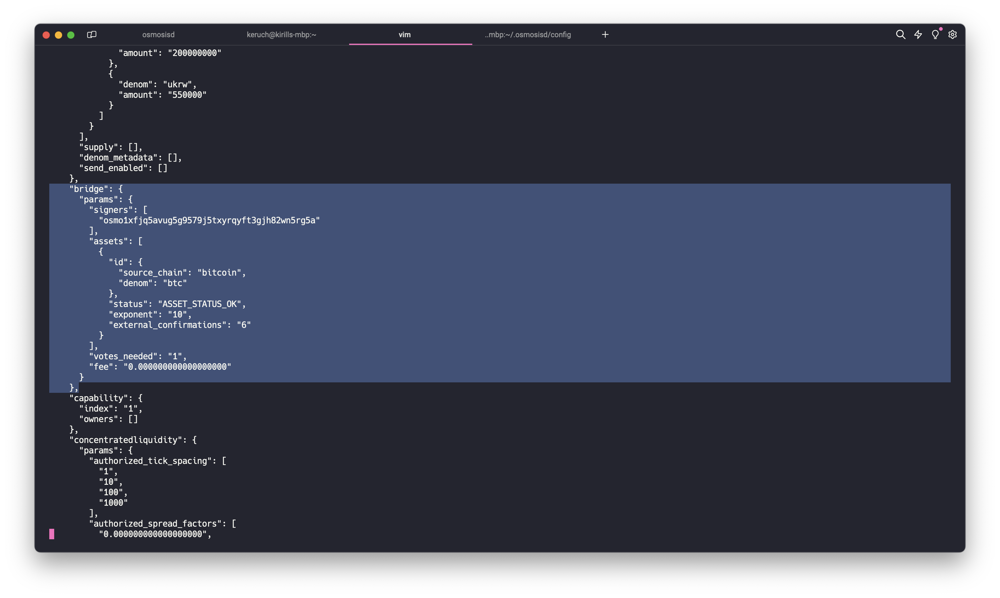
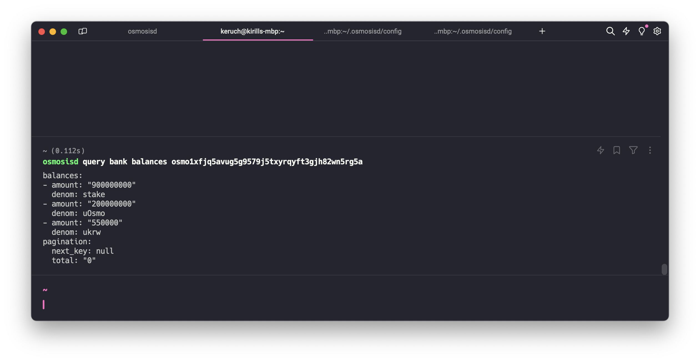
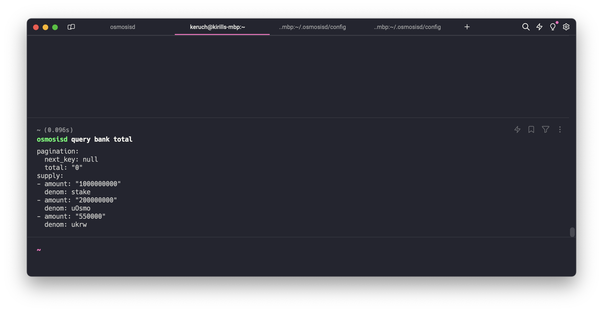
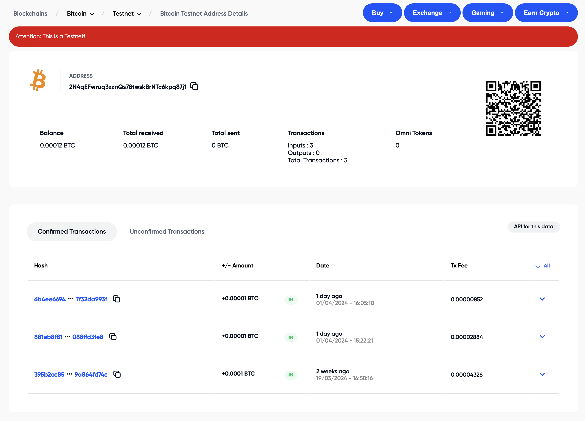
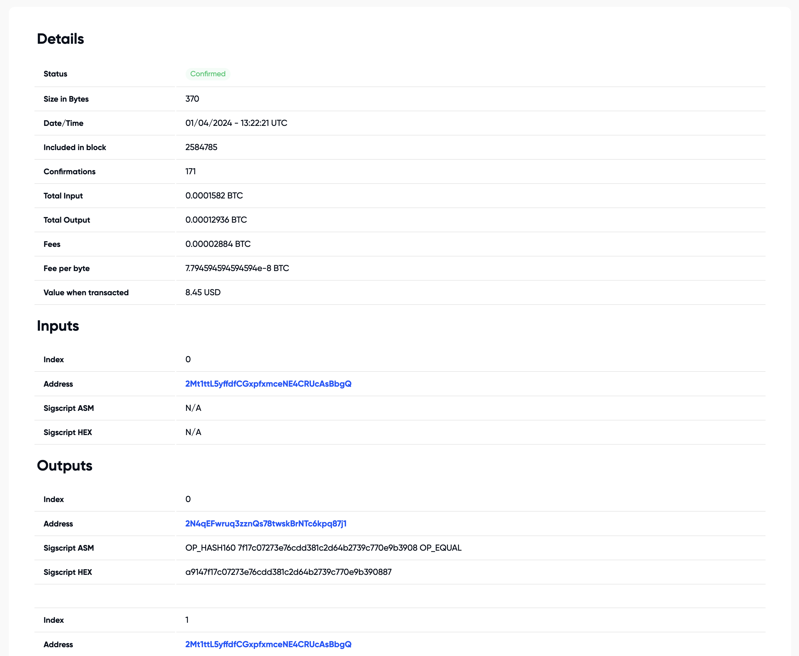
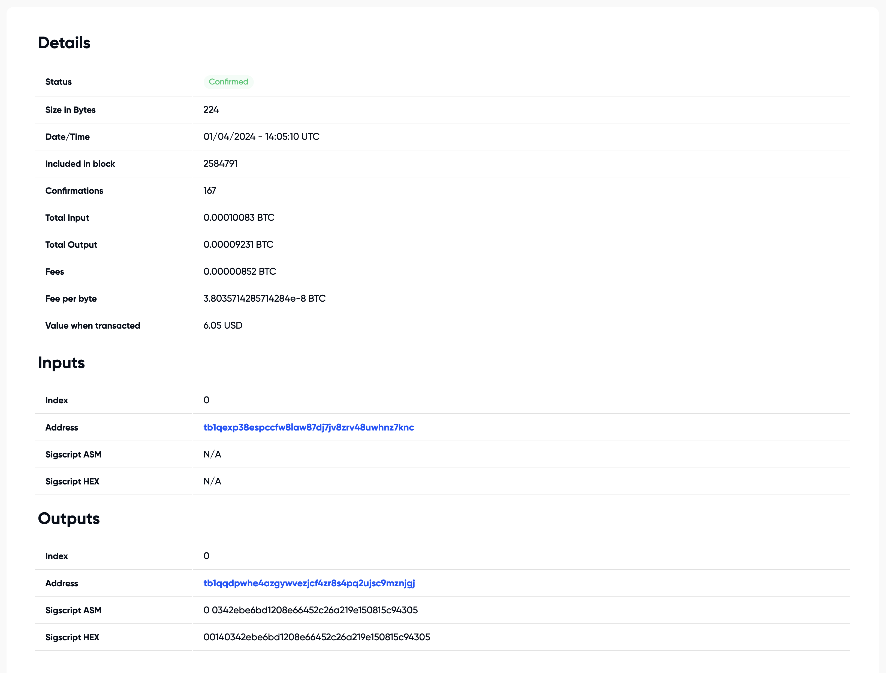
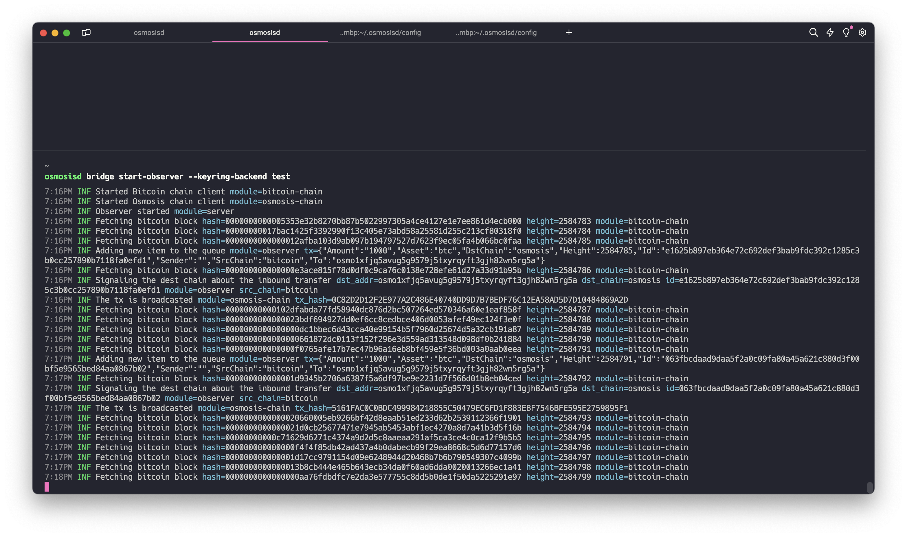
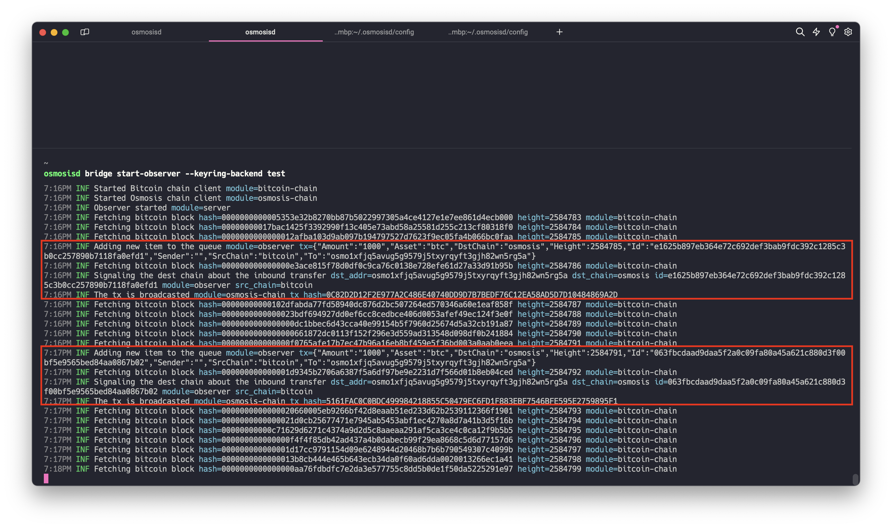
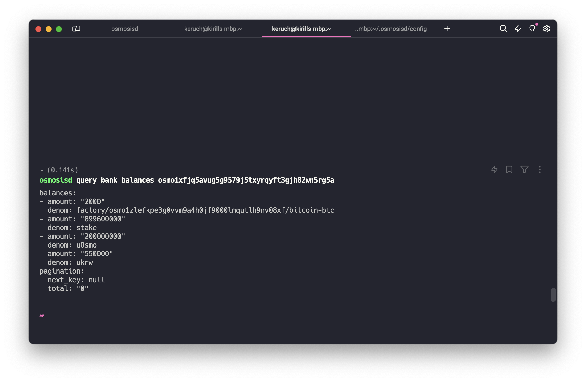
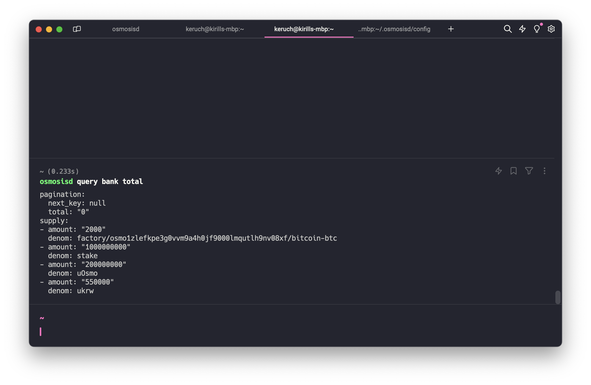

# Inbound transfer

1. Install `osmosisd` binary
```bash
make install
```

2. Add a chain as well as a chain id
```bash
osmosisd init keruch --chain-id my-test-chain
```

3. Add a new address
```bash
osmosisd keys add my_validator --keyring-backend test
```

4. We can check the generated address by using the following command. For me, it's `osmo1xfjq5avug5g9579j5txyrqyft3gjh82wn5rg5a`
```bash
osmosisd keys list --keyring-backend test
```

4. Add a genesis account and create a genesis tx
```bash
osmosisd add-genesis-account my_validator '200000000uOsmo,550000ukrw,1000000000stake' --keyring-backend test
osmosisd gentx my_validator 100000000stake --chain-id my-test-chain --keyring-backend test
osmosisd collect-gentxs
```

5. We will need to change the asset status to accept inbound transfers and add our new validator `my_validator` to the signer set. The former could be done by using `ChangeAssetStatus` command, while the latter should be done by the government proposal. In the sake of guide simplicity, we are making it thought the modifying the genesis state. In the real environment it won't work this way though.


6. Go to the `config` folder of the `.osmosisd` directory (it's `~/.osmosisd` by default)
```bash
cd ~/.osmosisd
```
  
7. Modify the `bridge` section of the `genesis.json` file to look like that
```json
...
"bridge": {
  "params": {
    "signers": [
      "osmo1xfjq5avug5g9579j5txyrqyft3gjh82wn5rg5a"     <-- put the validator addr
    ],
    "assets": [
      {
        "id": {
          "source_chain": "bitcoin",
          "denom": "btc"
        },
        "status": "ASSET_STATUS_OK",     <-- allow all transfers for this asset
        "exponent": "10",
        "external_confirmations": "6"
      }
    ],
    "votes_needed": "1",
    "fee": "0.000000000000000000"
  }
},
...
```



8. Now you can prompt the following command to start the chain
```bash
osmosisd start
```

9. Before start transferring, let's check `my_validator` balance as well as chain tokens total supply to compare it in the future. We could do it using the following commands

```bash
osmosisd query bank balances osmo1xfjq5avug5g9579j5txyrqyft3gjh82wn5rg5a
```



```bash
osmosisd query bank total
```



9. The way to automatically determine the external chain's vault address is to be determined. Now, we hardcode it with a pre-determined address. For tests, we will be using the Bitcoin testnet with the vault address `2N4qEFwruq3zznQs78twskBrNTc6kpq87j1`, [block scanner link](https://blockexplorer.one/bitcoin/testnet/address/2N4qEFwruq3zznQs78twskBrNTc6kpq87j1).



10. As you can see, the vault contains 3 in transactions. We will focus on the second one, with hash `4881eb8f81aa4d9773ad7b7e37ba3d8bf2f60dfa7ef7fc912ac10f088ffd3fe8`, [block scanner link](https://blockexplorer.one/bitcoin/testnet/tx/4881eb8f81aa4d9773ad7b7e37ba3d8bf2f60dfa7ef7fc912ac10f088ffd3fe8). Its height is 2584785.



11. And on the third one `b6b4ee6694b8aa769f5f378fcd278f0edf9d36093512b2de0b17567f32da993f`, [block scanner link](https://blockexplorer.one/bitcoin/testnet/tx/b6b4ee6694b8aa769f5f378fcd278f0edf9d36093512b2de0b17567f32da993f). Its height is 2584791.



12. We will manually set a number around 2584785 on the observer start. Now it's a hardcoded value due testing, but in future this value should be obtained either from the local validator's file or `LastTransferHeight` query of `x/bridge`. 


13. Now we are ready to run the observer! The starting height is 2584783.
```bash
osmosisd bridge start-observer --keyring-backend test
```



14. As we can see, the observer starts going thought the Bitcoin blocks and scanning them. The blocks 2584785 and 2584791 contain needed transactions. On these heights the observer triggers inbound transfers on Osmosis (signing and sending **MsgInboundTransfer**). 



15. Now we can check both `my_validator` balance and the bank module total supply.

```bash
osmosisd query bank balances osmo1xfjq5avug5g9579j5txyrqyft3gjh82wn5rg5a
```



```bash
osmosisd query bank total
```



16. **The tokens are here!** 