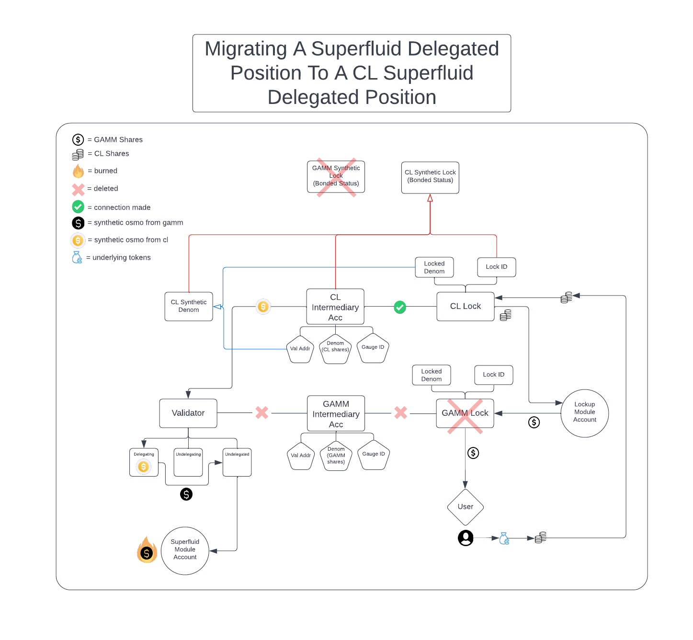
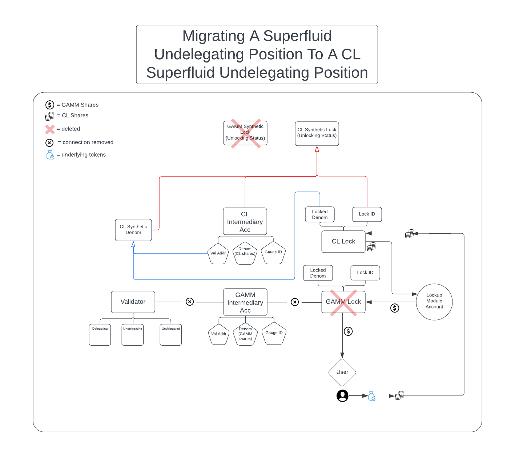
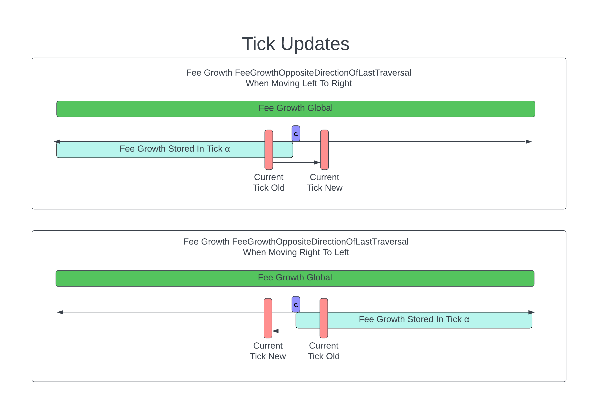

# Concentrated Liquidity

## Background

Concentrated liquidity is a novel Automated Market Maker (AMM) design introduced
by Uniswap that allows for more efficient use of capital. The improvement is
achieved by providing liquidity in specific price ranges chosen by the user.

For instance, a pool with stablecoin pairs like USDC/USDT has a spot price that
should always be trading near 1. As a result, Liquidity Providers (LPs) can
focus their capital in a small range around 1, rather than the full range from 0
to infinity. This approach leads to an average of 200-300x higher capital
efficiency. Moreover, traders benefit from lower price impact because the pool
incentivizes greater depth around the current price.

Concentrated liquidity also opens up new opportunities for providing liquidity
rewards to desired strategies. For example, it's possible to incentivize LPs
based on their position's proximity to the current price and the time spent
within that position. This design also allows for a new "range order" type,
similar to a limit order with order-books.

## Architecture

The traditional Balancer AMM relies on the following curve that tracks current reserves:

$$xy = k$$

This formula allows for distributing liquidity along the $xy=k$ curve and across
the entire price range of (0, &infin;).

With the new architecture, we introduce the concept of a `position` that allows
users to concentrate liquidity within a fixed range. A position only needs to
maintain enough reserves to satisfy trading within this range. Consequently,
it functions as the traditional `xy = k` within that range.

In the new architecture, real reserves are described by the following formula:

$$(x + L / \sqrt P_u)(y + L \sqrt P_l) = L^2$$

Where `P_l` is the lower tick, `P_u` is the upper tick, and `L` is the amount
of liquidity provided, $$L = \sqrt k$$

This formula stems from the original $xy = k$ but with a limited range. In the
traditional design, a pool's `x` and `y` tokens are tracked directly. However,
with the concentrated design, we only track $L$ and $\sqrt P$, which can be
calculated with:

$$L = \sqrt {xy}$$

$$\sqrt P = \sqrt {y / x}$$

By rearranging the above, we obtain the following formulas to track virtual reserves:

$$x = L / \sqrt P$$

$$y = L \sqrt P$$

Note the square root around price. By tracking it this way, we can utilize the
following core property of the architecture:

$$L = \Delta y / \Delta \sqrt P$$

Since only one of the following changes at a time:

- $L$: When an LP adds or removes liquidity
- $\sqrt P$: When a trader swaps

We can use the above relationship to calculate the outcome of swaps as well as
pool joins that mint shares.

Conversely, we calculate liquidity from the other token in the pool:

$$\Delta x = \Delta \frac {1}{\sqrt P} L$$

Overall, the architecture's goal is to enable LPs to provide concentrated
liquidity within a specific range while maintaining high capital efficiency.

## Ticks

### Context

In Uniswap V3, discrete points (called ticks) are used when providing liquidity
in a concentrated liquidity pool.

The price [p] corresponding to a tick [t] is defined by the equation:

$$ p(t) = 1.0001^t $$

This results in a .01% difference between adjacent tick prices. This does not,
however, allow for control over the specific prices that the ticks correspond
to. For example, if a user wants to make a limit order at the $17,100.50 price point,
they would have to interact with either tick 97473 (corresponding to price
$17,099.60) or tick 97474 (price $17101.30).

Since we know what range a pair will generally trade in, how can we provide more
granularity at that range and provide a more optimal price range between ticks
instead of the "one-size-fits-all" approach explained above?

### Geometric Tick Spacing with Additive Ranges

In Osmosis' implementation of concentrated liquidity, we will instead make use
of geometric tick spacing with additive ranges.

We start by defining an exponent for the precision factor of each incremental
tick starting at the spot price of one. This is referred to as $exponentAtPriceOne$.

In the current design, we hardcode $exponentAtPriceOne$ as -6. When used with a
tick spacing of 100, this effectively acts as an $exponentAtPriceOne$ of -4,
since only every 100 ticks are able to be initialized.

When $exponentAtPriceOne = -6$ (and tick spacing is 100), each tick starting at
0 and ending at the first factor of 10 will represents a spot price increase of 0.0001:

- $tick_{0} = 1$
- $tick_{100} = 1.0001$
- $tick_{200} = 1.0002$
- $tick_{300} = 1.0003$

This continues until the pool reaches a spot price of 10. At this point, since
the pool has increased by a factor of 10, the $exponentAtCurrentTick$ increases
from -4 to -3 (decreasing the incremental precision), and the ticks will
increase as follows:

- $tick_{8999900} =  9.9999$
- $tick_{9000000} = 10.000$
- $tick_{9000100} = 10.001$
- $tick_{9000200} = 10.002$

For spot prices less than a dollar, the precision factor decreases
(increasing the incremental precision) at every factor of 10:

- $tick_{-100} = 0.99999$
- $tick_{-200} = 0.99998$
- $tick_{-500100} = 0.94999$
- $tick_{-500200} = 0.94998$
- $tick_{-9000100} = 0.099999$
- $tick_{-9000200} = 0.099998$

This goes on in the negative direction until it reaches a spot price of
0.000000000000000001 or in the positive direction until it reaches a spot
price of 100000000000000000000000000000000000000.

The minimum spot price was chosen as this is the smallest possible number
supported by the osmomath.Dec type. As for the maximum spot price, the above number
was based on gamm's max spot price of 340282366920938463463374607431768211455.
While these numbers are not the same, the max spot price used in concentrated
liquidity utilizes the same number of significant figures as gamm's max spot
price and is less than gamm's max spot price which satisfies the initial design requirements.

### Formulas

After we define tick spacing (which effectively defines the $exponentAtPriceOne$,
since $exponentAtPriceOne$ is fixed), we can then calculate how many ticks must
be crossed in order for $k$ to be incremented
( $geometricExponentIncrementDistanceInTicks$ ).

$$geometricExponentIncrementDistanceInTicks = 9 * 10^{(-exponentAtPriceOne)}$$

Since we define $exponentAtPriceOne$ and utilize this as the increment starting
point instead of price zero, we must multiply the result by 9 as shown above.
In other words, starting at 1, it takes 9 ticks to get to the first power of 10.
Then, starting at 10, it takes 9\*10 ticks to get to the next power of 10, etc.

Now that we know how many ticks must be crossed in order for our
$exponentAtPriceOne$ to be incremented, we can then figure out what our change
in $exponentAtPriceOne$ will be based on what tick is being traded at:

$$geometricExponentDelta = ⌊ tick / geometricExponentIncrementDistanceInTicks ⌋$$

With $geometricExponentDelta$ and $exponentAtPriceOne$, we can figure out what
the $exponentAtPriceOne$ value we will be at when we reach the provided tick:

$$exponentAtCurrentTick = exponentAtPriceOne + geometricExponentDelta$$

Knowing what our $exponentAtCurrentTick$ is, we must then figure out what power
of 10 this $exponentAtPriceOne$ corresponds to (by what number does the price
gets incremented with each new tick):

$$currentAdditiveIncrementInTicks = 10^{(exponentAtCurrentTick)}$$

Lastly, we must determine how many ticks above the current increment we are at:

$$numAdditiveTicks = tick - (geometricExponentDelta * geometricExponentIncrementDistanceInTicks)$$

With this, we can determine the price:

$$price = (10^{geometricExponentDelta}) + (numAdditiveTicks * currentAdditiveIncrementInTicks)$$

where $(10^{geometricExponentDelta})$ is the price after $geometricExponentDelta$
increments of $exponentAtPriceOne$ (which is basically the number of decrements
of difference in price between two adjacent ticks by the power of 10)

### Tick Spacing Example: Tick to Price

Bob sets a limit order on the USD<>BTC pool at tick 36650010. This pool's
$exponentAtPriceOne$ is -6. What price did Bob set his limit order at?

$$geometricExponentIncrementDistanceInTicks = 9 * 10^{(6)} = 9000000$$

$$geometricExponentDelta = ⌊ 36650010 / 9000000 ⌋ = 4$$

$$exponentAtCurrentTick = -6 + 4 = -2$$

$$currentAdditiveIncrementInTicks = 10^{(-2)} = 0.01$$

$$numAdditiveTicks = 36650010 - (4 * 9000000) = 650010$$

$$price = (10^{4}) + (650010 * 0.01) = 16,500.10$$

Bob set his limit order at price $16,500.10

### Tick Spacing Example: Price to Tick

Bob sets a limit order on the USD<>BTC pool at price $16,500.10. This pool's
$exponentAtPriceOne$ is -6. What tick did Bob set his limit order at?

$$geometricExponentIncrementDistanceInTicks = 9 * 10^{(6)} = 9000000$$

We must loop through increasing exponents until we find the first exponent that
is greater than or equal to the desired price

$$currentPrice = 1$$

$$ticksPassed = 0$$

$$currentAdditiveIncrementInTicks = 10^{(-6)} = 0.000001$$

$$maxPriceForCurrentAdditiveIncrementInTicks = geometricExponentIncrementDistanceInTicks
* currentAdditiveIncrementInTicks = 9000000 * 0.000001 = 9$$

$$ticksPassed = ticksPassed + geometricExponentIncrementDistanceInTicks =
0 + 9000000 = 9000000$$

$$totalPrice = totalPrice + maxPriceForCurrentAdditiveIncrementInTicks =
1 + 9 = 10$$

10 is less than 16,500.10, so we must increase our exponent and try again

$$currentAdditiveIncrementInTicks = 10^{(-5)} = 0.00001$$

$$maxPriceForCurrentAdditiveIncrementInTicks = geometricExponentIncrementDistanceInTicks
* currentAdditiveIncrementInTicks = 9000000 * 0.00001 = 90$$

$$ticksPassed = ticksPassed + geometricExponentIncrementDistanceInTicks =
9000000 + 9000000 = 18000000$$

$$totalPrice = totalPrice + maxPriceForCurrentAdditiveIncrementInTicks =
10 + 90 = 100$$

100 is less than 16,500.10, so we must increase our exponent and try again.
This goes on until...

$$currentAdditiveIncrementInTicks = 10^{(-2)} = 0.01$$

$$maxPriceForCurrentAdditiveIncrementInTicks = geometricExponentIncrementDistanceInTicks
* currentAdditiveIncrementInTicks = 9000000 * 0.01 = 90000$$

$$ticksPassed = ticksPassed + geometricExponentIncrementDistanceInTicks =
36000000 + 9000000 = 45000000$$

$$totalPrice = totalPrice + maxPriceForCurrentAdditiveIncrementInTicks =
10000 + 90000 = 100000$$

100000 is greater than 16,500.10. This means we must now find out how many
additive tick in the currentAdditiveIncrementInTicks of -2 we must pass in
order to reach 16,500.10.

$$ticksToBeFulfilledByExponentAtCurrentTick = (desiredPrice - totalPrice) /
currentAdditiveIncrementInTicks = (16500.10 - 100000) / 0.01 = -8349990$$

$$tickIndex = ticksPassed + ticksToBeFulfilledByExponentAtCurrentTick =
45000000 + -8349990 = 36650010$$

Bob set his limit order at tick 36650010

## Chosing an Exponent At Price One Value

The creator of a pool cannot choose an exponenetAtPriceOne as one of the input
parameters since it is hard coded to -6. The number can be psedo-controlled by
choosing the tick spacing a pool is initialized with. For example, if a pool
is desired to have an exponentAtPriceOne of -6, the pool creator can choose a
tick spacing of 1. If a pool is desired to have an exponentAtPriceOne of -4,
this is two factors of 10 greater than -6, so the pool creator can choose a
tick spacing of 100 to achieve this level of precision.

As explained previously, the exponent at price one determines how much the spot
price increases or decreases when traversing ticks. The following equation will
assist in selecting this value:

$$exponentAtPriceOne=log_{10}(\frac{D}{P})$$

$$P=(\frac{baseAssetInUSD}{quoteAssetInUSD})$$

$$D=P-(\frac{baseAssetInUSD}{quoteAssetInUSD+desiredIncrementOfQuoteInUSD})$$

### Example 1

SHIB is trading at $0.00001070 per SHIB
BTC is trading at $28,000 per BTC

We want to create a SHIB/BTC concentrated liquidity pool where SHIB is the
baseAsset (asset0) and BTC is the quoteAsset (asset1). In terms of the quoteAsset,
we want to increment in 10 cent values.

$$P=(\frac{0.00001070}{28,000})=0.000000000382142857$$

$$D=(0.000000000382142857)-(\frac{0.00001070}{28,000+0.10})=0.0000000000000013647910441136$$

$$exponentAtPriceOne=log_{10}(\frac{0.0000000000000013647910441136}{0.000000000382142857})=-5.447159582$$

We can therefore conclude that we can use an exponent at price one of -5
(slightly under precise) or -6 (slightly over precise) for this base/quote pair
and desired price granularity. This means we would either want a tick spacing of 1
(to have an exponent at price one of -6) or 10 (to have an exponent at price one of -5).

### Example 2

Flipping the quoteAsset/baseAsset, for BTC/SHIB, lets determine what the
exponentAtPriceOne should be. For SHIB as a quote, centralized exchanges
list prices at the 10^-8, so we will set our desired increment to this value.

$$P=(\frac{28,000}{0.00001070})=2616822429$$

$$D=(2616822429)-(\frac{28,000}{0.00001070+0.00000001})=2443345$$

$$exponentAtPriceOne=-log_{10}(\frac{2443345}{2616822429})=-3.0297894598783$$

We can therefore conclude that we can use an exponent at price one of -3
for this base/quote pair and desired price granularity. This means we would
want a tick spacing of 1000 (to have an exponent at price one of -3).

### Consequences

This decision allows us to define ticks at spot prices that users actually
desire to trade on, rather than arbitrarily defining ticks at .01% distance
between each other. This will also make integration with UX seamless,
instead of either:

a) Preventing trade at a desirable spot price or
b) Having the front end round the tick's actual price to the nearest
  human readable/desirable spot price

One side effect of increasing precision as we get closer to the minimum tick
is that multiple ticks can represent the same price. For example, tick
-161795100 (along with the ticks surrounding it) correlate to a price
of 0.000000000000000002. To get around any issues this may cause, when a
position is created with a user defined lower and upper tick, we determine
if a larger tick exists that represents the same price. If so, we use that tick
instead of the user defined tick. In the above example, the tick would be
changed to -161000000, which is the first tick that represents the same price.

## Concentrated Liquidity Module Messages

### `MsgCreatePosition`

- **Request**

This message allows LPs to provide liquidity between `LowerTick` and `UpperTick`
in a given `PoolId`. The user provides the amount of each token desired. Since
LPs are only allowed to provide liquidity proportional to the existing reserves,
the actual amount of tokens used might differ from requested. As a result, LPs
may also provide the minimum amount of each token to be used so that the system fails
to create position if the desired amounts cannot be satisfied.

Three KV stores are initialized when a position is created:

1. `Position ID -> Position` - This is a mapping from a unique position ID to a
position object. The position ID is a monotonically increasing integer that is
incremented every time a new position is created.
2. `Owner | Pool ID | Position ID -> Position ID` - This is a mapping from a
composite key of the owner address, pool ID, and position ID to the position ID.
This is used to keep track of all positions owned by a given owner in a given pool.
3. `Pool ID -> Position ID` - This is a mapping from a pool ID to a position ID.
This is used to keep track of all positions in a given pool.

```go
type MsgCreatePosition struct {
 PoolId          uint64
 Sender          string
 LowerTick       int64
 UpperTick       int64
 TokenDesired0   types.Coin
 TokenDesired1   types.Coin
 TokenMinAmount0 github_com_cosmos_cosmos_sdk_types.Int
 TokenMinAmount1 github_com_cosmos_cosmos_sdk_types.Int
}
```

- **Response**

On succesful response, we receive the actual amounts of each token used to
create the liquidityCreated number of shares in the given range.

```go
type MsgCreatePositionResponse struct {
 PositionId  uint64
 Amount0 github_com_cosmos_cosmos_sdk_types.Int
 Amount1 github_com_cosmos_cosmos_sdk_types.Int
 JoinTime google.protobuf.Timestamp
 LiquidityCreated github_com_cosmos_cosmos_sdk_types.Dec

}
```

This message should call the `createPosition` keeper method that is introduced
in the `"Liquidity Provision"` section of this document.

### `MsgWithdrawPosition`

- **Request**

This message allows LPs to withdraw their position via their position ID,
potentially in partial amount of liquidity. It should fail if the position ID
does not exist or if attempting to withdraw an amount higher than originally
provided. If an LP withdraws all of their liquidity from a position, then the
position is deleted from state along with the three KV stores that were
initialized in the `MsgCreatePosition` section. However, the spread factor accumulators
associated with the position are still retained until a user claims them manually.

```go
type MsgWithdrawPosition struct {
 PositionId      uint64
 Sender          string
 LiquidityAmount github_com_cosmos_cosmos_sdk_types.Dec
}
```

- **Response**

On successful response, we receive the amounts of each token withdrawn
for the provided share liquidity amount.

```go
type MsgWithdrawPositionResponse struct {
 Amount0 github_com_cosmos_cosmos_sdk_types.Int
 Amount1 github_com_cosmos_cosmos_sdk_types.Int
}
```

This message should call the `withdrawPosition` keeper method that is introduced
in the `"Liquidity Provision"` section of this document.

### `MsgCreatePool`

This message is responsible for creating a concentrated-liquidity pool.
It propagates the execution flow to the `x/poolmanager` module for pool id
management and for routing swaps.

```go
type MsgCreateConcentratedPool struct {
 Sender                    string
 Denom0                    string
 Denom1                    string
 TickSpacing               uint64
 SpreadFactor                   github_com_cosmos_cosmos_sdk_types.Dec
}
```

- **Response**

On successful response, the pool id is returned.

```go
type MsgCreateConcentratedPoolResponse struct {
 PoolID uint64
}
```

### `MsgCollectSpreadRewards`

This message allows collecting rewards from spreads for multiple position IDs from a
single owner.

The spread factor collection is discussed in more detail in the "Spread Rewards" section of this document.

```go
type MsgCollectSpreadRewards struct {
 PositionIds    []uint64
 Sender         string
}
```

- **Response**

On successful response, the collected tokens are returned.
The sender should also see their balance increase by the returned
amounts.

```go
type MsgCollectSpreadRewardsResponse struct {
 CollectedSpreadRewards []types.Coin
}
```

### `MsgFungifyChargedPositions`

This message allows fungifying the fully charged unlocked positions belonging to the same owner
and located in the same tick range.
MsgFungifyChargedPosition takes in a list of positionIds and combines them into a single position.
It validates that all positions belong to the same owner, are in the same ticks and are fully charged.
Fails if not. Otherwise, it creates a completely new position P. P's liquidity equals to the sum of all
liquidities of positions given by positionIds. The uptime of the join time of the new position equals
to current block time - max authorized uptime duration (to signify that it is fully charged).
The previous positions are deleted from state. Prior to deleting, the rewards are claimed.
The old position's unclaimed rewards are transferred to the new position.
The new position ID is returned.

```go
type MsgFungifyChargedPositions struct {
 PositionIds    []uint64
 Sender         string
}
```

- **Response**

On successful response, the new position id is returned.

```go
type MsgFungifyChargedPositionsResponse struct {
 NewPositionId uint64
}
```

## Relationship to Pool Manager Module

### Pool Creation

As previously mentioned, the `x/poolmanager` is responsible for creating the
pool upon being called from the `x/concentrated-liquidity` module's message server.

It does so to store the mapping from pool id to concentrated-liquidity module so
that it knows where to route swaps.

Upon successful pool creation and pool id assignment, the `x/poolmanager` module
returns the execution to `x/concentrated-liquidity` module by calling `InitializePool`
on the `x/concentrated-liquidity` keeper.

The `InitializePool` method is responsible for doing concentrated-liquidity specific
initialization and storing the pool in state.

Note, that `InitializePool` is a method defined on the `SwapI` interface that is
implemented by all swap modules. For example, `x/gamm` also implements it so that
`x/pool-manager` can route pool initialization there as well.

### Swaps

We rely on the swap messages located in `x/poolmanager`:

- `MsgSwapExactAmountIn`
- `MsgSwapExactAmountOut`

The `x/poolmanager` received the swap messages and, as long as the swap's pool id
is associated with the `concentrated-liquidity` pool, the swap is routed
into the relevant module. The routing is done via the mapping from state that was
discussed in the "Pool Creation" section.

## Liquidity Provision

> As an LP, I want to provide liquidity in ranges so that I can achieve greater
capital efficiency

This is a basic function that should allow LPs to provide liquidity in specific ranges
to a pool.

A pool's liquidity is consisted of two assets: asset0 and asset1. In all pools,
asset1 will be the quote asset and must be an approved denom listed in the module
parameters. At the current tick, the bucket at this tick consists of a mix of both
asset0 and asset1 and is called the virtual liquidity of the pool (or "L" for short).
Any positions set below the current price are consisted solely of asset0 while
positions above the current price only contain asset1.

### Adding Liquidity

We can either provide liquidity above or below the current price, which would
act as a range order, or decide to provide liquidity at the current price.

As declared in the API for `createPosition`, users provide the upper and lower
tick to denote the range they want to provide the liquidity in. The users are
also prompted to provide the amount of token0 and token1 they desire to receive.
The liquidity that needs to be provided for the given token0 and token1 amounts
would be then calculated by the following methods:

Liquidity needed for token0:
$$L = \frac{\Delta x \sqrt{P_u} \sqrt{P_l}}{\sqrt{P_u} - \sqrt{P_l}}$$

Liquidity needed for token1:
$$L = \frac{\Delta y}{\sqrt{P_u}-\sqrt{P_l}}$$

Then, we pick the smallest of the two values for choosing the final `L`. The
reason we do that is because the new liquidity must be proportional to the old
one. By choosing the smaller value, we distribute the liqudity evenly between
the two tokens. In the future steps, we will re-calculate the amount of token0
and token1 as a result the one that had higher liquidity will end up smaller
than originally given by the user.

Note that the liquidity used here does not represent an amount of a specific
token, but the liquidity of the pool itself, represented in `osmomath.Dec`.

Using the provided liquidity, now we calculate the delta amount of both token0
and token1, using the following equations, where L is the liquidity calculated above:

$$\Delta x = \frac{L(\sqrt{p(i_u)} - \sqrt{p(i_c)})}{\sqrt{p(i_u)}\sqrt{p(i_c)}}$$
$$\Delta y = L(\sqrt{p(i_c)} - \sqrt{p(i_l)})$$

Again, by recalculating the delta amount of both tokens, we make sure that the
new liquidity is proportional to the old one and the excess amount of the token
that originally computed a larger liquidity is given back to the user.

The delta X and the delta Y are the actual amounts of tokens joined for the
requested position.

Given the parameters needed for calculating the tokens needed for creating a
position for a given tick, the API in the keeper layer would look like the following:

```go
ctx sdk.Context, poolId uint64, owner sdk.AccAddress, amount0Desired,
amount1Desired, amount0Min, amount1Min osmomath.Int,
lowerTick, upperTick int64, frozenUntil time.Time
func createPosition(
    ctx sdk.Context,
    poolId uint64,
    owner sdk.AccAddress,
    amount0Desired,
    amount1Desired,
    amount0Min,
    amount1Min osmomath.Int
    lowerTick,
    upperTick int64) (amount0, amount1 osmomath.Int, osmomath.Dec, error) {
        ...
}
```

### Removing Liquidity

Removing liquidity is achieved via method `withdrawPosition` which is the inverse
of previously discussed `createPosition`. In fact, the two methods share the same
underlying logic, having the only difference being the sign of the liquidity.
Plus signifying addition while minus signifying subtraction.

Withdraw position also takes an additional parameter which represents the liqudity
a user wants to remove. It must be less than or equal to the available liquidity
in the position to be successful.

```go
func (k Keeper) withdrawPosition(
    ctx sdk.Context,
    poolId uint64,
    owner sdk.AccAddress,
    lowerTick,
    upperTick int64,
    frozenUntil time.Time,
    requestedLiquidityAmountToWithdraw osmomath.Dec)
    (amtDenom0, amtDenom1 osmomath.Int, err error) {
    ...
}
```

## Swapping

> As a trader, I want to be able to swap over a concentrated liquidity pool so
that my trades incur lower slippage

Unlike balancer pools where liquidity is spread out over an infinite range,
concentrated liquidity pools allow for LPs to provide deeper liquidity for
specific price ranges, which in turn allows traders to incur less slippage on
their trades.

Despite this improvement, the liquidity at the current price is still finite,
and large single trades in times of high volume, as well as trades against
volatile assets, are eventually bound to incur some slippage.

In order to determine the depth of liquidity and subsequent amountIn/amountOut
values for a given pool, we track the swap's state across multiple swap "steps".
You can think of each of these steps as the current price following the original
xy=k curve, with the far left bound being the next initialized tick below the
current price and the far right bound being the next initialized tick above the
current price. It is also important to note that we always view prices of asset1
in terms of asset0, and selling asset1 for asset0 would, in turn, increase its
spot price. The reciprocal is also true, where if we sell asset0 for asset1,
we would decrease the pool's spot price.

When a user swaps asset0 for asset1 (can also be seen as "selling" asset0), we
move left along the curve until asset1 reserves in this tick are depleted.
If the tick of the current price has enough liquidity to fulfill the order without
stepping to the next tick, the order is complete. If we deplete all of asset1 in
the current tick, this then marks the end of the first swap "step". Since all
liquidity in this tick has been depleted, we search for the next closest tick
to the left of the current tick that has liquidity. Once we reach this tick, we
determine how much more of asset1 is needed to complete the swap. This process
continues until either the entire order is fulfilled or all liquidity is drained
from the pool.

The same logic is true for swapping asset1, which is analogous to buying asset0;
however, instead of moving left along the set of curves, we instead search for
liquidity to the right.

From the user perspective, there are two ways to swap:

1. Swap given token in for token out.
   - E.g. I have 1 ETH that I swap for some computed amount of DAI.

2. Swap given token out for token in
   - E.g. I want to get out 3000 DAI for some amount of ETH to compute.

Each case has a corresponding message discussed previosly in the `x/poolmanager`
section.

- `MsgSwapExactIn`
- `MsgSwapExactOut`

Once a message is received by the `x/poolmanager`, it is propageted into a
corresponding keeper
in `x/concentrated-liquidity`.

The relevant keeper method then calls its non-mutative `calc` version which is
one of:

- `calcOutAmtGivenIn`
- `calcInAmtGivenOut`

State updates only occur upon successful execution of the swap inside the calc method.
We ensure that calc does not update state by injecting `sdk.CacheContext` as its
context parameter. The cache context is dropped on failure and committed on success.

### Calculating Swap Amounts

Let's now focus on the core logic of calculating swap amounts.
We mainly focus on `calcOutAmtGivenIn` as the high-level steps of `calcInAmtGivenOut`
are similar.

**1. Determine Swap Strategy**

The first step we need to determine is the swap strategy. The swap strategy determines
the direction of the swap, and it is one of:

- `zeroForOne` - swap token zero in for token one out.

- `oneForZero` - swap token one in for token zero out.

Note that the first token in the strategy name always corresponds to the token
being swapped in, while the second token corresponds to the token being swapped
out. This is true for both `calcOutAmtGivenIn` and `calcInAmtGivenOut` calc methods.

Recall that, in our model, we fix the tokens axis at the time of pool creation.
The token on the x-axis is token zero, while the token on the y-axis is token one.

Given that the sqrt price is defined as $$\sqrt (y / x)$$, as we swap token zero
(x-axis) in for token one (y-axis), we decrease the sqrt price and move down
along the price/tick curve. Conversely, as we swap token one (y-axis) in for token
zero (x-axis), we increase the sqrt price and move up along the price/tick curve.

The reason we call this a price/tick curve is because there is a relationship
between the price and the tick. As a result, when we perform the swap, we are
likely to end up crossing a tick boundary. As a tick is crossed, the swap state
internals must be updated. We will discuss this in more detail later.

**2. Initialize Swap State**

The next step is to initialize the swap state. The swap state is a struct that
contains all of the swap state to be done within the current active tick
(before we across a tick boundary).

It contains the following fields:

```go
// SwapState defines the state of a swap.
// It is initialized as the swap begins and is updated after every swap step.
// Once the swap is complete, this state is either returned to the estimate
// swap querier or committed to state.
type SwapState struct {
 // Remaining amount of specified token.
 // if out given in, amount of token being swapped in.
 // if in given out, amount of token being swapped out.
 // Initialized to the amount of the token specified by the user.
 // Updated after every swap step.
 amountSpecifiedRemaining osmomath.Dec

 // Amount of the other token that is calculated from the specified token.
 // if out given in, amount of token swapped out.
 // if in given out, amount of token swapped in.
 // Initialized to zero.
 // Updated after every swap step.
 amountCalculated osmomath.Dec

 // Current sqrt price while calculating swap.
 // Initialized to the pool's current sqrt price.
 // Updated after every swap step.
 sqrtPrice osmomath.Dec
 // Current tick while calculating swap.
 // Initialized to the pool's current tick.
 // Updated each time a tick is crossed.
 tick osmomath.Int
 // Current liqudiity within the active tick.
 // Initialized to the pool's current tick's liquidity.
 // Updated each time a tick is crossed.
 liquidity osmomath.Dec

 // Global spread reward growth per-current swap.
 // Initialized to zero.
 // Updated after every swap step.
 spreadRewardGrowthGlobal osmomath.Dec
}
```

**3. Compute Swap**

The next step is to compute the swap. Conceptually, it can be done in two ways
listed below.Before doing so, we find the next initialized tick. An initialized
tick is the tick that is touched by the edges of at least one position. If no
position has an edge at a tick, then that tick is uninitialized.

a. Swap within the same initialized tick range.

See "Appendix A" for details on what "initialized" means.

This case occurs when `swapState.amountSpecifiedRemaining` is less than or equal
to the amount needed to reach the next tick. We omit the math needed to determine
how much is enough until a later section.

b. Swap across multiple initialized tick ranges.

See "Appendix A" for details on what "initialized" means.

This case occurs when `swapState.amountSpecifiedRemaining` is greater than the
amount needed to reach the next tick

In terms of the code implementation, we loop, calling a `swapStrategy.ComputeSwapStepOutGivenIn`
or `swapStrategy.ComputeSwapStepInGivenOut` method, depending on swap out given
in or in given out, respectively.

The swap strategy is already initialized to be either `zeroForOne` or `oneForZero`
from step 1. Go dynamically determines the desired implementation via polymorphism.

We leave details of the `ComputeSwapStepOutGivenIn` and `ComputeSwapStepInGivenOut`
methods to the appendix of the "Swapping" section.

The iteration stops when `swapState.amountSpecifiedRemaining` runs out or when
swapState.sqrtPrice reaches the sqrt price limit specified by the user as a price
impact protection.

**4. Update Swap State**

Upon computing the swap step, we update the swap state with the results of the
swap step. Namely,

- Subtract the consumed specified amount from `swapState.amountSpecifiedRemaining`.

- Add the calculated amount to `swapState.amountCalculated`.

- Update `swapState.sqrtPrice` to the new sqrt price. The new sqrt price is not
  necessarily the sqrt price of the next tick. It is the sqrt price of the next tick
  if the swap step crosses a tick boundary. Otherwise, it is something in between
  the original and the next tick sqrt price.

- Update `swapState.tick` to the next initialized tick if it is reached;
  otherwise, update it to the new tick calculated from the new sqrt price.
  If the sqrt price is unchanged, the tick remains unchanged as well.

- Update `swapState.liquidity` to the new liquidity only if the next initialized
  tick is crossed. The liquidity is updated by incorporating the `liquidity_net`
  amount associated with the next initialized tick being crossed.

- Update `swapState.spreadRewardGrowthGlobal` to the value of the total spread factor charged within
  the swap step on the amount of token in per one unit of liquidity within the
  tick range being swapped in.

Then, we either proceed to the next swap step or finalize the swap.

**5. Update Global State**

Once the swap is completed, we persiste the swap state to the global state
(if mutative action is performed) and return the `amountCalculated` to the user.

## Liquidity depths calculation

### Calculating liquidity for buckets
Each bucket (the area between two initialized ticks) contains ceratin amount of liquidity. The liquidity amount can be obtained through `GetTickLiquidityNetInDirection` query. `GetTickLiquidityNetInDirection` returns two results:
- `expectedStartTickLiquidity` which is the global liquidity, the cumulative liquidity from the bucket of the current price
- `expectedLiquidityDepths` which is list of liquidity deltas for each and every initialized tick for the full price range in a certain direction that should be cumulatively added to or subtracted starting from the global liquidity in order to get the liquidity for an arbitrary range.

Querying in two different directions is possible, one being 'one for zero', which is in the direction of max tick, the other direction being 'zero for one', which is in the direction of min tick.

If the direction is zero for one, the liquidity for a bucket in tick can be calculated as follows: L<sub>t</sub> = L<sub>t-1</sub> - ΔL<sub>t</sub>, t=1,2, ...

If the direction is one for zero, the liquidity for the bucket in the designated tick can be calculated as follows: L<sub>t</sub> = L<sub>t-1</sub> + ΔL<sub>t</sub>, t=1,2

where L<sub>0</sub> is the global(cumulative liquidity).

### Deducing the quantity of tokens X and Y for a tick range
Having obtained the liquidity depths for each liquidity buckets in the pool, we can derive an equation to calculate the quantity of each token locked for a certain price range. Let *i* and *j* be the indexes of lower and upper tick boundaries of the range we want to calculate, let P<sub>0</sub> be current price and P<sub>a</sub>, P<sub>b</sub> prices for lower tick and upper tick respectively, where P<sub>a</sub>, P<sub>b</sub> are defined as the following:
<p align="center"> 
P<sub>a</sub> = 1.0001<sup>i</sup>, P<sub>b</sub> = 1.0001<sup>j</sup>
</p>

Let *L* be the total liquidity locked within price range [P<sub>a</sub>, P<sub>b</sub>]. The real reserve curve with liquidity *L*  is:

$(x + \frac{L}{\sqrt{P_b}})(y + L\sqrt{P_a}) = L^2$

Given the amount of liquidity, the quantity of tokens available in the price range [P<sub>a</sub>, P<sub>b</sub>] can be derived as follows:

- If $P_a \leq P_a$:
$x = L \left(\frac{1}{\sqrt{P_a}} - \frac{1}{\sqrt{P_b}}\right)$
$y = 0$

- If $P_a \geq P_b$:
$x = 0$
$y = L \left(\sqrt{P_b} - \sqrt{P_a}\right)$

- If $P_a \in (P_a, P_b)$:
$x = \left(\frac{1}{{\sqrt{P_a}}} - \frac{1}{{\sqrt{P_b}}}\right)$
$y = L \left(\sqrt{P_a} - \sqrt{P_b}\right)$

This can be written as: 

$x = \left(\frac{1}{\sqrt{z}} - \frac{1}{\sqrt{P_b}}\right)$ 

$y = L \left(\sqrt{z} - \sqrt{P_a}\right)$

where:

$z = P_a \quad \forall \quad P \leq P_a$  
$z = P_0 \quad \forall \quad P \in (P_a, P_b)$  
$z = P_b \quad \forall \quad P \geq P_b$  

### Calculating Pool Depths
Pool depths here refers to the token required to shift the pool price to a certain tick.

Let i<sub>0</sub> be the integer index identifying a current tick (this is the tick that corresponds to the square root of the current price). Let δ be the desired depth level and d be the associated change in ticks such that 

$\delta = \frac{P_1}{P_0} - 1 = \frac{1.0001^{(i_0 + d)}}{1.0001^{i_0}} - 1$

The change in ticks $d$ can be found as follows:

$d = \log_{1.0001}(\delta + 1)$

e.g. $d = -513$ for $\delta = -5\%$

Note that as the current price formally belongs only to the first range [s<sub>0</sub>, s<sub>1</sub>] or [s<sub>1</sub>, s<sub>0</sub>], where s<sub>0</sub> is the left (when the price grows) or the right (when the price drops) boundary of the current liquidity segment (segment that contains the current price). Mathematically, as we always start calculations from the current price, when recovering the token amounts, all ranges contain only one of the tokens (X or Y depending on the direction of the price change). When swapping, one of the tokens is exchanged for the token being sold. We need to find how much we can swap until the price reaches a certain level.

The Pool Depths expressed in units of asset X or Y in calculated as follows:

$Depth_{x}(\delta) = \sum_{i=0}^{n}x_{i}$
$Depth_{y}(\delta) = \sum_{i=0}^{n}y_{i}$

where:
$x_i = L_i \left(\frac{1}{\sqrt{P_{a}(i)}} - \frac{1}{\sqrt{P_{b}(i)}}\right), i = 0, \dots, n$

$y_i = L_i \left(\sqrt{P_{b}(i)} - \sqrt{P_{a}(i)}\right), i = 0, \dots, n$

### Calculating Liquidator Depths
Liquidator Depth refers to the real price slippage, the real price slippage (average execution price in relation to the current price) from the liquidator's point of view. That is, the amount of tokens that can be liquidated so that the real price slippage does not exceed certain level.

The idea to determine the depth is to swap the maximum possible amount per each liquidity segment until a realized slippage doesn’t exceed a desired level. For the last segment the procedure is repeated per tick until the desired realized slippage is achieved.
Maximum token amounts that can be locked within each segment or tick (and exchanged for another token when the price crosses the ticks) can be derived as follows:

$x_i = L_i \left(\frac{1}{\sqrt{P_{a}(i)}} - \frac{1}{\sqrt{P_{b}(i)}}\right)$

$y_i = L_i \left(\sqrt{P_{b}(i)} - \sqrt{P_{a}(i)}\right)$

Starting from the current tick *i<sub>0</sub>*  and swapping one token for another one, the average execution price at the end of each tick *i*  can be determined as follows:

$P_i = \frac{(Y_{i-1} + y_i)}{X_{i-1} + x}, \quad i = i_0, \ldots, i_N$

$Y_i = Y_{i-1} + y_i, \quad Y_0 = 0$

$X_i = X_{i-1} + x_i, \quad X_0 = 0$

The slippage equals to:

$Slippage_i = P_i - P_0 - 1$

The algorithm to determine the depth is then the following:

Calculate $X_i$ and $Y_i$ while $|Slippage_i| \leq \delta$ at some $i = N$

Then 

$Depth_x (\delta) = X_N$

$Depth_y (\delta) = Y_N$


## Migration

Users can migrate their Balancer positions to a Concentrated Liquidity full range
position provided the underlying Balancer pool has a governance-selected canonical
Concentrated Liquidity pool. The migration is routed depending on the state of the
underlying Balancer position:

Balancer position is:

- Superfluid delegated
  - Locked
- Superfluid undelegating
  - Locked
  - Unlocking
- Normal lock
  - Locked
  - Unlocking
- Unlocked

Regardless of the path taken, the `UnlockAndMigrateSharesToFullRangeConcentratedPosition`
message executes all of the below logic:

### Superfluid Delegated Balancer to Concentrated

The following diagram illustrates the migration flow for a Superfluid delegated
Balancer position to a Superfluid delegated Concentrated Liquidity position.



The migration process starts by removing the connection between the GAMM lock and
the GAMM intermediary account. The synthetic OSMO that was previously minted by
the GAMM intermediary account is immediately undelegated (skipping the two-week
unbonding period) and sent to the Superfluid module account where it is burned.

Next, the Lockup module account holding the original GAMM shares sends them back
to the user, deleting the GAMM lock in the process. These shares are used to
claim the underlying two assets from the GAMM pool, which are then immediately
put into a full range Concentrated Liquidity position in the canonical
Concentrated Liquidity pool.

The underlying liquidity this creates is tokenized (similar to GAMM shares) and
is put into a new lock, which is then routed to the Lockup module account. A new
intermediary account is created based on this new CL share denom. The new
intermediary account mints synthetic OSMO and delegates it to the validator the
user originally delegated to. Finally, a new synthetic lock in a bonded status
is created based on the new CL lock ID, the new CL intermediary account, and the
new CL synthetic denom.

### Superfluid Undelegating Balancer to Concentrated

The following diagram illustrates the migration flow for a superfluid undelegating
balancer position to a superfluid undelegating concentrated liquidity position.
The reason we must account for this situation is to respect the two week unbonding
period that is required for superfluid undelegating, and be capable of slashing
a position that was migrated.



The process is identical to the Superfluid delegated migration, with three
exceptions. First, the connection between the GAMM intermediary account and the
GAMM lock is already removed when a user started undelegation, so it does not
need to be done again. Second, no synthetic OSMO needs to be burned or created.
Lastly, instead of creating a new CL synthetic lock in a bonded status, we create
a new CL synthetic lock in an unlocking status. This lock will be unlocked once
the two-week unbonding period is over.

### Locked and Unlocked Balancer to Concentrated

The locked<>locked and unlocked<>unlocked migration utilizes a subset of actions
that were taken in the superfluid migration. The Lockup module account that was
holding the original GAMM shares sends them back to the user, deleting the GAMM
lock in the process. These shares are used to claim the underlying two assets
from the GAMM pool, which are then immediately put into a full range Concentrated
Liquidity position in the canonical Concentrated Liquidity pool.

If it was previously locked, we keep the concentrated locked for the same period
of time. If it was previously unlocking, we begin unlocking the concentrated lock
from where the GAMM lock left off.

### Balancer to Concentrated with No Lock

When GAMM shares are not locked, they are simply claimed for the underlying two
assets, which are then immediately put into a full range concentrated liquidity
position in the canonical concentrated liquidity pool. No locks are involved in
this migration.

## Position Fungification

There is a possibility to fungify fully-charged positions within the same tick range.
Assume that there are two positions in the same tick range and both are fully charged.

As a user, I might want to combine them into a single position so that I don't have to manage
positions inside the same tick range separately.

Therefore, I execute `MsgFungifyChargedPositions` that takes a list of position ids to fungify
and merges them into one.

Besides being fully charged, all of the positions must be in the same tick range and have the same
owner (sender). All must belong to the same pool and be unlocked. As a result, none of the positions
can be superfluid staked if they are full-range.

Once the message finishes, the user will have a completely new position with spread factors and incentive rewards
moved into the new position. The old positions will be deleted.

## Swapping. Appendix A: Example

Note, that the numbers used in this example are not realistic. They are used to
illustrate the concepts on the high level.

Imagine a tick range from min tick -1000 to max tick 1000 in a pool with a 1%
spread factor.

Assume that user A created a full range position from ticks -1000 to 1000 for
`10_000` liquidity units.

Assume that user B created a narrow range position from ticks 0 to 100 for `1_000`
liquidity units.

Assume the current active tick is -34 and user perform a swap in the positive
direction of the tick range by swapping 5_000 tokens one in for some tokens
zero out.

Our tick range and liquidity graph now looks like this:

```markdown
         cur_sqrt_price      //////////               <--- position by user B

/////////////////////////////////////////////////////////  <---position by user A
-1000           -34          0       100              1000
```

The swap state is initialized as follows:

- `amountSpecifiedRemaining` is set to 5_000 tokens one in specified by the user.
- `amountCalculated` is set to zero.
- `sqrtPrice` is set to the current sqrt price of the pool
(computed from the tick -34)
- `tick` is set to the current tick of the pool (-34)
- `liquidity` is set to the current liquidity tracked by the pool at tick -34 (10_000)
- `spreadRewardGrowthGlobal` is set to (0)

We proceed by getting the next initialized tick in the direction of the swap (0).

Each initialized tick has 2 fields:

- `liquidity_gross` - this is the total liquidity referencing that tick
  at tick -1000: 10_000
  at tick 0: 1_000
  at tick 100: 1_000
  at tick 1000: 10_000

- `liquidity_net` - liquidity that needs to be added to the active liquidity as
we cross the tick moving in the positive direction so that the active liquidity
is always the sum of all `liquidity_net` amounts of initialized ticks below the
current one.
  at tick -1000: 10_000
  at tick 0: 1_000
  at tick 100: -1_000
  at tick 1000: -10_000

Next, we compute swap step from tick -34 to tick 0. Assume that 5_000 tokens one
in is more than enough to cross tick 0 and it returns 10_000 of token zero out
while consuming half of token one in (2500).

Now, we update the swap state as follows:

- `amountSpecifiedRemaining` is set to 5000 - 2_500 = 2_500 tokens one in remaining.

- `amountCalculated` is set to 10_000 tokens zero out calculated.

- `sqrtPrice` is set to the sqrt price of the crossed initialized tick 0 (0).

- `tick` is set to the tick of the crossed initialized tick 0 (0).

- `liquidity` is set to the old liquidity value (10_000) + the `liquidity_net`
of the crossed tick 0 (1_000) = 11_000.

- `spreadRewardGrowthGlobal` is set to 2_500 \* 0.01 / 10_000 = 0.0025 because we assumed
1% spread factor.

Now, we proceed by getting the next initialized tick in the direction of
the swap (100).

Next, we compute swap step from tick 0 to tick 100. Assume that 2_500 remaining
tokens one in is not enough to reach the next initialized tick 100 and it returns
12_500 of token zero out while only reaching tick 70. The reason why we now get a
greater amount of token zero out for the same amount of token one in is because the
liquidity in this tick range is greater than the liquidity in the previous tick range.

Now, we update the swap state as follows:

- `amountSpecifiedRemaining` is set to 2_500 - 2_500 = 0 tokens one in remaining.

- `amountCalculated` is set to 10_000 + 12_500 = 22_500 tokens zero out calculated.

- `sqrtPrice` is set to the reached sqrt price.

- `tick` is set to an uninitialized tick associated with the reached sqrt price (70).

- `liquidity` is set kept the same as we did not cross any initialized tick.

- `spreadRewardGrowthGlobal` is updated to 0.0025 + (2_500 \* 0.01 / 10_000) = 0.005
  because we assumed 1% spread factor.

As a result, we complete the swap having swapped 5_000 tokens one in for 22_500
tokens zero out. The tick is now at 70 and the current liquidity at the active
tick tracked by the pool is 11_000. The global spread reward growth per unit of liquidity
has increased by 50 units of token one. See more details about the spread reward growth
in the "Spread Rewards" section.

TODO: Swapping, Appendix B: Compute Swap Step Internals and Math

## Range Orders

> As a trader, I want to be able to execute ranger orders so that I have better
control of the price at which I trade

TODO

## Spread Rewards

> As a an LP, I want to earn spread rewards on my capital so that I am incentivized to
participate in active market making.

In Balancer-style pools, spread rewards go directly back into the pool to benefit all LPs pro-rata.
For concentrated liquidity pools, this approach is no longer feasible due to the
non-fungible property of positions. As a result, we use a different accumulator-based
mechanism for tracking and storing spread rewards.

Reference the following papers for more information on the inspiration behind our accumulator package:

- [Scalable Reward Distribution](https://uploads-ssl.webflow.com/5ad71ffeb79acc67c8bcdaba/5ad8d1193a40977462982470_scalable-reward-distribution-paper.pdf)
- [F1 Fee Distribution](https://drops.dagstuhl.de/opus/volltexte/2020/11974/pdf/OASIcs-Tokenomics-2019-10.pdf)

We define the following accumulator and spread-reward-related fields to be stored on various
layers of state:

- **Per-pool**

```go
// Note that this is proto-generated.
type Pool struct {
    ...
    SpreadFactor osmomath.Dec
}
```

Each pool is initialized with a static spread factor value `SpreadFactor` to be paid by swappers.
Additionally, each pool's spread reward accumulator tracks and stores the total rewards accrued from spreads
throughout its lifespan, named `SpreadRewardGrowthGlobal`.

- **Per-tick**

```go
// Note that this is proto-generated.
type TickInfo struct {
    ...
   SpreadRewardGrowthOppositeDirectionOfLastTraversal sdk.DecCoins
}
```

TickInfo keeps a record of spread rewards accumulated opposite the direction the tick was last traversed.
In other words, when traversing the tick from right to left, `SpreadRewardGrowthOppositeDirectionOfLastTraversal`
represents the spread rewards accumulated above that tick. When traversing the tick from left to right,
`SpreadRewardGrowthOppositeDirectionOfLastTraversal` represents the spread rewards accumulated below that tick.



This information is required for calculating the amount of spread rewards that accrue between
a range of two ticks.

Note that keeping track of the spread reward growth is only necessary for the ticks that
have been initialized. In other words, at least one position must be referencing
that tick to require tracking the spread reward growth occurring in that tick.

By convention, when a new tick is activated, it is set to the pool's `SpreadRewardGrowthGlobal`
if the tick being initialized is above the current tick.

See the following code snippet:

```go
if tickIndex <= currentTick {
  accum, err := k.GetSpreadRewardAccumulator(ctx, poolId)
  if err != nil {
    return err
  }

  tickInfo.SpreadRewardGrowthBelow = accum.GetValue()
}
```

Essentially, setting the tick's `tickInfo.SpreadRewardGrowthOppositeDirectionOfLastTraversal`
to the pools accum value represents the amount of spread rewards collected by the pool up until
the tick was activated.

Once a tick is activated again (crossed in either direction),
`tickInfo.SpreadRewardGrowthOppositeDirectionOfLastTraversal` is updated to add the difference
between the pool's current accumulator value and the old value of
`tickInfo.SpreadRewardGrowthOppositeDirectionOfLastTraversal`.

Tracking how many spread rewards are collected below, in the case of a lower tick, and above,
in the case of an upper tick, allows us to calculate the
amount of spread rewards inside a position (spread reward growth inside between two ticks) on demand.
This is done by updating the activated tick with the amount of spread rewards collected for
every tick lower than the tick that is being crossed.

This has two benefits:

- We avoid updating _all_ ticks
- We can calculate a range by subtracting the upper and lower ticks for the range
  using the logic below.

We calculate the spread reward growth above the upper tick in the following way:

- If calculating spread reward growth for an upper tick, we consider the following two cases:
  - currentTick >= upperTick: If the current tick is greater than or equal to the
  upper tick, the spread reward growth would be the pool's spread reward growth minus the upper tick's
  - currentTick < upperTick: If the current tick is smaller than the upper tick,
  the spread reward growth would be the upper tick's spread reward growth outside.

This process is vice versa for calculating spread reward growth below the lower tick.

Now, by having the spread reward growth below the lower and above the upper tick of a range,
we can calculate the spread reward growth inside the range by subtracting the two from the
global per-unit-of-liquidity spread reward growth.


```go
spreadRewardGrowthInsideRange := SpreadRewardGrowthGlobalOutside - spreadRewardGrowthBelowLowerTick - spreadRewardGrowthAboveUpperTick
```

Note that although `tickInfo.SpreadRewardGrowthOutside` may be initialized at different times
for each tick, the comparison of these values between ticks is not meaningful, and
there is no guarantee that the values across ticks will follow any particular pattern.
However, this does not affect the per-position calculations since all the position
needs to know is the spread reward growth inside the position's range since the position was
last interacted with.

- **Per-position-accumulator**

In a concentrated liquidity pool, unlike traditional pools, spread rewards do not get automatically
re-added to pool. Instead, they are tracked by the `unclaimedRewards` fields of each
position's accumulator.

The amount of uncollected spread rewards needs to be calculated every time a user modifies
their position. This occurs when a position is created, and liquidity is removed
(liquidity added is analogous to creating a new position).

We must recalculate the values for any modification, because with a change in liquidity
for the position, the amount of spread rewards allocated to the position must also change accordingly.

## Collecting Spread Rewards

Once calculated, collecting spread rewards is a straightforward process of transferring the
calculated amount from the pool address to the position owner.

To collect spread rewards, users call `MsgCollectSpreadRewards` with the ID corresponding to
their position. The function `collectSpreadRewards` in the keeper is responsible for
executing the spread reward collection and returning the amount collected, given the owner's
address and the position ID:

```go
func (k Keeper) collectSpreadRewards(
    ctx sdk.Context,
    owner sdk.AccAddress,
    positionId uint64) (sdk.Coins, error) {
}
```

This returns the amount of spread rewards collected by the user.

## Interval Accumulation

Section pre-face: interval accumulation for incentives functions
similarly to the spread rewards. However, we focus on spread rewards only for brevity.

As mentioned in the previous sections, to collect spread rewards,
we utilize a rewards accumulator abstraction with an interval accumulation extension.

The accumulator abstraction can be summarized by the following bullet points:
- accumulator values are per-share
- per-pool-global ever-increasing accumulator
- each position takes a snapshot of the accumulator at the time of creation
- assume t' represents the time of claiming rewards and t represents the time of position's snapshot of
the global accumulator. Then, the total position's rewards are equal to
`(global accumulator at time t' - position snapshot at time t) * number of shares

Interval accumulation further extends this abstraction where positions only accumulate the rewards whenever they are active.
That is, the current tick is within the position's range.

To calculate that, we utilize tick accumulators. Each tick accumulator is updated whenever it is crossed. It can be thought
of as having the snapshot of the global accumulator when going in the opposite direction of the last traversal. For example, assume that
we are reasoning about the snapshot value of tick 100 when the current tick is 150. Then, we know that the value of the tick is 100
contains rewards accrued before crossing tick 100 when going from the left to the right.

Fundamentally, our base accumulator abstraction changes to the following:
- accumulator values are per-share (still the same)
- per-pool-global ever-increasing accumulator (still the same)
- each position takes a snapshot of the rewards accumulated while the position is active at the time of its creation (as defined by tick accumulator snapshots) (changed)
- assume t' represents the time of claiming rewards and t represents the time of the position's snapshot of the interval accumulation.
Then, the total position's rewards are equal to `(global accumulator at time t' - interval accumulation outside at time t' - interval accumulation inside at time t) * number of shares
Essentially, this gives us interval accumulation inside between times t and t' for each share of the position.

By convention, we initialize the tick snapshot to either:
a) 0 if the current tick is < tick
b) global accumulator value if the current tick is >= tick

This is done to ensure that the tick accumulator always contains the rewards accrued before crossing the tick from left to right.

Since tick accumulator snapshots are initialized at different times, their comparison is not meaningful.

By having tick snapshots at each edge of the position and a global value, we can compute how many rewards are accrued inside
the position. It accounts for all rewards accrued between position creation and the time of claiming rewards whenever the following
is true:
`lower tick <= current tick < upper tick``

For this reason, there are 3 ways to compute the rewards accrued inside the position:
1. current tick is below the position's range (current tick < lower tick)
- Then, we compute rewards as `lower tick snapshot - upper tick snapshot`
2. current tick is within the position's range (lower tick <= current tick < upper tick)
- Then, we compute rewards as `global accumulator - upper tick snapshot - lower tick snapshot`
3. current tick is above the position's range (current tick >= upper tick)
- Then, we compute rewards as `upper tick accumulator - lower tick accumulator`

### Negative Interval Accumulation Edge Case Behavior

Case 1: Initialize lower tick snapshot to be greater than upper tick snapshot when current tick > upper tick

Note, that if we initialize the lower tick after the upper tick is already initialized,
for example, by another position, this might lead to negative accumulation inside
the interval. This is only possible if the current tick is greater than the lower tick
that is being initialized.

The reason is that we initialize the lower tick accumulator to the global accumulator
if the current tick >= tick. As a result, when subtracting the lower tick snapshot from the upper,
the lower one is greater than or equal to the upper.

This is not an issue because it gets canceled out by the "interval accumulation outside at time t'" that is added to
the "interval accumulation inside at time t" before being subtracted from the global accumulator at the time of claiming.

Perhaps even more importantly, as long as the _change_ in interval accumulation is tracked correctly, the initial value should not make a difference.

Interestingly, this edge case should not be possible in the other direction. That is, we cannot get negative
interval accumulation inside if the upper is initialized after the lower and the current tick is less than the upper tick.
The reason is that if the current tick is less than the tick we initialize, the snapshot becomes 0 by convention.
As a result, the subtraction from the global accumulator for computing interval accumulation never leads to a
negative value.

Case 2: Initialize lower tick snapshot to be zero while upper tick snapshot to be non-zero when current tick < lower tick

Assume that initially current tick > upper tick and the upper tick gets initialized by some position.
Then, its accumulator snapshot is set to the global accumulator. Now, assume that the current tick
moves under the future position's lower tick. Then, the position gets initialized.

As a result, the lower tick is set to 0, and interval accumulation is
`lower tick snapshot - upper tick snapshot = 0 - positive value = negative value`

## Swaps

Swapping within a single tick works as the regular `xy = k` curve. For swaps
across ticks to work, we simply apply the same spread reward calculation logic for every swap step.

Consider data structures defined above. Let `tokenInAmt` be the amount of token being
swapped in.

Then, to calculate the spread reward within a single tick, we perform the following steps:

1. Calculate an updated `tokenInAmtAfterSpreadReward` by charging the `pool.SpreadFactor` on `tokenInAmt`.

```go
// Update global spread reward accumulator tracking spread rewards for denom of tokenInAmt.
// TODO: revisit to make sure if truncations need to happen.
pool.SpreadRewardGrowthGlobalOutside.TokenX = pool.SpreadRewardGrowthGlobalOutside.TokenX.Add(tokenInAmt.Mul(pool.SpreadFactor))

// Update tokenInAmt to account for spread factor.
spread_factor = tokenInAmt.Mul(pool.SpreadFactor).Ceil()
tokenInAmtAfterSpreadFactor = tokenInAmt.Sub(spread_factor)

k.bankKeeper.SendCoins(ctx, swapper, pool.GetAddress(), ...) // send tokenInAmtAfterSpreadFactor
```

2. Proceed to calculating the next square root price by utilizing the updated `tokenInAmtAfterSpreadFactor.

Depending on which of the tokens in `tokenIn`,

If token1 is being swapped in:
$$\Delta \sqrt P = \Delta y / L$$

Here, `tokenInAmtAfterSpreadFactor` is delta y.

If token0 is being swapped in:
$$\Delta \sqrt P = L / \Delta x$$

Here, `tokenInAmtAfterSpreadFactor` is delta x.

Once we have the updated square root price, we can calculate the amount of
`tokenOut` to be returned. The returned `tokenOut` is computed with spread rewards
accounted for given that we used `tokenInAmtAfterSpreadFactor`.

## Swap Step Spread Factors

We have a notion of `swapState.amountSpecifiedRemaining` which is the amount of
token in remaining over all swap steps.

After performing the current swap step, the following cases are possible:

1. All amount remaining is consumed

In that case, the spread factor is equal to the difference between the original amount remaining
and the one actually consumed. The difference between them is the spread factor.

```go
spreadRewardChargeTotal = amountSpecifiedRemaining.Sub(amountIn)
```

2. Did not consume amount remaining in-full.

The spread factor is charged on the amount actually consumed during a swap step.

```go
spreadRewardChargeTotal = amountIn.Mul(spreadFactor)
```

3. Price impact protection makes it exit before consuming all amount remaining.

The spread factor is charged on the amount in actually consumed before price impact
protection got trigerred.

```go
spreadRewardChargeTotal = amountIn.Mul(spreadFactor)
```

## Incentive/Liquidity Mining Mechanism

## Overview

Due to the nonfungibility of positions and ticks, incentives for concentrated liquidity requires a
slightly different mechanism for distributing incentives compared to Balancer and Stableswap pools.
In general, the design space of incentive mechanisms for concentrated liquidity DEXs is extremely
underexplored, so our implementation takes this as an opportunity to break some new ground in the
broader design space of order-book-style AMMs.

Below, we outline the approach for CL incentives that Osmosis will be implementing for its initial
implementation of concentrated liquidity, as well as our baseline reasoning for why we are pursuing
this design.

## Target Properties

As a starting point, it's important to understand the properties of a healthy liquidity pool.
These are all, of course, properties that become self-sustaining once the positive feedback cycle
between liquidity and volume kicks off, but for the sake of understanding what exactly it is that
 we are trying to bootstrap with incentives it helps to be explicit with our goals.

### Liquidity Depth
We want to ensure spread rewards and incentives are being used to maximize liquidity depth at the active tick
(i.e. the tick the current spot price is in), as this gives the best execution price for trades on
the pool.

### Liquidity Breadth
It is critical that as we roll out concentrated liquidity, there is an incentive for there to be
width in the books for our major pools. This is to avoid the scenario where the liquidity in the
active tick gets filled and liquidity falls off a cliff (e.g. when there is a large price move and
active tick LPs get bulk arbed against). It is important for our liquidity base to be broad when it
is low until our CL markets mature and active LPs begin participating.

### Liquidity Uptime

We want to ensure that the active tick is not only liquid, but that it is _consistently_ liquid,
meaning that liquidity providers are incentivized to keep their liquidity on the books while
they trade.

Specifically, we want to ensure that idle liquidity waiting for volume does not sit off the
books with the goal of jumping in when a trade happens, as this makes Osmosis's liquidity
look thinner than it is and risks driving volume to other exchanges.

While just-in-time (JIT) liquidity technically benefits the trader on a first-degree basis
(better price execution for that specific trade), it imposes a cost on the whole system by
pushing LPs to an equilibrium that ultimately hurts the DEX (namely that liquidity stays of
the books until a trade happens). This instance of [Braess's paradox](https://en.wikipedia.org/wiki/Braess%27s_paradox)
can be remedied with mechanisms designed around rewarding liquidity uptime.

## Current Standard: Pro-rata in Active Tick

The current status quo for concentrated liquidity incentives is to distribute them pro-rata
to all LPs providing liquidity in the active tick. With
some [clever accumulator tricks](https://www.paradigm.xyz/2021/05/liquidity-mining-on-uniswap-v3),
this can be designed to ensure that each LP only receives incentives for liquidity they contribute
to the active tick. This approach is incredible for liquidity depth, which is arguably the most
important property we need incentives to be able to accommodate. It is also a user flow that
on-chain market makers are already somewhat familiar with and has enough live examples where
we roughly know that it functions as intended.

## Our Implementation

At launch, Osmosis's CL incentives will primarily be in the format described above while we
iron out a mechanism that achieves the remaining two properties predictably and effectively.
As a piece of foreshadowing, the primary problem space we will be tackling is the following:
status quo incentives advantage LPs who keep their liquidity off the books until a trade
happens, ultimately pushing liquidity off of the DEX and creating ambiguity around the "real"
liquidity depth. This forces traders to make uninformed decisions about where to trade their
assets (or worse, accept worse execution on an inferior venue).

In other words, instead of having incentives go towards bootstrapping healthy liquidity pools,
they risk going towards adversely pushing volume to other exchanges at the cost of the DEX,
active LPs, and ultimately traders.

### Note on supported and authorized uptimes

If you dig through our incentives logic, you might find code dealing with notions of **Supported Uptimes**
and **Authorized Uptimes**. These are for an uptime incentivization mechanism we are keeping off
at launch while we refine a more sophisticated version. We leave the state-related parts
in core logic to ensure that if we do decide to turn the feature on (even if just to
experiment), it could be done by a simple governance proposal (to add more supported
uptimes to the list of authorized uptimes) and not require a state migration for pools.
At launch, only the 1ns uptime will be authorized, which is roughly equivalent to status
quo CL incentives with the small difference that positions that are created and closed in
the same block are not eligible for any incentives.

For the sake of clarity, this mechanism functions very similarly to status quo incentives,
but it has a separate accumulator for each supported uptime and ensures that only liquidity
that has been in the pool for the required amount of time qualifies for claiming incentives.

### Incentive Creation and Querying

While it is technically possible for Osmosis to enable the creation of incentive records directly in the CL module, incentive creation is currently funneled through existing gauge infrastructure in the `x/incentives` module. This simplifies UX drastically for frontends, external incentive creators, and governance, while making CL incentives fully backwards-compatible with incentive creation and querying flows that everyone is already used to. As of the initial version of Osmosis's CL, all incentive creation and querying logic will be handled by respective gauge functions (e.g. the `IncentivizedPools` query in the `x/incentives` module will include CL pools that have internal incentives on them).

To create a gauge dedicated to the concentrated liquidity pool, run a `MsgCreateGauge` message in the `x/incentives` module with the following parameter constraints:
- `PoolId`: The ID of the CL pool to create a gauge for.
- `DistrTo.LockQueryType` must be set to `locktypes.LockQueryType.NoLock`
- `DistrTo.Denom` must be an empty string.

The rest of the parameters can be set according to the desired configuration of the gauge. Please read the `x/incentives` module documentation for more information on how to configure gauges.

Note, that the created gauge will start emitting at the first epoch after the given `StartTime`. During the epoch, a `x/concentrated-liquidity`
module `IncentiveRecord` will be created for every denom in the gauge. This incentive record will be configured to emit all given incentives
over the period of an epoch. If the gauge is non-perpetual (emits over several epochs), the distribution will be split evenly between the epochs.
and a new `IncentiveRecord` will be created for each denom every epoch with the emission rate and token set to finish emitting at the end of the epoch.

### Reward Splitting Between Classic and CL pools

While we want to nudge Classic pool LPs to transition to CL pools, we also want to ensure that we do not have a hard cutoff for incentives where past a certain point it is no longer worth it to provide liquidity to Classic pools. This is because we want to ensure that we have a healthy transition period where liquidity is not split between Classic and CL pools, but rather that liquidity is added to CL pools while Classic pools are slowly drained of liquidity.

To achieve this in a way that is difficult to game and efficient for the chain to process, we will be using a **reward-splitting** mechanism that treats _bonded_ liquidity in a Classic pool that is paired by governance to a CL pool (e.g. for the purpose of migration) as a single full-range position on the CL pool for the purpose of calculating incentives. Note that this _does not affect spread reward distribution_ and only applies to the flow of incentives through a CL pool.

One implication of this mechanism is that it moves the incentivization process to a higher level of abstraction (incentivizing _pairs_ instead of _pools_). For internal incentives (which are governance managed), this is in line with the goal of continuing to push governance to require less frequent actions, which this change ultimately does.

To keep a small but meaningful incentive for LPs to still migrate their positions, we have added a **discount rate** to incentives that are redirected to Classic pools. This is initialized to 5% by default but is a governance-upgradable parameter that can be increased in the future. A discount rate of 100% is functionally equivalent to all the incentives staying in the CL pool.

## TWAP Integration

In the context of twap, concentrated liquidity pools function differently from
CFMM pools.

There are 2 major differences that stem from how the liquidity is added and
removed in concentrated-liquidity.

The first one is given by the fact that a user does not provide liquidity at
pool creation time. Instead, they have to issue a separate message post-pool
creation. As a result, there can be a time where there is no valid spot price
initialized for a concentrated liquidity pool. When a concentrated liquidity pool
is created, the `x/twap` module still initializes the twap records. However, these
records are invalidated by setting the "last error time" field to the block time
at pool creation. Only adding liquidity to the pool will initialize the spot price
and twap records correctly. One technical detail to note is that adding liquidity
in the same block as pool creation will still set the "last error time" field to
the block time despite spot price already being initialized. Although we fix an
error within that block, it still occurs. As a result, this is deemed acceptable.
However, this is a technical trade-off for implementation simplicity and not an
intentional design decision.

The second difference from balancer pools is focused around the fact that
liquidity can be completely removed from a concentrated liquidity pool,
making its spot price be invalid.

To recap the basic LP functionality in concentrated liquidity, a user adds
liqudity by creating a position. To remove liquidity, they withdraw their
position. Contrary to CFMM pools, adding or removing liquidity does not affect
the price in 99% of the cases in concentrated liquidity. The only two exceptions
to this rule are:

**Creating the first position in the pool.**

In this case, we transition from invalid state where there is no liqudity, and
the spot price is uninitialized to the state where there is some liqudity, and
as a result a valid spot price.

Note, that if there is a pool where liqudiity is completely drained and re-added,
the TWAP's last error time will be pointing at the time when the liquidity was drained.
This is different from how twap functions in CFMM pool where liquidity cannot
be removed in-full.

**Removing the last position in the pool.**

In this case, we transition from a valid state with liquidity and spot price to
an invalid state where there is no liquidity and, as a result, no valid spot
price anymore. The last spot price error will be set to the block time of when
the last position was removed.

To reiterate, the above two exceptions are the only cases where twap is updated
due to adding or removing liquidity.

The major source of updates with respect to twap is the swap logic. It functions
similarly to CFMM pools where upon the completion of a swap, a listener `AfterConcentratedPoolSwap`
propagates the execution to the twap module for the purposes of tracking state updates
necessary to retrieve the spot price and update the twap accumulators
(more details in x/twap module).

Lastly, see the "Listeners" section for more details on how twap is enabled by
the use of these hooks.

## Parameters

- `AuthorizedQuoteDenoms` []string

This is a list of quote denoms that can be used as token1 when creating a pool.
We limit the quote assets to a small set for the purposes of having convenient
price increments stemming from tick to price conversion. These increments are
in a human readable magnitude only for token1 as a quote. For limit orders in
the future, this will be a desirable property in terms of UX as to allow users
to set limit orders at prices in terms of token1 (quote asset) that are easy
to reason about.

This goes in-hand with centralized exchanges that limit the quote asset set
to only a few denoms.

Our list at launch is expected to consist of OSMO, DAI and USDC. These are set
in the v16 upgrade handler.

- `IsPermisionlessPoolCreationEnabled` bool

The flag indicating whether permissionless pool creation is enabled or not. For
launch, we have decided to disable permissionless pool creation. It will still
be enabled via governance. This is because we want to limit the number of pools
for risk management and want to avoid fragmenting liquidity for major denom
pairs with configurations of tick spacing that are not ideal.

## Listeners

### `AfterConcentratedPoolCreated`

This listener executes after the pool is created.

At the time of this writing, it is only utilized by the `x/twap` module.
The twap module is expected to create twap records where the last error time
is set to the block time of when the pool was created. This is because there
is no liquidity in the pool at creation time.

### `AfterInitialPoolPositionCreated`

This listener executes after the first position is created in a concentrated
liquidity pool.

At the time of this writing, it is only utilized by the `x/twap` module.

### `AfterLastPoolPositionRemoved`

This listener executes after the last position is removed in a concentrated
liquidity pool.

At the time of this writing, it is only utilized by the `x/twap` module.

### `AfterConcentratedPoolSwap`

This listener executes after a swap in a concentrated liquidity pool.

At the time of this writing, it is only utilized by the `x/twap` module.


### State entries and KV store management
The following are the state entries (key and value pairs) stored for the concentrated liquidity module. 

- structs
  - TickPrefix + pool ID + tickIndex ➝ Tick Info struct
  - PoolPrefix + pool id ➝ pool struct
  - IncentivePrefix | pool id | min uptime index | denom | addr ➝ Incentive Record body struct
- links
  - positionToLockPrefix | position id ➝ lock id
  - lockToPositionPrefix | lock id ➝ position id
  - PositionPrefix | addr bytes | pool id | position id ➝ boolean
  - PoolPositionPrefix | pool id | position id ➝ boolean

Note that for storing ticks, we use 9 bytes instead of directly using uint64, first byte being reserved for the Negative / Positive prefix, and the remaining 8 bytes being reserved for the tick itself, which is of uint64. Although we directly store signed integers as values, we use the first byte to indicate and re-arrange tick indexes from negative to positive.


## State and Keys

### Incentive Records

- `KeyIncentiveRecord`

`0x04|` || `string encoding of pool ID` || `|` || `string encoding of min uptime index` || `|` || `string encoding of incentive ID`

Note that the reason for having pool ID and min uptime index is so that we can retrieve
all incentive records for a given pool ID and min uptime index by performing prefix iteration.

## Precision Issues With Price

There are precision issues that we must be considerate of in our design.

Consider the balancer pool between `arb` base unit and `uosmo`:

```bash
osmosisd q gamm pool 1011
pool:
  '@type': /osmosis.gamm.v1beta1.Pool
  address: osmo1pv6ffw8whyle2nyxhh8re44k4mu4smqd7fd66cu2y8gftw3473csxft8y5
  future_pool_governor: 24h
  id: "1011"
  pool_assets:
  - token:
      amount: "101170077995723619690981"
      denom: ibc/10E5E5B06D78FFBB61FD9F89209DEE5FD4446ED0550CBB8E3747DA79E10D9DC6
    weight: "536870912000000"
  - token:
      amount: "218023341414"
      denom: uosmo
    weight: "536870912000000"
  pool_params:
    exit_fee: "0.000000000000000000"
    smooth_weight_change_params: null
    swap_fee: "0.002000000000000000"
  total_shares:
    amount: "18282469846754434906194"
    denom: gamm/pool/1011
  total_weight: "1073741824000000"
```

Let's say we want to migrate this into a CL pool where `uosmo` is the quote
asset and `arb` base unit is the base asset.

Note that quote asset is denom1 and base asset is denom0.
We want quote asset to be `uosmo` so that limit orders on ticks
have tick spacing in terms of `uosmo` as the quote.

Note:
- OSMO has precision of 6. 1 OSMO = 10**6 `uosmo`
- ARB has precision of 18. 1 ARB = 10**18 `arb` base unit

Therefore, the true price of the pool is:
```python
>>> (218023341414 / 10**6)  / (101170077995723619690981 / 10**18)
2.1550180224553714
```

However, in our core logic it is represented as:

```python
218023341414 / 101170077995723619690981
2.1550180224553714e-12
```

or

```python
osmosisd q gamm spot-price 1011 uosmo ibc/10E5E5B06D78FFBB61FD9F89209DEE5FD4446ED0550CBB8E3747DA79E10D9DC6
spot_price: "0.000000000002155018"
```

As a protocol, we need to accomodate prices that are very far apart.
In the example above, the difference between `10**6 and 10**18`

Most of the native precision is 10**6. However, most of the ETH
precision is 10**18.

This starts to matter for assets such as `upepe`. That have
a precision of 18 and a very low price level relative to
the quote asset that has precision of 6 (e.g `uosmo` or `uusdc`).

The true price of PEPE in USDC terms is `0.0000009749`.

In the "on-chain representation", this would be:
`0.0000009749 * 10**6 / 10**18 = 9.749e-19`

Note that this is below the minimum precision of `osmomath.Dec`.

Additionally, there is a problem with tick to sqrt price conversions
where at small price levels, two sqrt prices can map to the same
tick.

As a workaround, we have decided to limit min spot price to 10^-12
and min tick to `-108000000`. It has been shown at at price levels
below 10^-12, this issue is most apparent. See this issue for details:
<https://github.com/osmosis-labs/osmosis/issues/5550>

Now, we have a problem that we cannot handle pairs where
the quote asset has a precision of 6 and the base asset has a
precision of 18.

Note that this is not a problem for pairs where the quote asset
has a precision of 18 and the base asset has a precision of 6.
E.g. OSMO/DAI.

### Solution

At launch, pool creation is permissioned. Therefore, we can
ensure correctness for the initial set of pools.

Long term, we will implement a wrapper contract around concentrated liquidity
that will handle the precision issues and scale the prices to all have a precision of at most 12.

The contract will have to handle truncation and rounding to determine
how to handle dust during this process. The truncated amount can be significant.
That being said, this problem is out of scope for this document.

## Terminology

We will use the following terms throughout the document and our codebase:

- `Tick` - a unit that has a 1:1 mapping with price

- `Bucket` - an area between two initialized ticks.

- `Tick Range` - a general term to describe a concept with lower and upper bound.
  * Position is defined on a tick range.
  * Bucket is defined on a tick range.
  * A trader performs a swap over a tick range.

- `Tick Spacing` - the distance between two ticks that can be initialized. This is
what defines the minimum bucket size.

Note that ticks are defined inside buckets. Assume tick spacing is 100. A liquidity provider
creates a position with amounts such that the current tick is 155 between ticks 100 and 200.

Note, that the current tick of 155 is defined inside the bucket over a range of 100 to 200.

- `Initialized Tick` - a tick at which LPs can provide liquidity. Some ticks cannot be
initialized due to tick spacing. `MinCurrentTick` is an exception due to being 1 tick below
`MinInitializedTick`. Only initialized ticks are crossed during a swap (see "Crossing Tick")
for details.

- `MinInitializedTick` - the minimum tick at which a position can be initialized. When this tick is
crossed, all liquidity is consumed at the tick ends up on `MinCurrentTick`. At that point, there
is no liquidity and the pool is in no bucket. To enter the first bucket, a swap right must be done
to cross the next initialized tick and kick in the liquidity. If at least one full range position is
defined, `MinInitializedTick` will be the first such tick.

- `MinCurrentTick` - is the minimum value that a current tick can take. If we consume all liquidity and
cross the min initialized tick, our current tick will equal to MinInitializedTick - 1 (MinCurrentTick)
with zero liquidity. However, note that this `MinCurrentTick` cannot be crossed. If current tick equals
to this tick, it is only possible to swap in the right (one for zero) direction.

- MaxTick` - is the maximum tick at which a position can be initialized. It is also the maximum value that
a current tick can be. Note that this is different from the `MinInitializedTick` and `MinCurrentTick` due
to our definition of the full range (see below). The full range is inclusive of the lower tick but exclusive
of the upper tick. As a result, we do not need to differentiate between the two for the max. When the pool
is on the `MaxTick`, there is no liquidity. To kick in the liquidity, a swap left must be done to cross
the `MaxTick` and enter the last bucket (when sequencing from left to right).

- `Initialized Range` - the range of ticks that can be initialized: `[MinInitializedTick, MaxTick]`

- `Full Range` - the maximum range at which a position can be defined: `[MinInitializedTick, MaxTick)`

- `Crossing Tick` - crossing a tick means leaving one bucket and entering another. Each tick has a liquidity
net value defined. This value measures "how much of liquidity needs to be added to the current when crossing
a tick going left-to-right and entering a new bucket". This value is positive for lower ticks of a position
and negative for higher. When going left-to-right, instead of adding, we subtract this value from the current liquidity.
There are two edge cases. First, when pool crosses a `MinInitializedTick`, the pool does not enter any bucket.
since it is now outside of the `Full Range`. Second, when pool crossed a `MaxTick`, the pool does not enter
any bucket since it is now outside of the `Full Range`. Instead, we treat this being directly on either
the `MinCurrentTick` or `MaxTick`.

## External Sources

- [Uniswap V3 Whitepaper](https://uniswap.org/whitepaper-v3.pdf)
- [Technical Note on Liquidity Math](https://atiselsts.github.io/pdfs/uniswap-v3-liquidity-math.pdf)
