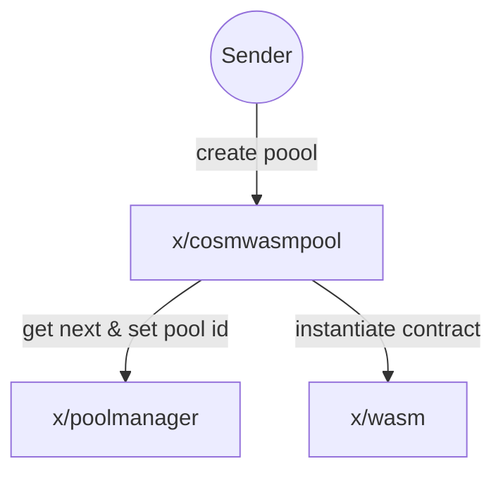
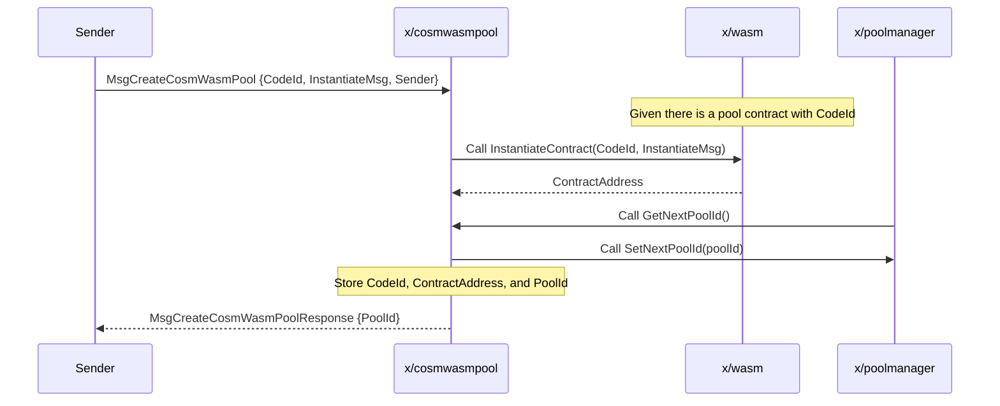
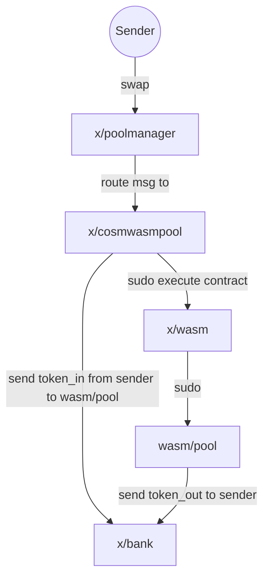

# CosmWasm Pool

The CosmWasm Pool Module is an extension for the Osmosis pools, aiming to create a custom module that allows users to create and manage liquidity pools backed by CosmWasm smart contracts. The feature enables developers to build and deploy custom smart contracts that can be integrated with the rest of the pool types on the Osmosis chain.

The module is built on top of the CosmWasm smart contracting platform, which provides a secure and efficient way to develop and execute WebAssembly (Wasm) smart contracts on the Cosmos SDK.

Having pools in CosmWasm provides several benefits, one of which is avoiding the need for chain upgrades when introducing new functionalities or modifying existing ones related to liquidity pools. This advantage is particularly important in the context of speed of development and iteration.

An example of a CosmWasm pool type: [transmuter](https://github.com/osmosis-labs/transmuter)


## Creating new CosmWasm Pool

To create new CosmWasm Pool, there are 3 modules involved: `x/cosmwasmpool`, `x/wasm`, and `x/poolmanager`. Here is an overview of the process:



The CosmWasm contract that is to be instanitiated needs to implement [CosmWasm Pool interface](#cosmwasm-pool-interface) and store it on chain first. Then new pool can be created by sending `MsgCreateCosmWasmPool`.


`MsgCreateCosmWasmPool` contains `InstantiateMsg`, which is a message that will be passed to the CosmWasm contract when it is instantiated. The structure of the message is defined by the contract developer, and can contain any information that the contract needs to be instantiated. JSON format is used for `InstantiateMsg`.




## Providing / Withdrawing Liquidity

Currently, all existing pool types has their own way of providing liquidity and shares calculation. CosmWasm pool aims to be flexible that regards and let the contract define the way of providing liquidity. So there is no restriction here, and the contract developer can define the way of providing liquidity as they wish, potentially with execute endpoint since `MsgExecuteContract` triggers state mutating endpoint and can also attach funds to it.

Common interface and later be defined for the contract to implement as spec and/or create a separated crate for that purpose.


## Swap

One of the main reason why CosmWasm pool is implemented as a module + contract rather than a contract only is that it allows us to use the existing pool manager module to handle swap, which means things like swap routing, cross chain swap, and other functionality that depends on existing pool interface works out of the box.



Pool contract's sudo endpoint expect the following message variant:

```rs
/// SwapExactAmountIn swaps an exact amount of tokens in for as many tokens out as possible.
/// The amount of tokens out is determined by the current exchange rate and the swap fee.
/// The user specifies a minimum amount of tokens out, and the transaction will revert if that amount of tokens
/// is not received.
SwapExactAmountIn {
    sender: String,
    token_in: Coin,
    token_out_denom: String,
    token_out_min_amount: Uint128,
    swap_fee: Decimal,
},
/// SwapExactAmountOut swaps as many tokens in as possible for an exact amount of tokens out.
/// The amount of tokens in is determined by the current exchange rate and the swap fee.
/// The user specifies a maximum amount of tokens in, and the transaction will revert if that amount of tokens
/// is exceeded.
SwapExactAmountOut {
    sender: String,
    token_in_denom: String,
    token_in_max_amount: Uint128,
    token_out: Coin,
    swap_fee: Decimal,
},
```

The reason why this needs to be sudo endpoint, which can only be called by the chain itself, is that the chain can provide correct information about `swap_fee`, which can be deviated from contract defined `swap_fee` in multihop scenario.

(TBD)
Problem with this approach is that swap expects funds to be sent with the same amount as `token_in` but there is no way to validate that in contract, so we need to make sure of that in `x/cosmwasmpool` module.

Alternative approach is to expose swap in execute endpoint instead and validate that msg sender is a specific module account so that we can leverage `MsgExecuteContract`'s `funds` field to send funds to the contract.

## Deactivating
(TBD)

## CosmWasm Pool Interface
(TBD)