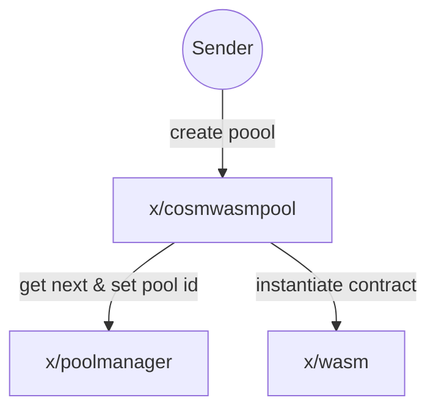
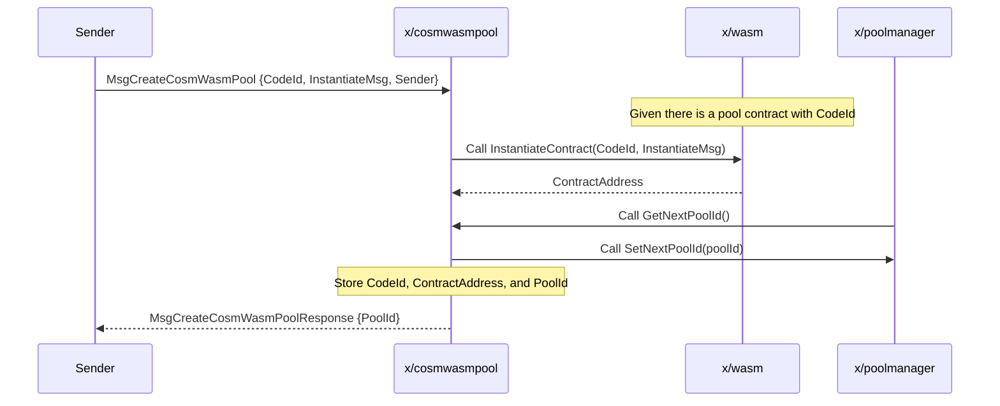
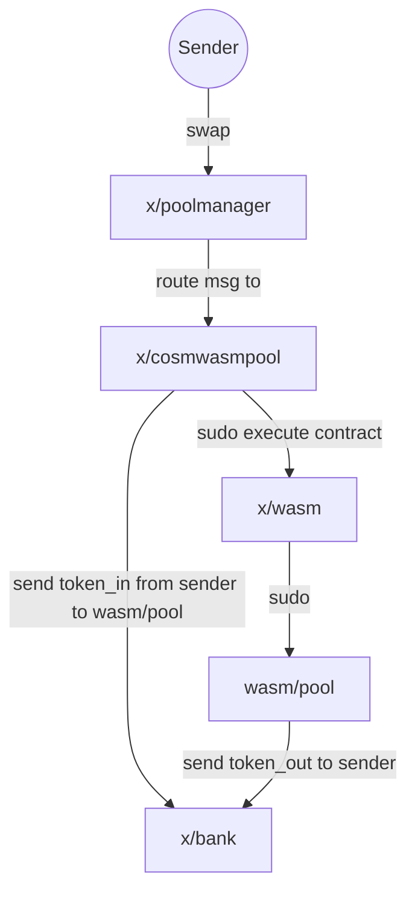

# CosmWasm Pool

The CosmWasm Pool Module is an extension for the Osmosis pools, aiming to create a custom module that allows users to create and manage liquidity pools backed by CosmWasm smart contracts. The feature enables developers to build and deploy custom smart contracts that can be integrated with the rest of the pool types on the Osmosis chain.

The module is built on top of the CosmWasm smart contracting platform, which provides a secure and efficient way to develop and execute WebAssembly (Wasm) smart contracts on the Cosmos SDK.

Having pools in CosmWasm provides several benefits, one of which is avoiding the need for chain upgrades when introducing new functionalities or modifying existing ones related to liquidity pools. This advantage is particularly important in the context of speed of development and iteration.

An example of a CosmWasm pool type: [transmuter](https://github.com/osmosis-labs/transmuter)


## Creating new CosmWasm Pool

To create new CosmWasm Pool, there are 3 modules involved: `x/cosmwasmpool`, `x/wasm`, and `x/poolmanager`. Here is an overview of the process:



The CosmWasm contract that is to be instanitiated needs to implement [CosmWasm Pool Contract Interface](#cosmwasm-pool-contract-interface) and store it on chain first. Then new pool can be created by sending `MsgCreateCosmWasmPool`.


`MsgCreateCosmWasmPool` contains `InstantiateMsg`, which is a message that will be passed to the CosmWasm contract when it is instantiated. The structure of the message is defined by the contract developer, and can contain any information that the contract needs to be instantiated. JSON format is used for `InstantiateMsg`.




## Providing / Withdrawing Liquidity

Currently, all existing pool types have their own way of providing liquidity and shares calculation. CosmWasm pool aims to be flexible that regards and let the contract define the way of providing liquidity. So there is no restriction here, and the contract developer can define the way of providing liquidity as they wish, potentially with execute endpoint since `MsgExecuteContract` triggers state mutating endpoint and can also attach funds to it.

Common interface and later be defined for the contract to implement as spec and/or create a separated crate for that purpose.

It's important to note that the _**contract itselfs hold tokens that are provided by users**_.


## Swap

One of the main reason why CosmWasm pool is implemented as a module + contract rather than a contract only is that it allows us to use the existing pool manager module to handle swap, which means things like swap routing, cross chain swap, and other functionality that depends on existing pool interface works out of the box.



Pool contract's sudo endpoint expect the following message variant:

```rs
/// SwapExactAmountIn swaps an exact amount of tokens in for as many tokens out as possible.
/// The amount of tokens out is determined by the current exchange rate and the swap fee.
/// The user specifies a minimum amount of tokens out, and the transaction will revert if that amount of tokens
/// is not received.
SwapExactAmountIn {
    sender: String,
    token_in: Coin,
    token_out_denom: String,
    token_out_min_amount: Uint128,
    swap_fee: Decimal,
},
/// SwapExactAmountOut swaps as many tokens in as possible for an exact amount of tokens out.
/// The amount of tokens in is determined by the current exchange rate and the swap fee.
/// The user specifies a maximum amount of tokens in, and the transaction will revert if that amount of tokens
/// is exceeded.
SwapExactAmountOut {
    sender: String,
    token_in_denom: String,
    token_in_max_amount: Uint128,
    token_out: Coin,
    swap_fee: Decimal,
},
```

The reason why this needs to be sudo endpoint, which can only be called by the chain itself, is that the chain can provide correct information about `swap_fee`, which can be deviated from contract defined `swap_fee` in multihop scenario.

And because of that, chain-side is required to ensure that `token_in` and `token_in_max_amount` is exactly the same amount of token that gets sent to the contract.


## Deactivating

On contract's sudo enpoint, `SetActive` can be called to deactivate the pool. This will prevent the pool from being used for swap, and also prevent users from providing liquidity to the pool. Contract needs to check if the pool is active before performing any state mutating operation except `SetActive`.

```rs
SetActive {
    is_active: bool,
}
```

(TBD) On how to handle the deactivation operationally.

## CosmWasm Pool Contract Interface

The contract interface is defined so that `cosmwasmpool` can delegate `PoolI` and `PoolModuleI` calls to contract.

The following are the messages that the contract needs to implement. (If you have trouble interpreting this, please read [Rust de/serialization](#rust-deserialization))

### Query
```rs
#[cw_serde]
#[derive(QueryResponses)]
enum QueryMessage {
    /// GetSwapFee returns the pool's swap fee, based on the current state.
    /// Pools may choose to make their swap fees dependent upon state
    /// (prior TWAPs, network downtime, other pool states, etc.)
    /// hence Context is provided as an argument.
    #[returns(GetSwapFeeResponse)]
    GetSwapFee {},

    /// Returns whether the pool has swaps enabled at the moment
    #[returns(IsActiveResponse)]
    IsActive {},

    /// GetTotalShares returns the total number of LP shares in the pool

    /// GetTotalPoolLiquidity returns the coins in the pool owned by all LPs
    #[returns(TotalPoolLiquidityResponse)]
    GetTotalPoolLiquidity {},

    /// Returns the spot price of the 'base asset' in terms of the 'quote asset' in the pool,
    /// errors if either baseAssetDenom, or quoteAssetDenom does not exist.
    /// For example, if this was a UniV2 50-50 pool, with 2 ETH, and 8000 UST
    /// pool.SpotPrice(ctx, "eth", "ust") = 4000.00
    #[returns(SpotPriceResponse)]
    SpotPrice {
        quote_asset_denom: String,
        base_asset_denom: String,
    },

    /// CalcOutAmtGivenIn calculates the amount of tokenOut given tokenIn and the pool's current state.
    /// Returns error if the given pool is not a CFMM pool. Returns error on internal calculations.
    #[returns(CalcOutAmtGivenInResponse)]
    CalcOutAmtGivenIn {
        token_in: Coin,
        token_out_denom: String,
        swap_fee: Decimal,
    },

    /// CalcInAmtGivenOut calculates the amount of tokenIn given tokenOut and the pool's current state.
    /// Returns error if the given pool is not a CFMM pool. Returns error on internal calculations.
    #[returns(CalcInAmtGivenOutResponse)]
    CalcInAmtGivenOut {
        token_out: Coin,
        token_in_denom: String,
        swap_fee: Decimal,
    },
}
#[cw_serde]
pub struct GetSwapFeeResponse {
    pub swap_fee: Decimal,
}

#[cw_serde]
pub struct IsActiveResponse {
    pub is_active: bool,
}

#[cw_serde]
pub struct TotalPoolLiquidityResponse {
    pub total_pool_liquidity: Vec<Coin>,
}

#[cw_serde]
pub struct SpotPriceResponse {
    pub spot_price: Decimal,
}

#[cw_serde]
pub struct CalcOutAmtGivenInResponse {
    pub token_out: Coin,
}

#[cw_serde]
pub struct CalcInAmtGivenOutResponse {
    pub token_in: Coin,
}
```

### Sudo

```rs
#[cw_serde]
pub enum SudoMessage {
    /// SetActive sets the active status of the pool.
    SetActive {
        is_active: bool,
    },
    /// SwapExactAmountIn swaps an exact amount of tokens in for as many tokens out as possible.
    /// The amount of tokens out is determined by the current exchange rate and the swap fee.
    /// The user specifies a minimum amount of tokens out, and the transaction will revert if that amount of tokens
    /// is not received.
    SwapExactAmountIn {
        sender: String,
        token_in: Coin,
        token_out_denom: String,
        token_out_min_amount: Uint128,
        swap_fee: Decimal,
    },
    /// SwapExactAmountOut swaps as many tokens in as possible for an exact amount of tokens out.
    /// The amount of tokens in is determined by the current exchange rate and the swap fee.
    /// The user specifies a maximum amount of tokens in, and the transaction will revert if that amount of tokens
    /// is exceeded.
    SwapExactAmountOut {
        sender: String,
        token_in_denom: String,
        token_in_max_amount: Uint128,
        token_out: Coin,
        swap_fee: Decimal,
    },
}
```

### Rust de/serialization

Contract read these msg as JSON format. Here are some examples of how it is being de/serialized:

```rs
// Notice that enum variant is turned into snake case and becomes the key of the JSON object.
enum QueryMessage {
    // { "spot_price": { "quote_asset_denom": "denom1", "base_asset_denom": "denom2" } }
    SpotPrice {
        quote_asset_denom: String,
        base_asset_denom: String,
    },
}


// In case of struct, the struct name is not used as the key,
// since there is no need to distinguish between different structs.
struct SpotPriceResponse {
    // { "spot_price": "0.001" }
    pub spot_price: Decimal,
}
```

[Decimal](https://docs.rs/cosmwasm-std/1.2.3/cosmwasm_std/struct.Decimal.html)  and [Uint128](https://docs.rs/cosmwasm-std/1.2.3/cosmwasm_std/struct.Uint128.html) are represented as string in JSON.

[Coin](https://docs.rs/cosmwasm-std/1.2.3/cosmwasm_std/struct.Coin.html) is:

```rs
pub struct Coin {
    pub denom: String,
    pub amount: Uint128,
}
```