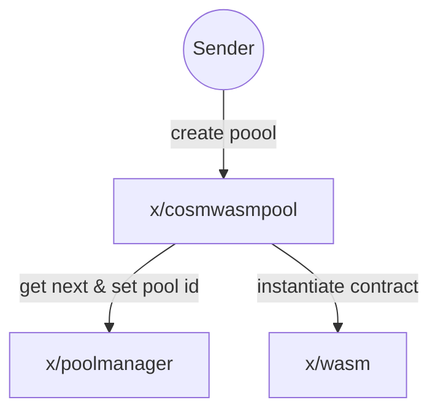
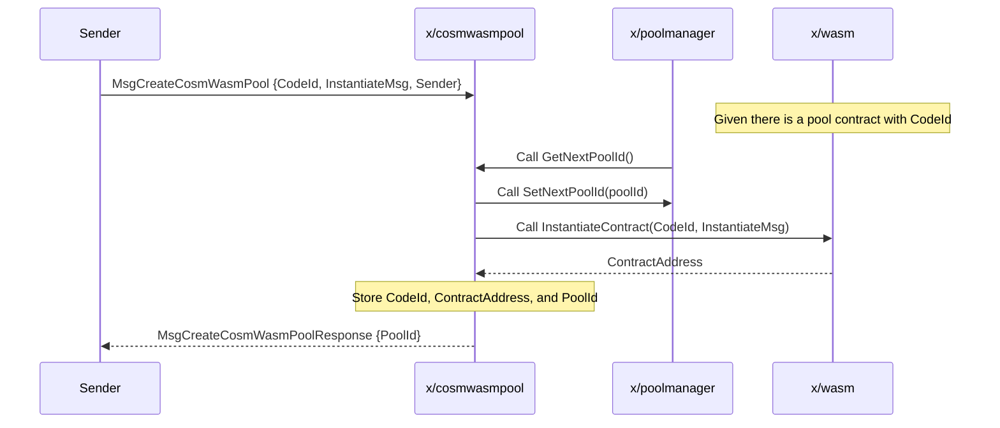
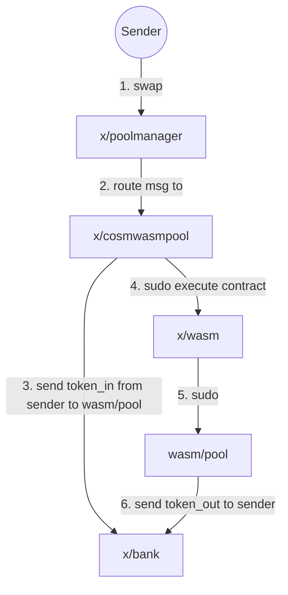
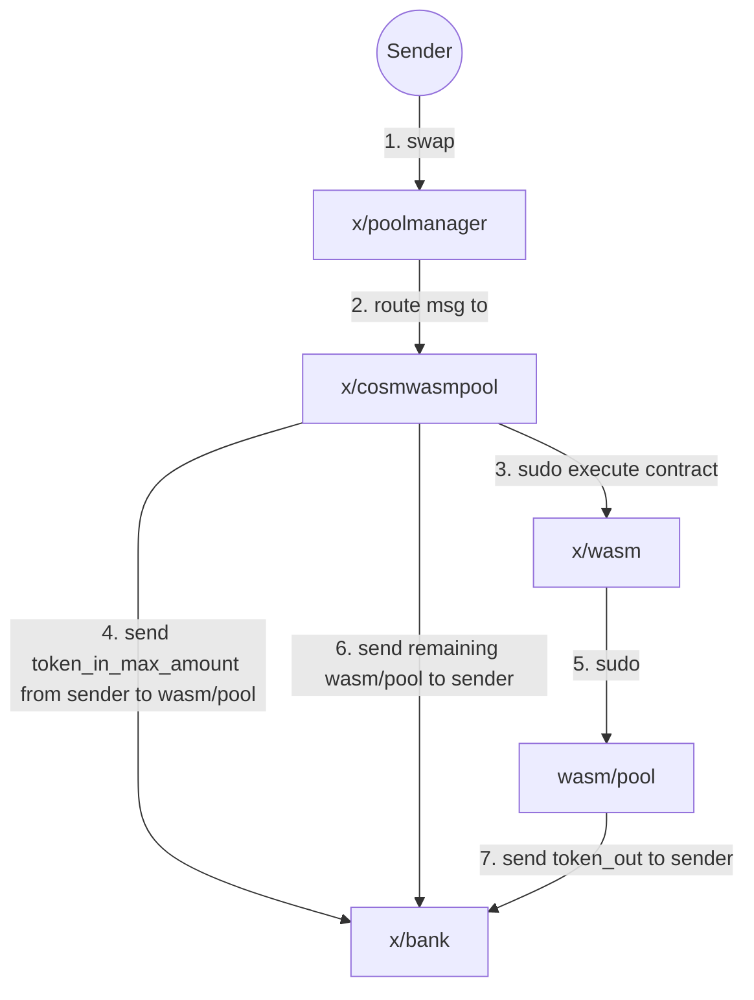

# CosmWasm Pool


## Overview

The CosmWasm Pool Module is an extension for the Osmosis pools, aiming to create a custom module that allows users to create and manage liquidity pools backed by CosmWasm smart contracts. The feature enables developers to build and deploy custom smart contracts that can be integrated with the rest of the pool types on the Osmosis chain.

The module is built on top of the CosmWasm smart contracting platform, which provides a secure and efficient way to develop and execute WebAssembly (Wasm) smart contracts on the Cosmos SDK.

Having pools in CosmWasm provides several benefits, one of which is avoiding the need for chain upgrades when introducing new functionalities or modifying existing ones related to liquidity pools. This advantage is particularly important in the context of speed of development and iteration.

An example of a CosmWasm pool type:
- [transmuter](https://github.com/osmosis-labs/transmuter)

## Key Components

- **Keeper**: The module's keeper is responsible for managing the state of the CosmWasm pools, including creating and initializing pools,
querying pool data, and executing privileged operations such as swaps using the CosmWasm sudo message. 
   * `InitializePool`: Initializes a new CosmWasm pool by instantiating a Wasm contract and storing the pool model in the keeper.
   * `Swap operations`: Swap operations like `SwapExactAmountIn` and `SwapExactAmountOut` are implemented, allowing users to perform swaps
   within the CosmWasm pools.
   * `Swap estimation`: Functions like CalcOutAmtGivenIn, and CalcInAmtGivenOut are provided to calculate prices and amounts for swap operations.
   * `Pool information`: Functions like `CalculateSpotPrice`, `GetPool`, `GetPoolAssets`, `GetPoolBalances`, `GetPoolTotalShares` allow
   for querying the state of the CosmWasm pools.


- **Query and Sudo functions**: The module includes generic functions to query CosmWasm smart contracts and execute sudo messages.
The Query and Sudo functions are used to interact with the smart contracts, while MustQuery and MustSudo variants panic if an error
occurs during the query or sudo call, respectively.

- **`poolmanager.PoolI` Interface**: The CosmWasm Pool Model implements the PoolI interface from the Pool Manager Module to enable
the creation and management of liquidity pools backed by CosmWasm smart contracts. By implementing the PoolI interface, the model
ensures compatibility with the existing Pool Manager Module's structure and functionalities and integrates seamlessly with
other modules such as `x/concentrated-liquidity` and `x/gamm`.

- **`poolmanager.PoolModule` Interface**: To integrate the CosmWasm Pool Module with the existing Pool Manager Module,
the module's keeper has to implement the PoolModule interface from `x/poolmanager` Module. By implementing the PoolModule interface,
the CosmWasm Pool Keeper can register itself as an extension to the existing Pool Manager Module and handle the creation and management
of CosmWasm-backed liquidity pools as well as receive swaps propagated from the `x/poolmanager`.

## Creating new CosmWasm Pool

To create new CosmWasm Pool, there are 3 modules involved: `x/cosmwasmpool`, `x/wasm`, and `x/poolmanager`. Here is an overview of the process:



The CosmWasm contract that is to be instanitiated needs to implement [CosmWasm Pool Contract Interface](#cosmwasm-pool-contract-interface) and store it on chain first. Then new pool can be created by sending `MsgCreateCosmWasmPool`.


`MsgCreateCosmWasmPool` contains `InstantiateMsg`, which is a message that will be passed to the CosmWasm contract when it is instantiated. The structure of the message is defined by the contract developer, and can contain any information that the contract needs to be instantiated. JSON format is used for `InstantiateMsg`.




## Providing / Withdrawing Liquidity

Currently, all existing pool types have their own way of providing liquidity and shares calculation. CosmWasm pool aims to be flexible that regards and let the contract define the way of providing liquidity. So there is no restriction here, and the contract developer can define the way of providing liquidity as they wish, potentially with execute endpoint since `MsgExecuteContract` triggers state mutating endpoint and can also attach funds to it.

Common interface and later be defined for the contract to implement as spec and/or create a separated crate for that purpose.

It's important to note that the _**contract itselfs hold tokens that are provided by users**_.


## Swap

One of the main reason why CosmWasm pool is implemented as a module + contract rather than a contract only is that it allows us to use the existing pool manager module to handle swap, which means things like swap routing, cross chain swap, and other functionality that depends on existing pool interface works out of the box.

Pool contract's sudo endpoint expect the following message variant:

```rs
/// SwapExactAmountIn swaps an exact amount of tokens in for as many tokens out as possible.
/// The amount of tokens out is determined by the current exchange rate and the swap fee.
/// The user specifies a minimum amount of tokens out, and the transaction will revert if that amount of tokens
/// is not received.
SwapExactAmountIn {
    sender: String,
    token_in: Coin,
    token_out_denom: String,
    token_out_min_amount: Uint128,
    swap_fee: Decimal,
},
/// SwapExactAmountOut swaps as many tokens in as possible for an exact amount of tokens out.
/// The amount of tokens in is determined by the current exchange rate and the swap fee.
/// The user specifies a maximum amount of tokens in, and the transaction will revert if that amount of tokens
/// is exceeded.
SwapExactAmountOut {
    sender: String,
    token_in_denom: String,
    token_in_max_amount: Uint128,
    token_out: Coin,
    swap_fee: Decimal,
},
```

`SwapExactAmountIn`





`SwapExactAmountOut`



The reason why this needs to be sudo endpoint, which can only be called by the chain itself, is that the chain can provide correct information about `swap_fee`, which can be deviated from contract defined `swap_fee` in multihop scenario.

`swap_fee` in this context is intended to be fee that is collected by liquidity providers. If the contract provider wants to collect fee for itself, it should implement its own fee collection mechanism.

And because sudo message can't attach funds like execute message, chain-side is required to perform sending token to the contract and ensure that `token_in` and `token_in_max_amount` is exactly the same amount of token that gets sent to the contract.

And the reason why the sequence is a little bit different for `SwapExactAmountIn` and `SwapExactAmountOut` is that, for `SwapExactAmountIn`, it is known beforehand how much `token_in_amount` to be sent to the contract and let it process, but for `SwapExactAmountOut`, it isn't, so we need to sent `token_in_max_amount` to the contract and let it process, then send the remaining token back to the sender.

## Deactivating

On contract's sudo enpoint, `SetActive` can be called to deactivate the pool. This will prevent the pool from being used for swap, and also prevent users from providing liquidity to the pool. Contract needs to check if the pool is active before performing any state mutating operation except `SetActive`.

```rs
SetActive {
    is_active: bool,
}
```

(TBD) On how to handle the deactivation operationally.

## CosmWasm Pool Contract Interface

The contract interface is defined so that `cosmwasmpool` can delegate `PoolI` and `PoolModuleI` calls to contract.

The following are the messages that the contract needs to implement. (If you have trouble interpreting this, please read [Rust de/serialization](#rust-deserialization))

### Query
```rs
#[cw_serde]
#[derive(QueryResponses)]
enum QueryMessage {
    /// GetSwapFee returns the pool's swap fee, based on the current state.
    /// Pools may choose to make their swap fees dependent upon state
    /// (prior TWAPs, network downtime, other pool states, etc.)
    /// This is intended to be fee that is collected by liquidity providers.
    /// If the contract provider wants to collect fee for itself, it should implement its own fee collection mechanism.
    #[returns(GetSwapFeeResponse)]
    GetSwapFee {},

    /// Returns whether the pool has swaps enabled at the moment
    #[returns(IsActiveResponse)]
    IsActive {},

    /// GetTotalShares returns the total number of LP shares in the pool

    /// GetTotalPoolLiquidity returns the coins in the pool owned by all LPs
    #[returns(TotalPoolLiquidityResponse)]
    GetTotalPoolLiquidity {},

    /// Returns the spot price of the 'base asset' in terms of the 'quote asset' in the pool,
    /// errors if either baseAssetDenom, or quoteAssetDenom does not exist.
    /// For example, if this was a UniV2 50-50 pool, with 2 ETH, and 8000 UST
    /// pool.SpotPrice(ctx, "eth", "ust") = 4000.00
    #[returns(SpotPriceResponse)]
    SpotPrice {
        quote_asset_denom: String,
        base_asset_denom: String,
    },

    /// CalcOutAmtGivenIn calculates the amount of tokenOut given tokenIn and the pool's current state.
    /// Returns error if the given pool is not a CFMM pool. Returns error on internal calculations.
    #[returns(CalcOutAmtGivenInResponse)]
    CalcOutAmtGivenIn {
        token_in: Coin,
        token_out_denom: String,
        swap_fee: Decimal,
    },

    /// CalcInAmtGivenOut calculates the amount of tokenIn given tokenOut and the pool's current state.
    /// Returns error if the given pool is not a CFMM pool. Returns error on internal calculations.
    #[returns(CalcInAmtGivenOutResponse)]
    CalcInAmtGivenOut {
        token_out: Coin,
        token_in_denom: String,
        swap_fee: Decimal,
    },
}
#[cw_serde]
pub struct GetSwapFeeResponse {
    pub swap_fee: Decimal,
}

#[cw_serde]
pub struct IsActiveResponse {
    pub is_active: bool,
}

#[cw_serde]
pub struct TotalPoolLiquidityResponse {
    pub total_pool_liquidity: Vec<Coin>,
}

#[cw_serde]
pub struct SpotPriceResponse {
    pub spot_price: Decimal,
}

#[cw_serde]
pub struct CalcOutAmtGivenInResponse {
    pub token_out: Coin,
}

#[cw_serde]
pub struct CalcInAmtGivenOutResponse {
    pub token_in: Coin,
}
```

### Sudo

```rs
#[cw_serde]
pub enum SudoMessage {
    /// SetActive sets the active status of the pool.
    SetActive {
        is_active: bool,
    },
    /// SwapExactAmountIn swaps an exact amount of tokens in for as many tokens out as possible.
    /// The amount of tokens out is determined by the current exchange rate and the swap fee.
    /// The user specifies a minimum amount of tokens out, and the transaction will revert if that amount of tokens
    /// is not received.
    SwapExactAmountIn {
        sender: String,
        token_in: Coin,
        token_out_denom: String,
        token_out_min_amount: Uint128,
        swap_fee: Decimal,
    },
    /// SwapExactAmountOut swaps as many tokens in as possible for an exact amount of tokens out.
    /// The amount of tokens in is determined by the current exchange rate and the swap fee.
    /// The user specifies a maximum amount of tokens in, and the transaction will revert if that amount of tokens
    /// is exceeded.
    SwapExactAmountOut {
        sender: String,
        token_in_denom: String,
        token_in_max_amount: Uint128,
        token_out: Coin,
        swap_fee: Decimal,
    },
}
```

## Incentives and Shares

In order to allow CosmWasm pool to work with the incentives module (or being composable in general),
the contract needs to be able to create share tokens.

We handle this by utilizing the `x/tokenfactory` module.
Each pool has share denom with this pattern: `factory/{contract_address}/cw-pool/{custom-name}`.

The contract address uniquely identifies a pool. We also use cw-pool to make these denoms distinguishable
from other tokenfactory denoms and provide contracts the ability to customize the `{custom-name}`.

Each contract is responsible for minting and burning its token factory shares. The chain does no interaction with tokenfactory.

To integrate `x/cosmwasmpool` into the `x/incentives` module, it also needs to create gauges.

This can be done by setting `after_pool_created` on `instantiate` response.

```rs
Ok(Response::new()
    .add_attribute("method", "instantiate")
    .add_attribute("contract_name", CONTRACT_NAME)
    .add_attribute("contract_version", CONTRACT_VERSION)
    // set `after_pool_created` information on response
    // for `cosmwasmpool` module to process
    .set_data(to_binary(&after_pool_created)?))
```

`after_pool_created` has type:

```rs
#[cw_serde]
pub struct AfterPoolCreated {
    pub create_pool_guages: Option<CreatePoolGauges>,
}

#[cw_serde]
pub enum CreatePoolGauges {
    // This works exactly like `gamm`'s.
    DefaultLockableDurations {},
    // Custom guages can be created.
    Custom { msgs: Vec<MsgCreateGauge> },
}
```

---
## Appendix

### TWAP
`x/twap` is not implemented for cosmwasm pools but can be in the future if there is a need.

### Rust de/serialization

Contract read these msg as JSON format. Here are some examples of how it is being de/serialized:

```rs
// Notice that enum variant is turned into snake case and becomes the key of the JSON object.
enum QueryMessage {
    // { "spot_price": { "quote_asset_denom": "denom1", "base_asset_denom": "denom2" } }
    SpotPrice {
        quote_asset_denom: String,
        base_asset_denom: String,
    },
}


// In case of struct, the struct name is not used as the key,
// since there is no need to distinguish between different structs.
struct SpotPriceResponse {
    // { "spot_price": "0.001" }
    pub spot_price: Decimal,
}
```

[Decimal](https://docs.rs/cosmwasm-std/1.2.3/cosmwasm_std/struct.Decimal.html)  and [Uint128](https://docs.rs/cosmwasm-std/1.2.3/cosmwasm_std/struct.Uint128.html) are represented as string in JSON.

[Coin](https://docs.rs/cosmwasm-std/1.2.3/cosmwasm_std/struct.Coin.html) is:

```rs
pub struct Coin {
    pub denom: String,
    pub amount: Uint128,
}
```

### Governance and Code Id Management

Despite code upload being permissioned by governance on Osmosis, it is allowed to be done by a certain
set of addresses:

```bash
osmosisd q wasm params
code_upload_access:
  address: ""
  addresses:
  - osmo1cd4nn8yzdrrsfqsmmvaafq8r03xn38qgqt8fzh
  - osmo1wl59k23zngj34l7d42y9yltask7rjlnxgccawc7ltrknp6n52fps94qsjd
  - osmo19vxp8vq8qm368dr026qxh8v82satwaf79y235lfv6wmgpwxx8dtskedaku
  - osmo1e0x2hnhhwyek7eq3kcxu2x6pt77wdnwz0lutz9fespdr9utq963qr0y5p5
  - osmo14n3a65fnqz9jve85l23al6m3pjugf0atvrfqh5
  - osmo15wna5dwylkuzvljsudyn6zfsd4zl0rkg5ge888mzk4vtnjpp0z5q4e9w58
  - osmo1r02tlyyaqs6tmrfa4jf37t7ewuxr57qp8ghzly
  permission: AnyOfAddresses
instantiate_default_permission: Everybody
```

We would like to make sure that it is not possible to upload any pool code
without governance approval. This is why we create two additional governance proposals:

Note, that in both cases, x/cosmwasmpool module account will act as the admin and creator of the contract.

#### 1. Store code and update code id whitelist

Proposal Name: `UploadCosmWasmPoolCodeAndWhiteListProposal`

On successful passing of this proposal, the code id of the pool contract will be added to the whitelist.
As a result, anyone would be able to instantiate a pool contract with this code id when creating a pol.
No address will be able to maliciously upload a new code id and instantiate a pool contract with it without
governance approval.

Inputs
 - `uploadByteCode` - `[]byte` - the raw wasm bytecode

The created code id is emitted via `TypeEvtUploadedCosmwasmPoolCode` event.

#### 2. Store code and migrate a specific code id to a new code id

Proposal Name: `MigratePoolContractsProposal`

Similarly, if we want to migrate a contract, anyone can do so but they will need to go
through a custom governance proposal.

Migrates all given cw pool contracts specified by their IDs. It has two options to perform the migration.

a. If the `codeID` is non-zero, it will migrate the pool contracts to a given `codeID` assuming that it has already been uploaded. uploadByteCode must be empty in such a case. Fails if `codeID` does not exist. Fails if uploadByteCode is not empty.

b. If the `codeID` is zero, it will upload the given `uploadByteCode` and use the new resulting code id to migrate the pool to. Errors if uploadByteCode is empty or invalid.

In both cases, if one of the pools specified by the given `poolID` does not exist, the proposal fails.

The reason for having `poolID`s be a slice of ids is to account for the potential need for emergency migration of all old code ids to new code ids, or simply having the flexibility of migrating multiple older pool contracts to a new one at once when there is a release.

`poolD`s must be at the most size of `PoolMigrationLimit` module parameter. It is configured to 20 at launch.
The proposal fails if more. Note that 20 was chosen arbitrarily to have a constant bound on the number of pools migrated at once.

Inputs
 - `poolIDs`        - `[]uint64`
 - `codeID`         - `uint64`
 - `uploadByteCode` - `[]byte`

 If the code is uploaded via proposal, the resulting code id is emitted via `TypeEvtMigratedCosmwasmPoolCode`.

##### Analysis of the Parameter Choice

- Pros
   * The flexibility is maximized as each pool id can be migrated individually either by uploading a new contract code or migrating to a pre-added one.
   * There is still an ability to migrate all pools belonging to a list of code ids. The max number of pools migrated at once is bounded by a constant parameter.

- Cons
   * If there are multiple iterations of the same type, It might become cumbersome to keep track of which pool is on which code id, why one is migrated and the other one is not
   * Some conditionality with proposal parameters. For example, if `codeId` is zero, byte code must be empty.

Overall, we concluded that pros outweigh the cons, and this is the best approach out of the other alternatives considered.

#### 3. Whitelist Management via Params

Since the code id whitelist is implemented as a module parameter, in addition to
the previous two proposals, the whitelist can be updated via parameter change proposal
to either add or remove a code id from the whitelist independently of the code upload.

The relevant parameter for changing is `CodeIdWhitelist`

Note, that the update to the parameter overwrites all previous values so the proposer
should be careful to include all code ids that should be whitelisted.

#### 4. Pool Migration Limit via Params

Additionally, the maximum number of pools that can be migrated at once is also implemented
as a parameter. It is initialized to 20 in the v16 upgrade handler. However, governance
can tweak it by changing the `PoolMigrationLimit` parameter.
