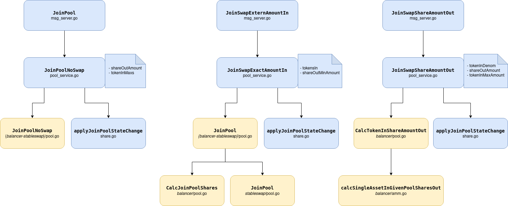
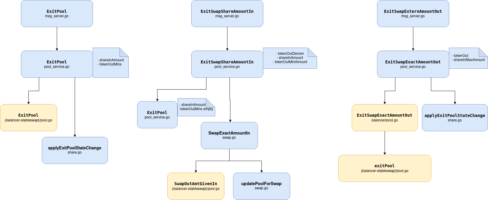

# GAMM

The ``GAMM`` module (**G**eneralized **A**utomated **M**arket **M**aker) provides the logic to create and interact with liquidity pools on the Osmosis DEX.

## Contents

1. **[Concepts](#concepts)**
2. **[Weights](#weights)**
3. **[Pool Parameters](#network-parameters)**
4. **[Messages](#messages)**
5. **[Transactions](#transactions)**
6. **[Queries and Transactions](#queries-and-transactions)**

## Concepts

The `x/gamm` module implements an AMM using:
- Balancer style pools with varying amounts and weights of assets in pools.
- Stableswap pools have liquidity centered around a given spot price. See [here](https://github.com/osmosis-labs/osmosis/blob/main/x/gamm/pool-models/stableswap/README.md) for the spec of the Osmosis implementation.

Here we will explain basic GAMM concepts and give an overview of how GAMM module's code is organized to support both type of pools.

### Pool

#### Creation of Pool

At an initial creation of the pool, a fixed amount of 100 share token is
minted in the pool and sent to the creator of the pool's account. The
pool share denom is in the format of `gamm/pool/{poolID}` and is
displayed in the format of `GAMM-{poolID}` to the user. 
Pool assets are sorted in alphabetical order by default.
Pool creation is possible only for at least 2 and no more than 8 denominations.

`PoolCreationFee` needs to be paid to create the pool. This also keeps
us safe when it comes to the malicious creation of unneeded pools.


#### Joining Pool

When joining a pool without swapping - with `JoinPool`, a user can provide the maximum amount of tokens `TokenInMaxs`
they're willing to deposit. This argument must contain all the denominations from the pool or no tokens at all, 
otherwise, the tx will be aborted.
If `TokenInMaxs` contains no tokens, the calculations are done based on the user's balance as the only constraint.

The front end takes care of the 
calculation of how many share tokens the user is eligible for at the
specific moment of sending the transaction.

Calculation of exactly how many tokens are needed to get the designated
share is done at the moment of processing the transaction, validating
that it does not exceed the maximum amount of tokens the user is willing
to deposit. After the validation, GAMM share tokens of the pool are
minted and sent to the user's account.

Joining the pool using a single asset is also possible with `JoinSwapExternAmountIn`.

Existing Join types:
- JoinPool
- JoinSwapExternAmountIn
- JoinSwapShareAmountOut

#### Join types code call stack and structure:

</br>

#### Exiting Pool

When exiting a pool, the user provides the minimum amount of tokens they
are willing to receive as they are returning their shares of the pool.
However, unlike joining a pool, exiting a pool requires the user to pay
the exit fee, which is set as a param of the pool. The user's share
tokens burnt as result. Exiting the pool using a single asset is also
possible.

Exiting a pool is possible only if user will leave a positive balance for a certain denomination after exiting
or positive number of LP shares. 
Otherwise transaction will be aborted and user will not be able to exit a pool.
Therefore, it is not possible to "drain out" a pool.

When exiting a pool with a swap, both exit and spread factors are paid.

Existing Exit types:
- ExitPool
- ExitSwapExternAmountOut
- ExitSwapShareAmountIn

#### Exit types code call stack and structure:

</br>


### Swap

During the process of swapping a specific asset, the token the user is
putting into the pool is denoted as `tokenIn`, while the token that
would be returned to the user, the asset that is being swapped for,
after the swap is denoted as `tokenOut` throughout the module.

Given a `tokenIn`, the following calculations are done to calculate how
many tokens are to be swapped into and removed from the pool:

`tokenBalanceOut * [1 - { tokenBalanceIn / (tokenBalanceIn + (1 - spreadFactor) * tokenAmountIn)} ^ (tokenWeightIn / tokenWeightOut)]`

The calculation is also able to be reversed, the case where user
provides `tokenOut`. The calculation for the amount of tokens that the
user should be putting in is done through the following formula:

`tokenBalanceIn * [{tokenBalanceOut / (tokenBalanceOut - tokenAmountOut)} ^ (tokenWeightOut / tokenWeightIn) -1] / tokenAmountIn`

Existing Swap types:
- SwapExactAmountIn
- SwapExactAmountOut

#### Spot Price

Meanwhile, calculation of the spot price with a spread factor is done using
the following formula:

`spotPrice / (1 - spreadFactor)`, where `spotPrice` is defined as:

`(tokenBalanceIn / tokenWeightIn) / (tokenBalanceOut / tokenWeightOut)`

[Spot price](https://github.com/osmosis-labs/osmosis/blob/main/x/gamm/keeper/swap.go)

#### Multi-Hop

The multi-hop logic is handled via `x/poolmanager` module.
Please see for details:
- https://github.com/osmosis-labs/osmosis/blob/main/x/poolmanager/README.md

## Weights

Weights refer to the how we weight the reserves of assets within a pool.
Its often convenient to think of weights in terms of ratios, so a 1:1
pool between "ATOM" and "BTC" is a pool where the spot price is
`#ATOM in pool / #BTC in pool`.

A 2:1 pool is one where the spot price is
`2*(#ATOM in pool) / #BTC in pool`. This weights allows one to get the
same spot price in the pool, with fewer ATOM reserves. (This comes at
the cost of having higher slippage, e.g. buying 10 atoms moves the price
more than a 1:1 pool with the same BTC liquidity).

Within the state machine, we represent weights as numbers, and the
ratios are computed internally. So you could specify a pool between
three assets, with weights 100:30:50, which is equivalent to a 10:3:5
pool.

The ratios provided in a CreatePool message, or governance proposal are
capped at 2\^20. However, within the state machine they are stored with
an extra 30 bits of precision, allowing for smooth changes between two
weights to happen with sufficient granularity.

(Note, these docs are intended to get shuffled around as we write more
of the spec for x/gamm. I just wanted to document this along with the
PR, to save work for our future selves)

## Network Parameters

Pools have the following parameters:

|  Key                       | Type                        |
|  --------------------------| ----------------------------|
|  SpreadFactor                   | sdk.Dec                     |
|  ExitFee                   | sdk.Dec                     |
|  FutureGovernor            | \*FutureGovernor            |
|  Weights                   | \*Weights                   |
|  SmoothWeightChangeParams  | \*SmoothWeightChangeParams  |
|  PoolCreationFee           | sdk.Coins                   |

1. **SpreadFactor** -
    The spread factor is the cut of all swaps that goes to the Liquidity Providers (LPs) for a pool. Suppose a pool has a spread factor `s`. Then if a user wants to swap `T` tokens in the pool, `sT` tokens go to the LP's, and then `(1 - s)T` tokens are swapped according to the AMM swap function.
2. **ExitFee** -
    The exit fee is a fee that is applied to LP's that want to remove their liquidity from the pool. Suppose a pool has an exit fee `e`. If they currently have `S` LP shares, then when they remove their liquidity they get tokens worth `(1 - e)S` shares back. The remaining `eS` shares are then burned, and the tokens corresponding to these shares are kept as liquidity.
3. **FutureGovernor** -
    Osmosis plans to allow every pool to act as a DAO, with its own governance in a future upgrade. To facilitate this transition, we allow pools to specify who the governor should be as a string. There are currently 3 options for the future governor.
    - No one will govern it. This is done by leaving the future governor string as blank.
    - Allow a given address to govern it. This is done by setting the future governor as a bech32 address.
    - Lockups to a token. This is the full DAO scenario. The future governor specifies a token denomination `denom`, and a lockup duration `duration`. This says that "all tokens of denomination `denom` that are locked up for `duration` or longer, have equal say in governance of this pool".
4. **Weights** -
    This defines the weights of the pool - [https://balancer.fi/whitepaper.pdf](https://balancer.fi/whitepaper.pdf)
5. **SmoothWeightChangeParams** -
    This allows pool governance to smoothly change the weights of the assets it holds in the pool. So it can slowly move from a 2:1 ratio, to a 1:1 ratio.
    Currently, smooth weight changes are implemented as a linear change in weight ratios over a given duration of time. So weights changed from 4:1 to 2:2 over 2 days, then at day 1 of the change, the weights would be 3:1.5, and at day 2 its 2:2, and will remain at these weight ratios.

The GAMM module also has a **PoolCreationFee** parameter, which currently is set to `100000000 uosmo` or `100 OSMO`.

[comment]: <> (TODO Add better description of how the weights affect things)

## Migration Records

Migration records are used to track a canonical link between a single balancer pool and its corresponding concentrated liquidity pool. There is a single `MigrationRecords` object for the entire gamm module that consists of many `BalancerToConcentratedPoolLink` objects. Each balancer pool can be linked to a maximum of one concentrated liquidity pool, and each concentrated liquidity pool can be linked to a maximum of one balancer pool. The entire `MigrationRecords` object can be either replaced through governance via `ReplaceMigrationRecordsProposal` or specific pool links can be added/removed/modified through governance via `UpdateMigrationRecordsProposal` (similar to how incentives are replaced and updated).

</br>
</br>

## Messages

The `x/gamm` module supports the following message types:

### MsgCreateBalancerPool

[MsgCreateBalancerPool](https://github.com/osmosis-labs/osmosis/blob/v7.1.0/proto/osmosis/gamm/pool-models/balancer/tx.proto#L16-L26)

### MsgJoinPool

[MsgJoinPool](https://github.com/osmosis-labs/osmosis/blob/v7.1.0/proto/osmosis/gamm/v1beta1/tx.proto#L27-L39)

### MsgExitPool

[MsgExitPool](https://github.com/osmosis-labs/osmosis/blob/v7.1.0/proto/osmosis/gamm/v1beta1/tx.proto#L44-L57)

### MsgSwapExactAmountIn

[MsgSwapExactAmountIn](https://github.com/osmosis-labs/osmosis/blob/v7.1.0/proto/osmosis/gamm/v1beta1/tx.proto#L68-L80)

Note, that this message was deprecated and moved to `x/poolmanager`. Please use the `MsgSwapExactAmountIn` message
in `x/poolmanager` instead.

### MsgSwapExactAmountOut

[MsgSwapExactAmountOut](https://github.com/osmosis-labs/osmosis/blob/v7.1.0/proto/osmosis/gamm/v1beta1/tx.proto#L90-L102)

Note, that this message was deprecated and moved to `x/poolmanager`. Please use the `MsgSwapExactAmountOut` message
in `x/poolmanager` instead.

### MsgJoinSwapExternAmountIn

[MsgJoinSwapExternAmountIn](https://github.com/osmosis-labs/osmosis/blob/v7.1.0/proto/osmosis/gamm/v1beta1/tx.proto#L107-L119)

#### MsgJoinSwapShareAmountOut

[MsgJoinSwapShareAmountOut](https://github.com/osmosis-labs/osmosis/blob/v7.1.0/proto/osmosis/gamm/v1beta1/tx.proto#L124-L138)

#### MsgExitSwapShareAmountIn

[MsgExitSwapShareAmountIn](https://github.com/osmosis-labs/osmosis/blob/v7.1.0/proto/osmosis/gamm/v1beta1/tx.proto#L143-L158)

#### MsgExitSwapExternAmountOut

[MsgExitSwapExternAmountOut](https://github.com/osmosis-labs/osmosis/blob/v7.1.0/proto/osmosis/gamm/v1beta1/tx.proto#L163-L175)

## Transactions

### Create pool

Create a new liquidity pool and provide initial liquidity to it.

```sh
osmosisd tx gamm create-pool [config-file] --from --chain-id
```

::: details Example
The JSON [config-file] must specify the following parameters:

```json
{
 "weights": [list weighted denoms],
 "initial-deposit": [list of denoms with initial deposit amount],
 "swap-fee": [spread factor in percentage],
 "exit-fee": [exit fee in percentage],
 "future-governor": [see options in pool parameters section above]
}
```

Create a new 50/50 AKT-OSMO liquidity pool with a swap and exit fee of 1%.

```sh
osmosisd tx gamm create-pool --pool-file [config-file] --from WALLET_NAME --chain-id osmosis-1
```

The configuration json file contains the following parameters:

```json
{
 "weights": "5ibc/1480B8FD20AD5FCAE81EA87584D269547DD4D436843C1D20F15E00EB64743EF4,5uosmo",
 "initial-deposit": "499404ibc/1480B8FD20AD5FCAE81EA87584D269547DD4D436843C1D20F15E00EB64743EF4,500000uosmo",
 "swap-fee": "0.003",
 "exit-fee": "0.00",
 "future-governor": ""
}
```

:::

::: warning
There is now a 100 OSMO fee for creating pools.
:::

### Join pool

Add liquidity to a specified pool to get an **exact** amount of LP shares while specifying a **maximum** number tokens willing to swap to receive said LP shares.

```sh
osmosisd tx gamm join-pool --pool-id --max-amounts-in --share-amount-out --from --chain-id
```

::: details Example

Join `pool 3` with a **maximum** of `.037753 AKT` and the corresponding amount of `OSMO` to get an **exact** share amount of `1.227549469722224220 gamm/pool/3` using `WALLET_NAME` on the osmosis mainnet:

```sh
osmosisd tx gamm join-pool --pool-id 3 --max-amounts-in 37753ibc/1480B8FD20AD5FCAE81EA87584D269547DD4D436843C1D20F15E00EB64743EF4 --share-amount-out 1227549469722224220 --from WALLET_NAME --chain-id osmosis-1
```

:::

### Exit pool

Remove liquidity from a specified pool with an **exact** amount of LP shares while specifying the **minimum** number of tokens willing to receive for said LP shares.

```sh
osmosisd tx gamm exit-pool --pool-id --min-amounts-out --share-amount-in --from --chain-id
```

::: details Example

Exit `pool 3` with for **exactly** `1.136326462628731195 gamm/pool/3` in order to receive a **minimum** of `.033358 AKT` and the corresponding amount of `OSMO` using `WALLET_NAME` on the osmosis mainnet:

```sh
osmosisd tx gamm exit-pool --pool-id 3 --min-amounts-out 33358ibc/1480B8FD20AD5FCAE81EA87584D269547DD4D436843C1D20F15E00EB64743EF4 --share-amount-in 1136326462628731195 --from WALLET_NAME --chain-id osmosis-1
```

:::

### Join-swap-extern-amount-in

Add liquidity to a specified pool with only one of the required assets (i.e. Join pool 1 (50/50 ATOM-OSMO) with just ATOM).

This command essentially swaps an **exact** amount of an asset for the required pairing and then converts the pair to a **minimum** of the requested LP shares in a single step (i.e. combines the `swap-exact-amount-in` and `join-pool` commands)

```sh
osmosisd tx gamm join-swap-extern-amount-in [token-in] [share-out-min-amount] --from --pool-id --chain-id
```

::: details Example

Join `pool 3` with **exactly** `.200000 AKT` (and `0 OSMO`) to get a **minimum** of `3.234812471272883046 gamm/pool/3` using `WALLET_NAME` on the osmosis mainnet:

```sh
osmosisd tx gamm join-swap-extern-amount-in 200000ibc/1480B8FD20AD5FCAE81EA87584D269547DD4D436843C1D20F15E00EB64743EF4 3234812471272883046 --pool-id 3 --from WALLET_NAME --chain-id osmosis-1
```

:::

### Exit-swap-extern-amount-out

Remove liquidity from a specified pool with a **maximum** amount of LP shares and swap to an **exact** amount of one of the token pairs (i.e. Leave pool 1 (50/50 ATOM-OSMO) and receive 100% ATOM instead of 50% OSMO and 50% ATOM).

This command essentially converts an LP share into the corresponding share of tokens and then swaps to the specified `token-out` in a single step (i.e. combines the `swap-exact-amount-out` and `exit-pool` commands)

```sh
osmosisd tx gamm exit-swap-extern-amount-out [token-out] [share-in-max-amount] --pool-id --from --chain-id
```

::: details Example

Exit `pool 3` by removing a **maximum** of `3.408979387886193586 gamm/pool/3` and swap the `OSMO` portion of the LP share to receive 100% AKT in the **exact** amount of `0.199430 AKT`:

```sh
osmosisd tx gamm exit-swap-extern-amount-out 199430ibc/1480B8FD20AD5FCAE81EA87584D269547DD4D436843C1D20F15E00EB64743EF4 3408979387886193586 --pool-id 3 --from WALLET_NAME --chain-id osmosis-1
```

:::

### Join-swap-share-amount-out

Swap a **maximum** amount of a specified token for another token, similar to swapping a token on the trade screen GUI (i.e. takes the specified asset and swaps it to the other asset needed to join the specified pool) and then adds an **exact** amount of LP shares to the specified pool.

```sh
osmosisd tx gamm join-swap-share-amount-out [token-in-denom] [share-out-amount] [token-in-max-amount] --pool-id --from --chain-id
```

::: details Example

Swap a **maximum** of `0.312466 OSMO` for the corresponding amount of `AKT`, then join `pool 3` and receive **exactly** `1.4481270389710236872 gamm/pool/3`:

```sh
osmosisd tx gamm join-swap-share-amount-out uosmo 14481270389710236872 312466 --pool-id 3 --from WALLET_NAME --chain-id osmosis-1
```

:::

### Exit-swap-share-amount-in

Remove an **exact** amount of LP shares from a specified pool, swap the LP shares to one of the token pairs to receive a **minimum** of the specified token amount.

```sh
osmosisd tx gamm exit-swap-share-amount-in [token-out-denom] [share-in-amount] [token-out-min-amount] --pool-id --from --chain-id
```

::: details Example

Exit `pool 3` by removing **exactly** `14.563185400026723131 gamm/pool/3` and swap the `AKT` portion of the LP share to receive 100% OSMO in the **minimum** amount of `.298548 OSMO`:

```sh
osmosisd tx gamm exit-swap-share-amount-in uosmo 14563185400026723131 298548 --pool-id 3 --from WALLET_NAME --chain-id osmosis-1
```

:::

### Swap-exact-amount-in

Swap an **exact** amount of tokens for a **minimum** of another token, similar to swapping a token on the trade screen GUI.

```sh
osmosisd tx gamm swap-exact-amount-in [token-in] [token-out-min-amount] --pool-id --from --chain-id
```

::: details Example

Swap **exactly** `.407239 AKT` through `pool 3` into a **minimum** of `.140530 OSMO` using `WALLET_NAME` on the osmosis mainnet:

```sh
osmosisd tx gamm swap-exact-amount-in 407239ibc/1480B8FD20AD5FCAE81EA87584D269547DD4D436843C1D20F15E00EB64743EF4 140530 --swap-route-pool-ids 3 --swap-route-denoms uosmo --from WALLET_NAME --chain-id osmosis-1
```

:::

### Swap-exact-amount-out

Swap a **maximum** amount of tokens for an **exact** amount of another token, similar to swapping a token on the trade screen GUI.

```sh
osmosisd tx gamm swap-exact-amount-out [token-out] [token-out-max-amount] --swap-route-pool-ids --from --chain-id
```

::: details Example

Swap a **maximum** of `.407239 AKT` through `pool 3` into **exactly** `.140530 OSMO` using `WALLET_NAME` on the osmosis mainnet:

```sh
osmosisd tx gamm swap-exact-amount-out 140530uosmo 407239 --swap-route-pool-ids 3 --swap-route-denoms ibc/1480B8FD20AD5FCAE81EA87584D269547DD4D436843C1D20F15E00EB64743EF4 --from WALLET_NAME --chain-id osmosis-1
```

[comment]: <> (Other resources Creating a liquidity bootstrapping pool and Creating a pool with a pool file)
:::

### Migrate-position

Migrate unlocked gamm shares to corresponding concentrated liquidity pool.


```sh
osmosisd tx gamm migrate-position [unlocked-shares] [flags]
```

::: details Example

Migrate 10000000000000000000 unlocked gamm shares from pool 2 to the canonical CL pool:

```sh
 osmosisd tx gamm migrate-position 10000000000000000000gamm/pool/2 --min-amounts-out=100uosmo,100uusdc --from pool -b block --keyring-backend test --chain-id localosmosis --fees 1000000uosmo --gas 700000
```
:::
## Queries

## Queries

The **Query** submodule of the GAMM module provides the logic to request information from the liquidity pools. It contains the following functions:

- [Estimate Swap Exact Amount In](#estimate-swap-exact-amount-in)
- [Estimate Swap Exact Amount Out](#estimate-swap-exact-amount-out)
- [Num Pools](#num-pools)
- [Pool](#pool)
- [Pool Assets](#pool-assets)
- [Pool Params](#pool-params)
- [Pools](#pools)
- [Spot Price](#spot-price)
- [Total Liquidity](#total-liquidity)
- [Total Share](#total-share)

### Estimate Swap Exact Amount In

Query the estimated result of the [Swap Exact Amount In](#swap-exact-amount-in) transaction. Note that the flags *swap-route-pool* and *swap-route-denoms* are required.

#### Usage

```sh
osmosisd query gamm estimate-swap-exact-amount-in <poolID> <sender> <tokenIn> [flags]
```

#### Example

Query the amount of ATOM the sender would receive for swapping 1 OSMO in pool 1.

```sh
osmosisd query gamm estimate-swap-exact-amount-in 1 osmo123nfq6m8f88m4g3sky570unsnk4zng4uqv7cm8 1000000uosmo --swap-route-pool-ids 1 --swap-route-denoms ibc/27394FB092D2ECCD56123C74F36E4C1F926001CEADA9CA97EA622B25F41E5EB2 
```

### Estimate Swap Exact Amount Out

Query the estimated result of the [Swap Exact Amount Out](#swap-exact-amount-out) transaction. Note that the flags *swap-route-pool* and *swap-route-denoms* are required.

#### Usage

```sh
osmosisd query gamm estimate-swap-exact-amount-out <poolID> <sender> <tokenOut> [flags]
```

#### Example

Query the amount of OSMO the sender would require to swap 1 ATOM out of pool 1.

```sh
osmosisd query gamm estimate-swap-exact-amount-out 1 osmo123nfq6m8f88m4g3sky570unsnk4zng4uqv7cm8 1000000ibc/27394FB092D2ECCD56123C74F36E4C1F926001CEADA9CA97EA622B25F41E5EB2 --swap-route-pool-ids 1 --swap-route-denoms uosmo
```

### Num Pools

Query the number of active pools.

#### Usage

```sh
osmosisd query gamm num-pools
```

## Pool

Query the parameter and assets of a specific pool.

### Usage

```sh
osmosisd query gamm pool <poolID> [flags]
```

### Example

Query parameters and assets from pool 1.

```sh
osmosisd query gamm pool 1
```

### Pool Assets

Query the assets of a specific pool. This query is a reduced form of the [Pool](#pool) query.

#### Usage

```sh
osmosisd query gamm pool-assets <poolID> [flags]
```

#### Example

Query the assets from pool 1.

```sh
osmosisd query gamm pool-assets 1
```

### Pool Params

Query the parameters of a specific pool. This query is a reduced form of the [Pool](#pool) query.

#### Usage

```sh
osmosisd query gamm pool-params <poolID> [flags]
```

Query the parameters from pool 1.

#### Example

```sh
osmosisd query gamm pool-params 1
```

### Pools

Query parameters and assets of all active pools.

#### Usage

Query the price of OSMO based on the price of ATOM in pool 1.

```sh
osmosisd query gamm spot-price 1 uosmo ibc/27394FB092D2ECCD56123C74F36E4C1F926001CEADA9CA97EA622B25F41E5EB2
```

### Total Liquidity

Query the total liquidity of all active pools.

#### Usage

```sh
osmosisd query gamm total-liquidity
```

### Total Share

Query the total amount of GAMM shares of a specific pool.

#### Usage

```sh
osmosisd query gamm total-share <poolID> [flags]
```

#### Example

Query the total amount of GAMM shares of pool 1.

```sh
osmosisd query gamm total-share 1
```

## Other resources

* [Creating a liquidity bootstrapping pool](./client/docs/create-lbp-pool.md)
* [Creating a pool with a pool file](./client/docs/create-balancer-pool.md)
* [Creating a stableswap pool](./client/docs/create-stableswap-pool.md)

## Events

There are 4 types of events that exist in GAMM:

* `sdk.EventTypeMessage` - "message"
* `types.TypeEvtPoolJoined` - "pool_joined"
* `types.TypeEvtPoolExited` - "pool_exited"
* `types.TypeEvtTokenSwapped` - "token_swapped"

### `sdk.EventTypeMessage`

This event is emitted in the message server when any of the gamm messages finish execution.

### `types.TypeEvtPoolJoined`

This event is emitted after one of `JoinPool` or `JoinPoolNoSwap` complete joining
the requested pool successfully.

It consists of the following attributes:

* `sdk.AttributeKeyModule` - "module"
  * The value is the module's name - "gamm".
* `sdk.AttributeKeySender`
  * The value is the address of the sender who created the swap message.
* `types.AttributeKeyPoolId`
  * The value is the pool id of the pool where swap occurs.
* `types.AttributeKeyTokensIn`
  * The value is the string representation of the tokens being swapped in.

### `types.TypeEvtPoolExited`

This event is emitted after `ExitPool` completes exiting
the requested pool successfully.

It consists of the following attributes:

* `sdk.AttributeKeyModule` - "module"
  * The value is the module's name - "gamm".
* `sdk.AttributeKeySender`
  * The value is the address of the sender who created the swap message.
* `types.AttributeKeyPoolId`
  * The value is the pool id of the pool where swap occurs.
* `types.AttributeKeyTokensOut`
  * The value is the string representation of the tokens being swapped out.

### `types.TypeEvtTokenSwapped`

This event is emitted after one of `SwapExactAmountOut` or `SwapExactAmountIn` updates
pool state successfully.

It consists of the following attributes:

* `sdk.AttributeKeyModule` - "module"
  * The value is the module's name - "gamm".
* sdk.AttributeKeySender
  * The value is the address of the sender who created the swap message.
* types.AttributeKeyPoolId
  * The value is the pool id of the pool where swap occurs.
* types.AttributeKeyTokensIn
  * The value is the string representation of the tokens being swapped in.
* types.AttributeKeyTokensOut
  * The value is the string representation of the tokens being swapped out.
